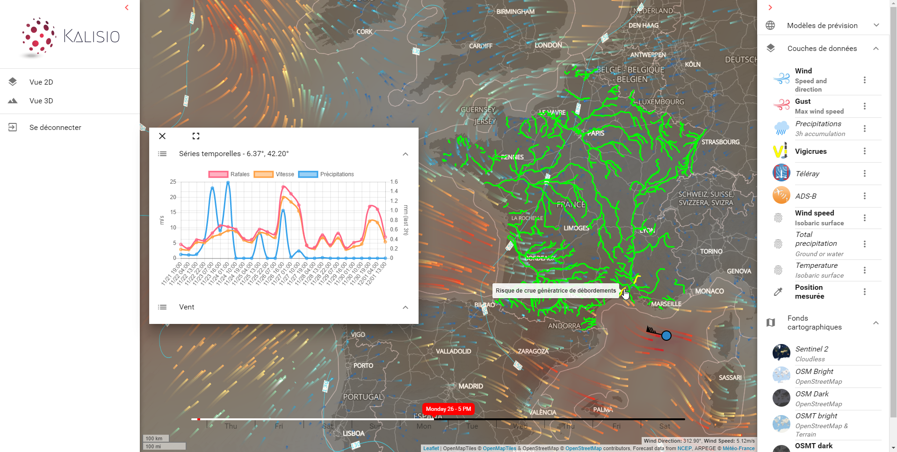

# About

The **Kalisio Development Kit** (**KDK**) aims to simplify the development of geospatial web applications running on desktop or mobile devices. It is a strongly opiniated stack initially developed to build multitenancy applications provided as SaaS (i.e. Cloud) like [Kalisio Crisis](https://crisis.kalisio.com). However, you can also build legacy applications because of the modularity and the flexibility of the KDK.

Our objective is to propose a microservice based platform. Each building block has the responsibility to deliver specific and limited functionalities. Such an architectural approach plays a key role in helping us face the challenge of maintaining several mature products that need scalability within multiple contexts in terms of processing, storage, and features delivery.

