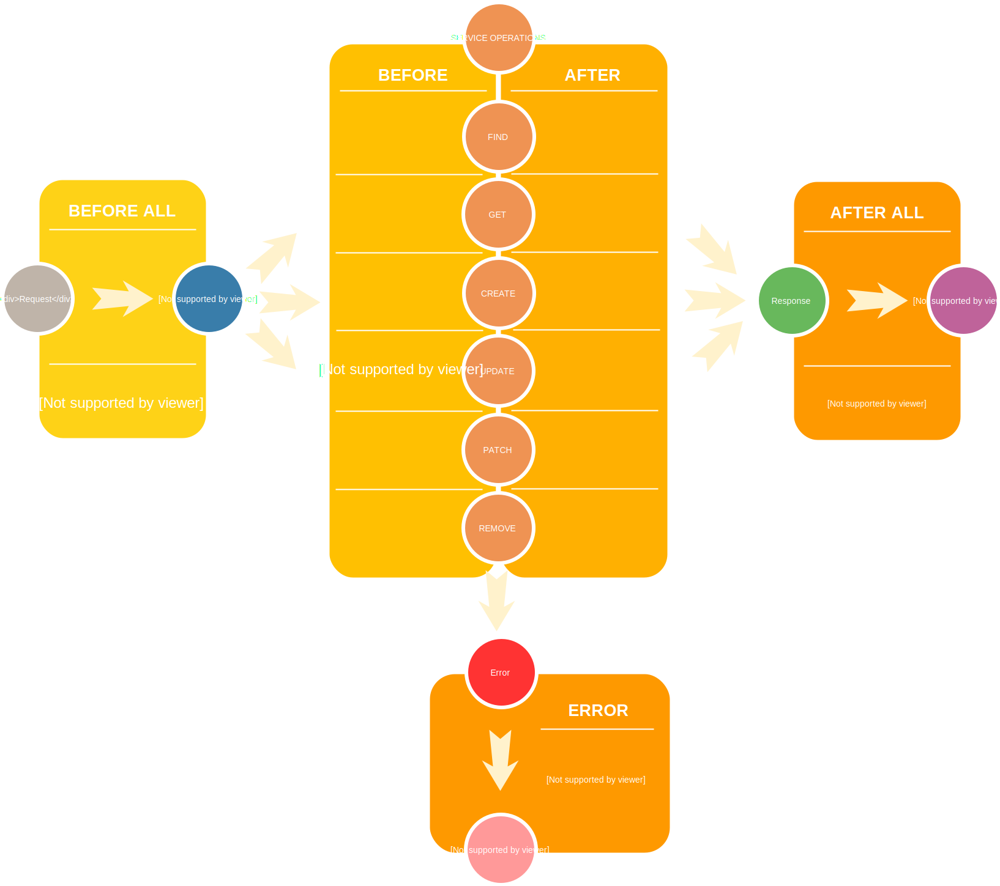
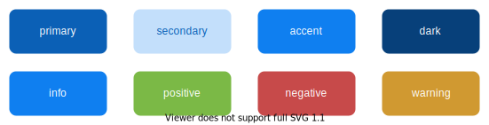

# Application

KDK [core](https://github.com/kalisio/kdk/core) offers a thin layer on top of the [FeathersJS application](https://docs.feathersjs.com/api/application.html) mainly to simplify the creation and configuration of services. It also provide some helpful concepts and utilities to structure your application right.

## Application API

### Backend setup

KDK [core](https://github.com/kalisio/kdk/core) provides a helper to quickly initialize what is required for your [server application](https://docs.feathersjs.com/api/application.html). The core module provides the ability to initialize a new KDK application instance, attach it to the configured database and setup authentication:
```javascript
import { kdk } from '@kalisio/kdk/core.api'

// Initialize app
let app = kdk()
// Connect to DB
await app.db.connect()
```

### Client setup

KDK [core](https://github.com/kalisio/kdk/core) provides a helper to quickly initialize what is required for your [client application](https://docs.feathersjs.com/api/client.html).
```javascript
import { initializeApi } from '@kalisio/kdk/core.client'

// Initialize API wrapper
let api = await initializeApi()
// Retrieve a given service
let users = api.getService('users')
```

You can provide the API initialization with an optional function that could be used to extend the wrapper object with additional features (i.e. properties or methods). This is typically used by the KDK [map](https://github.com/kalisio/kdk/core) submodule:
```javascript
import { initializeApi } from '@kalisio/kdk/core.client'
import { setupApi } from '@kalisio/kdk/map.client'

// Initialize API wrapper with extension function
let api = await initializeApi(setupApi)
```

### Isomorphic features

KDK provides some isomorphic features like the [permission system](./application.md#permissions).
```javascript
import { permissions } from '@kalisio/kdk/core.common'

...
```

### Configuration

Any value from the backend [configuration](../../guides/basics/step-by-step.md#configuring-a-kapp) can be directly retrieved on the application object like this:
```javascript
const value = app.get('property')
```

Any value from the frontend [configuration](../../guides/basics/step-by-step.md#configuring-a-kapp) can be directly retrieved by importing it like this:
```javascript
import config from 'config'

const value = config.property
```

> Under the hood [FeathersJS configuration module](https://github.com/feathersjs/configuration) and [node-config](https://github.com/lorenwest/node-config) are used to manage configuration so that any related concept to organise your configuration according to deployment options can be used.

### getService(name, context)

::: tip
backend/client
:::

Retrieve the given service by name, should replace [Feathers service method](https://docs.feathersjs.com/api/application.html#servicepath) so that you are abstracted away from the internal service path (i.e. API prefix and context ID) and only refer to it by its "usual" name.

> On the client side this is also used to instanciate the service on first call.

### createService(name, options)

::: tip
backend/client
:::

Create a new service attached to the application by name and given a set of options in the backend:
* **context**: the context object the service will be contextual to, if given the internal service path will be `contextId/serviceName`
* **modelsPath**: directory where to find model declaration (optional), if provided will initiate a DB service based on the model file
* **modelName**: name of the model file is not named after the service
* **servicesPath**: directory where to find service declaration (optional), if provided for a non-DB service will initiate a service based on the returned object or constructor function from the service module, for a DB service it will apply the provided mixin object coming from the service module
* **fileName**: by default the function will look to a model/service file named after the service name, this option allows to override it
* **events**: [service events](https://feathersjs.com/api/application.html#options) to be used by the service
* **methods**: [service methods](https://feathersjs.com/api/application.html#options) typically useful for [custom methods](https://feathersjs.com/api/services.html#custom-methods)
* **proxy**: options for a service to be proxied by the created service
  * **service**: the name of the proxied service
  * **params**: the parameters to be used when calling the proxied service, either an object or a function returning the object and applied on the input parameters
  * **id**: the id map function to be used when calling the proxied service, will be applied on the input id
  * **data**: the data map function to be used when calling the proxied service, will be applied on the input the object
  * **result**: the result map to be used when calling the proxied service, will be applied on the returning the object(s)

Depending on the options you have to create a *models* and *services* directories containing the required files to declare your services, e.g. your folder/file hierarchy should look like this:
* *index.js*: contains a default function instantiating all the services
* *models* : contains one file per database adapter you'd like to support
  * *serviceName.model.mongodb.js* : exporting the data model managed by your service in [MongoDB](https://docs.feathersjs.com/api/databases/mongodb.html), 
  * *serviceName.model.levelup.js* : exporting the data model managed by your service in [LevelUP](https://github.com/feathersjs/feathers-levelup), 
  * ...
* *services*
  * *serviceName*
    * *serviceName.hooks.js* : exporting the [hooks](https://docs.feathersjs.com/api/hooks.html) of your service, 
    * *serviceName.filters.js* : exporting the [filters](https://docs.feathersjs.com/api/events.html#event-filtering) of your service, 
    * *serviceName.service.js* : exporting the specific mixin or mixin constructor function associated to your service (optional)

By default client-side services related to backend services don't have to be explicitely created as Feathers will automatically generate a wrapper on first call.
However, the `declareService()` might be called to declare any specific options like the fact a service is a contextual one:
```js
api.declareService('catalog', { context: true })
```

Otherwise, you can create a new service attached to the application by name and given a set of options in the frontend:
* **context**: the context object the service will be contextual to, if given the internal service path will be `contextId/serviceName`
* **events**: [service events](https://feathersjs.com/api/application.html#options) to be used by the service
* **methods**: [service methods](https://feathersjs.com/api/application.html#options) typically useful for [custom methods](https://feathersjs.com/api/client/rest.html#custom-methods)
* **hooks**: object defining client-side hooks
* **service**: service object or function like `fn(name, app, options)` generating a serive object

For instance this creates a in-memory service o nthe frontend:
```js
import { memory } from '@feathersjs/memory'

api.createService('myService', {
  service: memory({
    id: 'name',
    paginate: { default: 12 }
  })
})
```

## Application Hooks

The following [hooks](./HOOKS.MD) are usually globally executed on the application:



## Permissions

We provide an isomorphic permissions management system so that user access can be checked:
* at backend level, typically when accessing the API
* at frontend level, typically before constructing the UI

The primary level of a permissions management system is a [Role Based Access Control](https://en.wikipedia.org/wiki/Role-based_access_control) (RBAC), which relies on the grouping of users into various roles which are then assigned rights.
A right is typically made up of an action and a resource type, e.g. role manager can create (action) documents (resource type).
The KDK provide the following default roles, ordered by privilege level:
* `Roles.member`, usually a "standard" user
* `Roles.manager`, usually a "privileged" user
* `Roles.owner`, usually a "superuser" or "administrator"

The secondary level of a permissions management system is an [Attribute Based Access Control](https://en.wikipedia.org/wiki/Attribute-based_access_control) (ABAC), which allows to enforce authorization decisions based on any attribute accessible to your application and not just the user's role. Let's say we'd like to give a specific user access to a specific resource and this resource is created/removed dynamically at run time by your app. RBAC is a legacy access control that usually fails in this kind of dynamic environments. ABAC is more flexible and powerful to support these use cases, and technically ABAC is also capable of enforcing RBAC. This is the reason why the KDK implements this type of access control.

The `create`, respectively `remove`, operation on the `authorisations` service will:
1. add, respectively remove, a privilege or permission level (e.g. `owner` or `manager`)
2. for a subject (i.e. a user in most case but it could be generalized)
3. on a resource (e.g. an organisation).

The permission will be stored directly on the subject (i.e. user) object so that they are already available once authenticated.
They will be organized by resource types (what is called a *scope*) so that a user being the owner of the *feathers* organisation
will be structured like this (*organisations* is an *authorization scope* on the user object):
```javascript
{
  email: 'xxx',
  name: 'xxx',
  organisations: [{
    name: 'feathers',
    _id: ID,
    permissions: 'owner'
  }]
}
```

A hook system allows to register the different rules that should be enforced, [CASL](https://stalniy.github.io/casl/) is used under-the-hood:
```javascript
import { permissions } from '@kalisio/kdk/core.common'

permissions.defineAbilities.registerHook((subject, can, cannot) => {
  if (subject && subject._id) { // Subject can be null on anonymous access
    // Anyone can create new organisations
    can('service', 'organisations')
    can('create', 'organisations')
    if (subject.organisations) { // Check for authorisation scope
      subject.organisations.forEach(organisation => {
        if (organisation._id) {
          // Get user privilege level for this organisation
          const role = permissions.Roles[organisation.permissions]
          if (role >= Roles.member) { // Members have read-only access to organisation
            can('read', 'organisations', { _id: organisation._id })
          }
          if (role >= Roles.manager) { // Manager have read-write access to organisation
            can('update', 'organisations', { _id: organisation._id })
          }
          if (role >= Roles.owner) { // Owners have full access to organisation
            can('remove', 'organisations', { _id: organisation._id })
          }
        }
      })
    }
  }
})
```
The `can/cannot` method requires three arguments to define permissions:
* the first one is the action or the set of actions you're setting the permission for
  * `service` can be used to completely block access to a given service, otherwise specify either
  `get`, `find`, `create`, `update`, `patch`, or `remove` service-level operation
  * `read` is an alias for `get` + `find`
  * `all` is an alias for `read` + `create` + `update` + `remove`
  * `update` is an alias for `patch` as objects are usually only patched due to [perspectives](../README.md#data-model)
* the second one is the name of the resource type (i.e. usually the service) you're setting it on,
* the third one is the conditions to further restrict which resources the permission applies to.

::: warning
It is important to only use database fields for the conditions so it can be used for fetching records.
:::

Once registered, rules can be enforced at API level using the `authorise` application-level hook:
```javascript
import { hooks } from '@kalisio/kdk/core'

app.hooks({
  before: {
    all: [hooks.authorise]
  }
})
```

You will find implementation details [in this article](https://blog.feathersjs.com/access-control-strategies-with-feathersjs-72452268739d).

## Client ecosystem

### Events

We use the [global event bus](https://alligator.io/vuejs/global-event-bus/) provided by Quasar to exchange events between independent components in the app:
```javascript
import { Events } from 'quasar'

// Register callback on event
const myCallback = (object) => { ... }
Events.on('myEvent', myCallback)
// Unregister it
Events.off('myEvent', myCallback)
```

> The event bus is notably used to be aware of state changes in the global store (see hereafter)

### Store

A component-based system like the one offered by **KDK** has its local and global states. Each component has its local data, but the application has a global application state that can be accessed by any component of the application. This is the purpose of the **Store** singleton object: allow to get or update the global state and make any interested component aware of it in real-time through events. The available API is illustrated by this code sample:

```js
import { Store } from '@kalisio/kdk/core.client'
import { Events } from 'quasar'

const myCallback = (value, previousValue) => { ... }

Store.set('myGlobal', { ... }) // Set a root object
Store.patch('myGlobal', { property: value }) // Set a specific group of properties
Store.set('myGlobal.property', value) // Set a specific property path
Store.get('myGlobal.property', defaultValue) // defaultValue is returned if path is not found
Events.on('myGlobal-changed', myCallback) // When updating a root object
Events.on('myGlobal-property-changed', myCallback) // When updating a specific property path
```

### Guards

[Navigation guards](https://router.vuejs.org/guide/advanced/navigation-guards.html) control access to [routes](https://quasar.dev/layout/routing-with-layouts-and-pages/) within an application. They allow you to define navigation rules in your app based on the user's status (authenticated or not), permissions, and route definitions.

The **KDK** provides you with some built-in before guards and a mecanism to register your own ones, more details can be found in our [application template](https://kalisio.github.io/skeleton/guides/howtos/guards.html).

### Storage

The **Storage** singleton provides you with high level functions to upload and download files using the [Storage service](./services.md#storage-service).

### Exporter

Like the **Storage** singleton, the **Exporter** singleton provides ready-to-use functions to exploit the [import-export service](./services.md#import-export-service)

This singleton exposes an `export` method which allows you to create an export. The interface is roughly similar to that exposed by the [create](https://github.com/kalisio/feathers-import-export#export-data-params) method of the library [feathers-import-export](https://github.com/kalisio/feathers-import-export). The difference is that this interface allows you to offer different formats and provide a transformation according the format.

Moreover; it allows to uniquely identify the generated files. Indeed, the **Exporter** automatically timestamps the generated files. The generated filename is computed using a `basename` property, or the `service` name if `basename` is not define. To this basename, it adds the time and the format as the file extension such as the following specification: `<basename|vervice>_<YYYY-MM-DDTHH-MM-SS:ssSZ>.<format>`

The following configuration allows you to export data from the `documents` service in 2 formats: `csv` and `json`. The transformation associated with the chosen format will then be used to call the service.

```js
service: 'documents',
  basename: 'my-documents',
  formats: [
    { label: 'CSV', value: 'csv' },
    { label: 'JSON', value: 'json' }
  ],
  transform: {
    csv: {
      mapping: {
        'icon.name' : 'iconName',
        'icon.color' : 'iconColor'
      },
      omit: [ '_id', 'icon' ]
    },
    json: {
      omit: [ '_id' ]
    }
  },
  gzip: false
```

 Assuming, the use has selected the `csv` format, the generated file will be named `my-documents_YYYY-MM-DDTHH-MM-SS:ssSZ.csv`.

### Context

**TODO**

### Theme

The **KDK** offers a simple way of theming your application. The application theme is strongly linked with the [Quasar's brand color](https://quasar.dev/style/color-palette#brand-colors) approach. It strongly relies on using a predefined color schema composed of 8 colors:



You can customize these color schema **statically** and **dynamically**.

* **statically** within the `css/quasar.variables.styl`:

```css
$primary    = #bf360c
$secondary  ?= lighten($primary, 75%)
$accent     ?= lighten($primary, 25%)
$dark       ?= darken($primary, 25%)
$info       = $accent
$positive   = #7bb946
$negative   = #c74a4a
$warning    = #d09931
```

* **dynamically** using the **Theme** singleton:

```js
import { Theme } from '@kalisio/kdk/core.client'
const myTheme = {
  primary: '#afb42b',
  secondary: '#bf360c'
  accent: '#e4e65e',
  dark: '#7c8500'
  // the orther colors will be defined according the quasar.varaibles.styl values
}
// Apply my theme
Theme.apply(myTheme)
// Restore the default colors defined in quasar.varaibles.styl
Theme.restore()
```

Even if you can specify four different colors, the **KDK** let you specify the `primary` color only and will compute the other colors according the following rules:

| Color | Rule |
|---|---|
| `secondary` | lighten the `primary` by 75% |
| `accent` | lighten the `primary` by 250% |
| `secondary` | darken the `primary` by 25% |
| `info` | equal to `accent` |
| `positive` | equal to `#7bb946` |
| `negative` | equal to `#c74a4a` |
| `warning` | equal to `#d09931` |

It provides a convenient way to change the theme of the application using just one color.

::: tip
Applications might also make possible to setup the theme object from the frontend [configuration](../../guides/basics/step-by-step.md#configuring-a-kapp)
:::

## i18n

### Client-side internationalization

Internationalization relies on [i18next](https://github.com/i18next/i18next) and its [Vue plugin](https://github.com/panter/vue-i18next). We don't use [component based localization](https://panter.github.io/vue-i18next/guide/component.html) and prefer to use [component interpolation](https://panter.github.io/vue-i18next/guide/component-interpolation.html). Each module/application has its own set of translation files stored in the *client/i18n* folder. To avoid conflicts the convention we use is the following:
* a translation used in multiple components has no prefix
* a translation used in a single component is prefixed by the source component name
* some prefixes are reserved
  * `errors` for error messages
  * `schemas` for labels in JSON schemas

```json
{
  "CANCEL": "Cancel",
  "errors": {
    "400": "Operation cannot be performed: bad parameters",
    ...
  },
  "schemas": {
    "AVATAR_FIELD_LABEL": "Select an avatar",
    ...
  },
  "KScreen": {
    "CLIENT_VERSION": "Client version",
    ...
  }
  ...
}
```

The setup of your application simply consists in providing to the i18n system the resolvers to load all the required translation files, please refer to our [application template](https://github.com/kalisio/kApp/blob/master/src/i18n/index.js).

### Server-side internationalization

Usually translations are only meant to be used at the client level, server errors are converted to client-side translation based on error codes. However, sometimes you need to raise more specific and meaningful error messages from the server, in this case the raised error should contain translation key(s) and context instead of raw message(s), e.g.:

```js
import { BadRequest } from '@feathersjs/errors'

  // Somewhere in a hook or service
  throw new BadRequest('The provided password does not comply to the password policy', {
    translation: {
      key: 'WEAK_PASSWORD',
      params: { failedRules: ... }
    }
  })
```

That way you can generate client-side translation with a generic error handler like in our [application template](https://github.com/kalisio/kApp/blob/master/src/App.vue):

```js
Events.on('error', error => {
  // Translate the message if a translation key exists
  const translation = _.get(error, 'data.translation')
  if (translation) {
    error.message = this.$t('errors.' + translation.key, translation.params)
  } else {
    // Overwrite the message using error code
    if (error.code) {
      error.message = this.$t('errors.' + error.code)
    }
  }
  this.showError(error.message)
})
```