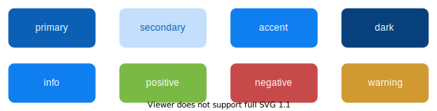

# Client ecosystem

## Events

We use the [global event bus](https://alligator.io/vuejs/global-event-bus/) provided by Quasar to exchange events between independent components in the app:
```javascript
import { Events } from 'quasar'

// Register callback on event
const myCallback = (object) => { ... }
Events.on('myEvent', myCallback)
// Unregister it
Events.off('myEvent', myCallback)
```

> The event bus is notably used to be aware of state changes in the global store (see hereafter)

## Store

A component-based system like the one offered by **KDK** has its local and global states. Each component has its local data, but the application has a global application state that can be accessed by any component of the application. This is the purpose of the **Store** singleton object: allow to get or update the global state and make any interested component aware of it in real-time through events. The available API is illustrated by this code sample:

```js
import { Store } from '@kalisio/kdk/core.client'
import { Events } from 'quasar'

const myCallback = (value, previousValue) => { ... }

Store.set('myGlobal', { ... }) // Set a root object
Store.patch('myGlobal', { property: value }) // Set a specific group of properties
Store.set('myGlobal.property', value) // Set a specific property path
Store.get('myGlobal.property', defaultValue) // defaultValue is returned if path is not found
Events.on('myGlobal-changed', myCallback) // When updating a root object
Events.on('myGlobal-property-changed', myCallback) // When updating a specific property path
```

## Context

You can define the currently active [context object](../introduction.md#context) by using either the **Context** singleton object or the [useContext](./composables.md#usecontext) composable, both actually sets it in the **Store** (`context` property). The composable will also track any change on the context business object by listening to the target service. Based on the current context, the `getService` method should return the appropriate service without the burden of providing the context as input parameter everywhere you need it:
```js
// Create a global/contextual service
api.createService('catalog')
api.createService('catalog', { context })
// Set the context as current
Context.set(context)
// Here get the contextual service
// Shortcut of api.getService('catalog', context)
api.getService('catalog')
// To get the global service even if the context is set
api.getService('catalog', 'global')
// Clear the current context
Context.set(null)
// Here get the global service
api.getService('catalog')
```

## Guards

[Navigation guards](https://router.vuejs.org/guide/advanced/navigation-guards.html) control access to [routes](https://quasar.dev/layout/routing-with-layouts-and-pages/) within an application. They allow you to define navigation rules in your app based on the user's status (authenticated or not), permissions, and route definitions.

The **KDK** provides you with some built-in before guards and a mecanism to register your own ones, more details can be found in our [application template](https://kalisio.github.io/skeleton/guides/howtos/guards.html).

## Storage

The **Storage** singleton provides you with high level functions to upload and download files using the [Storage service](./services.md#storage-service).

## Exporter

Like the **Storage** singleton, the **Exporter** singleton provides ready-to-use functions to exploit the [import-export service](./services.md#import-export-service)

This singleton exposes an `export` method which allows you to create an export. The interface is roughly similar to that exposed by the [create](https://github.com/kalisio/feathers-import-export#export-data-params) method of the library [feathers-import-export](https://github.com/kalisio/feathers-import-export). The difference is that this interface allows you to offer different formats and provide a transformation according the format.

Moreover; it allows to uniquely identify the generated files. Indeed, the **Exporter** automatically timestamps the generated files. The generated filename is computed using a `basename` property, or the `service` name if `basename` is not define. To this basename, it adds the time and the format as the file extension such as the following specification: `<basename|vervice>_<YYYY-MM-DDTHH-MM-SS:ssSZ>.<format>`

The following configuration allows you to export data from the `documents` service in 2 formats: `csv` and `json`. The transformation associated with the chosen format will then be used to call the service.

```js
service: 'documents',
  basename: 'my-documents',
  formats: [
    { label: 'CSV', value: 'csv' },
    { label: 'JSON', value: 'json' }
  ],
  transform: {
    csv: {
      mapping: {
        'icon.name' : 'iconName',
        'icon.color' : 'iconColor'
      },
      omit: [ '_id', 'icon' ]
    },
    json: {
      omit: [ '_id' ]
    }
  },
  gzip: false
```

Assuming, the use has selected the `csv` format, the generated file will be named `my-documents_YYYY-MM-DDTHH-MM-SS:ssSZ.csv`.

## Configurations

The **Configurations** singleton provides you with high level functions to manage objects through the [Configurations service](./services.md#configurations-service). As the configuration objects are usually not updated often but can be read a lot of times by an application a cache is used to avoid too much requests:
```js
// Read a configuration object value from service or cache
const options = Configurations.getValue('appConfig')
// Change configuration options
options.xxx = yyy
// Update a configuration object value
Configurations.update('appConfig', options)
```

## Theme

The **KDK** offers a simple way of theming your application. The application theme is strongly linked with the [Quasar's brand color](https://quasar.dev/style/color-palette#brand-colors) approach. It strongly relies on using a predefined color schema composed of 8 colors:



You can customize these color schema **statically** and **dynamically**.

* **statically** within the `css/quasar.variables.styl`:

```css
$primary    = #bf360c
$secondary  ?= lighten($primary, 75%)
$accent     ?= lighten($primary, 25%)
$dark       ?= darken($primary, 25%)
$info       = $accent
$positive   = #7bb946
$negative   = #c74a4a
$warning    = #d09931
```

* **dynamically** using the **Theme** singleton:

```js
import { Theme } from '@kalisio/kdk/core.client'
const myTheme = {
  primary: '#afb42b',
  secondary: '#bf360c'
  accent: '#e4e65e',
  dark: '#7c8500'
  // the orther colors will be defined according the quasar.varaibles.styl values
}
// Apply my theme
Theme.apply(myTheme)
// Restore the default colors defined in quasar.varaibles.styl
Theme.restore()
```

Even if you can specify four different colors, the **KDK** let you specify the `primary` color only and will compute the other colors according the following rules:

| Color | Rule |
|---|---|
| `secondary` | lighten the `primary` by 75% |
| `accent` | lighten the `primary` by 250% |
| `secondary` | darken the `primary` by 25% |
| `info` | equal to `accent` |
| `positive` | equal to `#7bb946` |
| `negative` | equal to `#c74a4a` |
| `warning` | equal to `#d09931` |

It provides a convenient way to change the theme of the application using just one color.

::: tip
Applications might also make possible to setup the theme object from the frontend [configuration](../../guides/basics/step-by-step.md#configuring-a-kapp)
:::