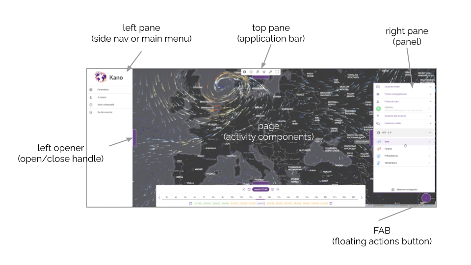
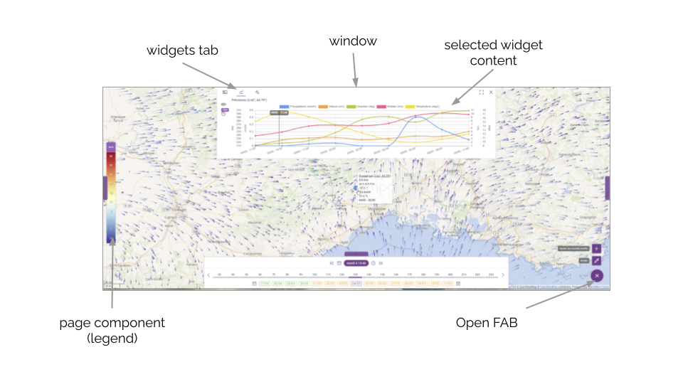
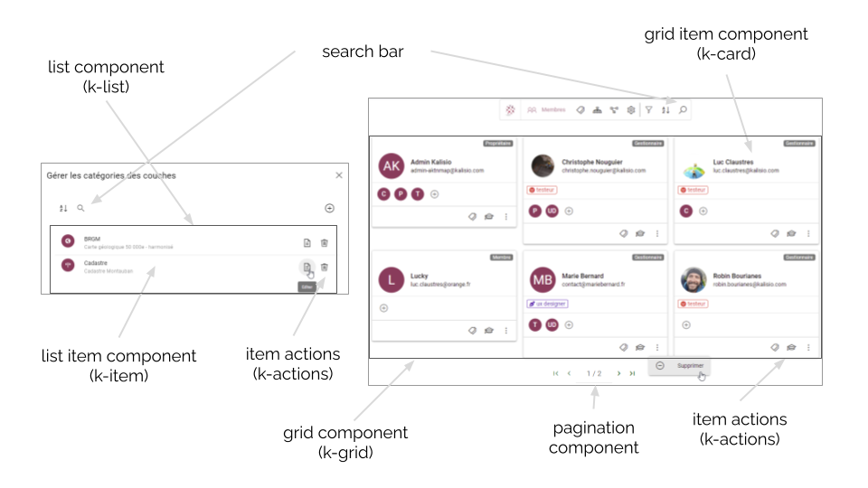
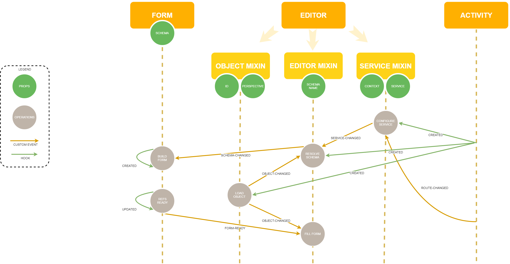

# Components

## Activity

An **activity** is the entry point used in applications for interacting with the user using business specific components. It usually represents a single screen with a user interface. For example, an email app might have one activity that shows a list of new emails, another activity to compose an email, and another activity for reading emails. Although the activities work together to form a cohesive user experience in the email app, each one is independent of the others as much as possible. As such, you should be able to start any one of these activities within the application or from an external application by activating a given [route](https://router.vuejs.org/) (i.e. link/URL).

There is no generic activity component within the core module because activities are usually business/domain-specific components (you might find a lot of them in others modules or in applications). However, it facilitates the interactions between activities and application as you will see hereafter.

## Layout

The basic application layout relies on [Material Design](https://material.io/) and is composed of a *page* with different *panes* that can de open/closed on-demand, as illustred in our [Kano](https://github.com/kalisio/kano) application:



Here is the layout in a different configuration to show additional components like the *window* composed of different *widgets* to be selected using a *tab* and the *FAB* (floating actions button):



The layout is flexible enough to only use part of it like e.g. the [Kalisio Crisis](https://github.com/kalisio/crisis) application is not a map-centered UI and the bottom/right panes are not always used for instance. Althought it can be built programmatically it aims at being constructed from the [application configuration](../../guides/basics/step-by-step.md#frontend-side) as well.

The **k-layout** component based on [QLayout](https://quasar.dev/layout/layout) contains the elements that wrap application's content:
* **header**: page header based on [q-header](https://quasar.dev/layout/header-and-footer)
* **footer**: page footer based on [q-footer](https://quasar.dev/layout/header-and-footer)
* **page**: activity components are injected using [nested routes and lazy-loading](https://quasar.dev/layout/routing-with-layouts-and-pages)

The embedded content of the page (i.e. the **Activity**) is a [router-view](https://router.vuejs.org/api/#router-view) pointing to a **KPage** component, which consists of a:
* **top pane**: a panel shown on top of the page - usually used as an application bar
* **left pane** : a left side navigation panel - usually used as a main menu
* **right pane** : a right side panel - usually used as an additional contextual panel
* **bottom pane**: a panel shown at the bottom of the page
* **fab**: an action button based on a [Quasar Floating Action Button](https://quasar.dev/layout/floating-action-button) at the bottom right corner of the page
* **page content**: additional page components to be dynamically injected into the activity
* **window**: a top window, which can be maximized, composed of a set of widgets to provide additional graphical content

::: tip
The application layout is usually wrapped using the **k-home** component that simply load it depending on the authentication state of the user. You can directly use the **k-layout** if you'd like.
:::

Some layout components are fixed for the entire application lifecycle, as such they read their own setup from the [application configuration](../../guides/basics/step-by-step.md#frontend-side): layout properties, header, footer.

Others components are more dynamic and support to be updated depending on the current activity of the user: panes, window, FAB. In this case the configuration is read from the [global store](./application.md#store) and any change watched to keep the components in sync. The [initial state](./README.md#store-objects) of the store can be fed from the [application configuration](../../guides/basics/step-by-step.md#frontend-side) as well. In this case, a [binding](./README.md#layout) will occur at runtime between the configured content and the target Vue component (i.e. activity or item objects). The default behaviour is to read the configured content of the activity named `my-activity` from the `myActivity` (camel case) property in the application configuration.

::: tip
The best thing to do to learn how to configure your application is to have a look to the config files of our production applications like [Kalisio Crisis](https://github.com/kalisio/crisis/blob/master/config/default.js) and [Kano](https://github.com/kalisio/kano/blob/master/config/default.js)
:::

In order to provide a consistent look & feel as much as possible, components or user actions (i.e. buttons) in the window, FAB and the different panes are created through the following base components:
* **k-action**: action button with different rendering mode depending on the context (`button`, `form-button`, `item`, `fab`, `fab-action`, etc.)
* **k-content**: a list of [dynamic components](https://v3.vuejs.org/guide/component-basics.html#dynamic-components) which default to create **k-action** components from configured properties as a default behaviour
* **k-panel**: a row/column of stacked **k-content** components (depending on the `horizontal` or `vertical` value of the `direction` property)

## Collections

Most activities are used to list, search, edit (i.e. update) and remove data model items. To avoid a lot of boilerplate code the KDK provides you with built-in components to manage item collections either as list or grid as shown below:



### List

The **k-list** component is powered by [Quasar lists](https://quasar.dev/vue-components/list-and-list-items) and [Quasar pagination](https://quasar.dev/vue-components/pagination). It also relies on the [service](./mixins.md#service) and [collection](./mixins.md#collection) mixins to manage its internal behaviour.

The following properties can be used to customize it:
* **renderer**:
  * **component**: the component to be used to render items (defaults to `collection/KItem`)
  * **options**: options of the rendrer,
  * **props**: properties to be bound to the item components
* **baseQuery**: the base query to be used when retrieving items from the target service
* **filterQuery**: the additional query parameters to be used to filter items according to current search criteria
* **listStrategy**: the update strategy used under the hood by [feathers-reactive](https://github.com/feathersjs-ecosystem/feathers-reactive)

The default **KItem** component is powered by the [base item mixin](./mixins.md#base-item) and provides you with the following properties:
* **item**: the object to be displayed
* **itemActions**: the list of actions available on the object, each action been described as
  * **label**: action label in the action menu
  * **route**: route to be pushed when action is triggerred
  * **handler**: function to be called when action is triggerred
* **options**: 
  * **icon**: icon to be used
  * **color**: icon color to be used
  * **avatar**: avatar image to be used
  * **nameField**: the name or path of the property used to retrieve the displayed name on the object, defaults to `name`
  * **descriptionField**: the name or path of the property used to retrieve the displayed description on the object, defaults to `description`
  
The default **KItem** component also provides you with the following slots will you need more customisation:
* `item-icon` or `item-avatar` to override icon or avatar section
* `item-content` to override content section
* `item-label` and `item-sublabel` to override labels section
* `item-actions` to override actions section

### Grid

The **k-grid** component is powered by [Flex](https://quasar.dev/layout/grid/introduction-to-flexbox), [Quasar cards](https://quasar.dev/vue-components/card) and [Quasar pagination](https://quasar.dev/vue-components/pagination). It also relies on the [service](./mixins.md#service) and [collection](./mixins.md#collection) mixins to manage its internal behaviour.

The same properties as with the **k-list** component can be used to customize it, the component to be used to render items defaults to `collection/KCard`.

The default **k-card** component is powered by the [base item mixin](./mixins.md#base-item) and provides you with the same properties as the **KItem** component but available slots are the following:
* `card-title` to override title section
* `card-icon` to override icon section
* `card-tags` to override tags section
* `card-content` to override content section
* `card-actions` to override actions section

However options of the **itemActions** are more complex:
* **pane**: the list of actions displayed in the pane, each action been described as
  * **name**: unique action name/ID
  * **icon**: action icon
  * **label**: action label in the action menu
  * **route**: route to be pushed when action is triggerred
  * **handler**: function to be called when action is triggerred
* **menu**: the list of actions displayed in the menu, each action been described as above

### Table

The **k-table** component is powered by [Quasar lists](https://quasar.dev/vue-components/list-and-list-items) and [Quasar pagination](https://quasar.dev/vue-components/pagination). It also relies on the [service](./mixins.md#service) and [collection](./mixins.md#collection) mixins to manage its internal behaviour.

The same properties as with the **k-grid** component can be used to customize it. There is no specific component to be used to render items as it relies on the rows of the table. As a consequence, the `item-actions` property has to be directly set on the **k-table** component.


## [Items](./components/items.md)

## Forms 

The **k-form** is a generic form component capable of building HTML forms from of a [JSON schema](https://json-schema.org/). Moreover **k-form** validates that the data is conformed to the schema using [AJV validator](https://github.com/epoberezkin/ajv). 

A schema must have the following convention:
* a `$schema` property specifying the version of the schema
* a `$id` property specifying the id of the schema. It is mainly used by **AJV** to cache the schema.
* a `title` property specifying the title of the form. It is used by the **Editors**.
* a `description` property providing a brief description of the usage of the schema
* a `type` which must be `object`
* a `properties` property which define the list of the fields of the form. To each object is assigned a field. The name of the field is the name of the object and the properties are used to provide the characteristics of the field. A `field` sub-object provides the UI characteristic to assign to the field: the component to be used for the rendering as well as the properties to apply to this component.
* `required` property to define the required fields. You must specify the name of the fields.

As an example, here is a schema defining a basic form asking for an `email` and a `password`:

```json
{
  "$schema": "http://json-schema.org/draft-07/schema#",
  "$id": "A unique identifier",
  "title": "The title of the schema", 
  "description": "A description of the schema", 
  "type": "object",
  "properties": {
     "email": {
      "type": "string",
      "format": "email",
      "field": {
        "component": "form/KTextEmail",
        "label": "schemas.EMAIL_FIELD_LABEL"
      }
    }
    "password": {
      "type": "string", 
      "format": "password"
      "field": {
        "component": "form/KTextPassword",
        "label": "schemas.PASSWORD_FIELD_LABEL"
      }
    }
  },
  "required": ["name", "password"]
}
```

The **KDK** comes with a set of built-in fields:
* **k-attachment-field**: an input used to upload a document
* **k-chips-field**: a basic chips input based on Quasar [Select input](https://quasar.dev/vue-components/select)
* **k-chips-with-icon-field**: extends the previous chips input in 
* **k-datetime-field**: a Quasar [Date input](https://quasar.dev/vue-components/date) and [Time input](https://quasar.dev/vue-components/time)
* **k-email-field**: a Quasar [Text input](https://quasar.dev/vue-components/input) of type of `email`
* **k-icon-field**: an input that allows you to select an icon and to assign it a color among. The list of icons is provided by [FontAwesome](https://fontawesome.com/icons?d=gallery)
* **KItem-field**: an input that allows you to select one or multiple items from one service or many services.
* **k-number-field**: a Quasar [Text input](https://quasar.dev/vue-components/input) of type of `number`
* **k-options-field**: a Quasar [Options group input](https://quasar.dev/vue-components/option-group)
* **k-phone-field**: a Quasar [Text input](https://quasar.dev/vue-components/input) of type of `phone`
* **k-select-field**:  a Quasar [Select input](https://quasar.dev/vue-components/select)
* **k-tag-field**: an input that allows you to define a set of tags
* **k-textarea-field**: a Quasar [Text input](https://quasar.dev/vue-components/input) of type of `textarea`
* **k-text-field**: a Quasar [Text input](https://quasar.dev/vue-components/input) of type of `text`
* **k-toggle-field**: a Quasar [Toggle input](https://quasar.dev/vue-components/toggle)
* **k-url-field**: a Quasar [Text input](https://quasar.dev/vue-components/input) of type of `url`

You can add additional ones, for instance, the **map** submodule provides the [**k-location-field**](../map/components.md#location). You can also add your own field, when implementing it you must rely on the [base field mixin](./mixins.md#base-field). 

The properties to declare  a **k-form** are the following:
* **schema**: the schema object to be used to build the form
* **clearOnCreate**: boolean indicating if the form should be cleared on creation
* **display**: the options to be used when displaying the fields. You can specify:
  * **icon**: a boolean value to tell whether an icon has to be displayed or not in front of each field
  * **label**: a boolean value to tell whether the field label have to be displayed or not in front of each field
  * **labelWidth**: the width used to display the label. Out of 12 grid points, how much should the label take? Default is 5. Minimum is 1 and maximum is 11

::: tip
Because, the **k-form** loads dynamically the required components to build the form, it is mandatory to use use a reference to the form using the keyword `ref` and the [**refs resolver mixin**](./mixins.md#refs-resolver) to wait for the components to be loaded before applying any methods.
:::

The **k-form** components exhibits the following methods:
* **getField(name)** get a field component by its name
* **build()** dynamically build the required field components and internal validator
* **fill(values)** fill the form with given object values
* **clear()** clear the form back to default values
* **validate()** validate the form
* **apply(object)** call **apply()** on all field components
* **submitted(object)** call **submitted()** on all field components

::: tip
If the **schema** props is defined on creation the form will automatically build itself and emit the `form-ready` event.
:::

## Editors

The **Editors** are built-in editors that allow you to create/edit an object/perspective using a **k-form**. Thus we distinguish the following modes:
* the `create` mode allows you to create a new object
* the `update` mode allows you to edit an existing object or a perspective. In that case you must provide to the **editor** the **object id** of the object to edit and the **perspective name** if wanted.

The **KDK** comes with 2 types of editor:
* the **k-editor** which is rendered within the parent container
* the **k-modal-editor** which is rendered within a modal widget

Both components depend on different [mixins](./mixins.md) according to the following lifecycle:



### k-editor

The following example shows how to edit the **profile** perspective of a user (service **users**):

```html
<k-editor service="users" :objectId="objectId" perspective="profile"/>
```

The properties to declare a **k-editor** are the following:
* **objectId**: the Id of the object to edit. If not defined, the editor is in the `create` mode
* **perspective**: the perspective of the object to edit
* **schemaName**: the name of the schema to be used to build the corresponding **k-form**. If you do not provide any name, the **editors** will search for a schema with the name:
  * in `create` mode: `<service>-create.json`
  * in `update` mode: `<service>-update.json`
* **baseObject**: an default object to be used to keep track of existing additional properties to the ones edited through the form 
* **baseQuery**: a query to be executed to customize the access to the service
* **clearButton**: the label of the clear button. When clearing the editor, all the fields are emptied. By default the property is empty and the button is not rendered.
* **resetButton**: the label of the reset button. When resetting the editor, the form is filled with the default object. By default the property is empty and the button is not rendered.

::: warning
Schemas are usually stored in a specific folder and you must have tell **Webpack** to look in this folder when searching for a schema.
::: 

### k-modal-editor

There are 2 ways to use the **k-modal-editor**:
* by declaring the **k-modal-editor** directly in the parent component. Check out the code example [here](https://github.com/kalisio/kdk/blob/master/core/client/components/KOrganisationsPanel.vue)
* by declaring a route using the the **KModalEditor**. In this case you must:
  * in the template section, define a `router-view` with the following properties:
    *  the targeted `service`
  
```html
<div>
  ....
  <router-view service="groups"></router-view>
</div>
```
  
```js
  router () {
    return {
      onApply: { name: 'groups-activity', params: { contextId: this.contextId } },
      onDismiss: { name: 'groups-activity', params: { contextId: this.contextId } }
    }
  }
```

  *  define a function that trigger the navigation to the editor route, usually an action within an activity:

```js
 this.registerFabAction({
    name: 'create-group',
    label: this.$t('KGroupsActivity.CREATE_GROUP_LABEL'),
    icon: 'add',
    route: { name: 'create-group', params: { contextId: this.contextId } }
  })
```

  *  define the corresponding route with:
     * the `name` of the route
     * the `component` property set to **editor/KModalEditor** 
     * the `props` property set to to `true`

```js
'groups': {
  name: 'groups-activity',
  component: 'KGroupsActivity',
  props: true,
  children: {
  'create': { name: 'create-group', component: 'editor/KModalEditor', props: true },
  'edit/:objectId': { name: 'edit-group', component: 'editor/KModalEditor', props: true }
}
```

The properties to declare a **k-modal-editor** are identical to those of the **k-modal-editor** plus: 
 * **router**: the router function to be triggered when the editor is getting closed. 

## Basics

### Chip

The `KChip` component extends Quasar’s QChip, adding full support for HTML colors and an automatic tooltip for truncated text. It maintains the core functionality of [QChip](https://quasar.dev/vue-components/chip/) while improving color flexibility and usability: 
- Unlike `QChip`, which primarily supports Quasar’s predefined color classes, `KChip` allows any valid HTML color
- The `label` prop is automatically translated
- It detects whether the label text is truncated inside the chip and automatically displays a tooltip to show the full text if needed

**
## Graphics

### Shapes

The **KDK** provide a convenient component to render an **SVG** shape using the [KShape](https://github.com/kalisio/kdk/blob/master/core/client/components/media/KShape.vue) component.
Under the hood it relies on the [createShape](https://github.com/kalisio/kdk/blob/master/core/client/utils/utils.shapes.js#L134) function and requires an objet conforming to the following specification:

```js
{
  shape: 'circle', // represent a registered SVG shape
  size: ['24px', '24px'], // array of HTML sizes
  radius: undefined,  // alternative to the size property.
  color: 'black', // any HTML color or [Quasar color](https://quasar.dev/style/color-palette/)
  opacity: 1.0, // range from 0.0 (transparent) to 1.0 (opaque)
  stroke: { 
      color: 'black', // any HTML color or [Quasar color](https://quasar.dev/style/color-palette/)
      width: 1, // any positive value
      opacity: 1.0, // range from 0.0 (transparent) to 1.0 (opaque)
      cap: 'round', // https://developer.mozilla.org/en-US/docs/Web/SVG/Attribute/stroke-linecap
      join: 'round', // https://developer.mozilla.org/en-US/docs/Web/SVG/Attribute/stroke-linejoin
      dashArray: 'none', // https://developer.mozilla.org/en-US/docs/Web/SVG/Attribute/stroke-dasharray
      dashOffset: 0 // https://developer.mozilla.org/en-US/docs/Web/SVG/Attribute/stroke-dashoffset
  },
  icon: {
    classes: undefined // must be specified, e.g 'las la-home'
    url: '' // url to the image to be displayed. Alternative to the classes property
    color: 'black', // any HTML color or [Quasar color](https://quasar.dev/style/color-palette/)
    opacity: 1.0, // range from 0.0 (transparent) to 1.0 (opaque)
    size: '14px', // any HTML size
    translation: ['-50%', '-50%'], // translation to apply to render the icon relative to the shape
    rotation: 0 // rotation to apply to render the icon relative to the shape
  },
  text: {
    label: undefined, // text to be displayed
    color: 'black', // any HTML color or [Quasar color](https://quasar.dev/style/color-palette/)
    size: '12px', // any HTML size
    translation: ['-50%', '-50%'], // translation to apply to render the text relative to the shape
    rotation: 0, // rotation to apply to render the text relative to the shape
    extraStyle: 'background-color: #1A1A1A' // additional CSS to be applied to text
  },
  extraStyle: 'transform: translate(50%, 0%)', // additional CSS to be applied to the whole element (ie shape, icon and text)
  html: null // an HTML element to be rendered
}
```
The **KDK** comes with a set of predefined marker shapes: `circle`, `rect`, `rounded-rect`, `diamond`, `triangle`, `triangle-down`, `triangle-left`, `triangle-right`, `star`, `marker-pin`, `square-pin`. But it allows you to register you own shape. For that, you have to define the shape such as below:

```js
Shapes['my-shape'] = {
  content: // the SVG path of the shape (required)
  viewBox: // the bounding box of the path (required)
  icon: {
    translation: // the default translation to apply to render the icon. Default value is ['-50%', '-50%'] (optional)
  },
  text: {
    translation: // the default translation to apply to render the text. Default value is ['-50%', '-50%'] (optional)
  },
  anchor: 'bottom-center', // the anchor of the shape. Default value is `center-center` (optional)
  radiusToSize: (r) => { return ...  }, // a function to compute the size according a radius. Default function returns the double of the radius (optional)
  extraStyle: 'background-color: #1A1A1A', // additional CSS to be applied to the shape (optional)
},
```

::: tip Tip
Checkout the [Miscellaneous activity](https://kapp.dev.kalisio.xyz/#/home/miscellaneous) to see examples.
:::

### Color scales

The [KColorScale](https://github.com/kalisio/kdk/blob/master/core/client/components/media/KColorScale.vue) component helps to render [Chroma color scales](https://gka.github.io/chroma.js/#color-scales).
You can provide the `scale`, `domain` and `classes` properties and also a `label` as well as a `direction` (vertical or horizontal).

::: tip Tip
Checkout the [Miscellaneous activity](https://kapp.dev.kalisio.xyz/#/home/miscellaneous) to see examples.
:::

### Chart

The **KDK** provides a helper component that allows rendering charts based on  [chart.js](https://www.chartjs.org/). 

In addition and only if needed, it uses [chroma.js](https://gka.github.io/chroma.js/) to provide the `backgoundColor` array in order to render the different datasets of the chart. You can provide the color scale of your choice by setting the `scaleColor` property on each datasets. 

Checkout the [ChartActivity](https://github.com/kalisio/kApp/blob/master/src/components/ChartActivity.vue) to understand how it works.

::: tip Tip
Have a look at the [choma color scales](https://gka.github.io/chroma.js/#color-scales) to see how to define your color scale.
:::

## User Account

The KDK provides you with a default [activity](./components.md#activity) to manage user accounts in the [account folder](https://github.com/kalisio/kdk/tree/master/core/client/components/account):
* an "identity panel" to edit profile information
* a "danger zone" for account removal
* a "security zone" for password and email change
