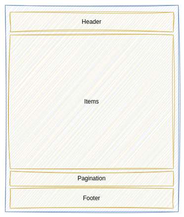
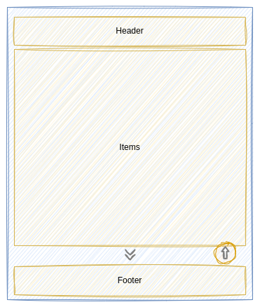
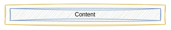
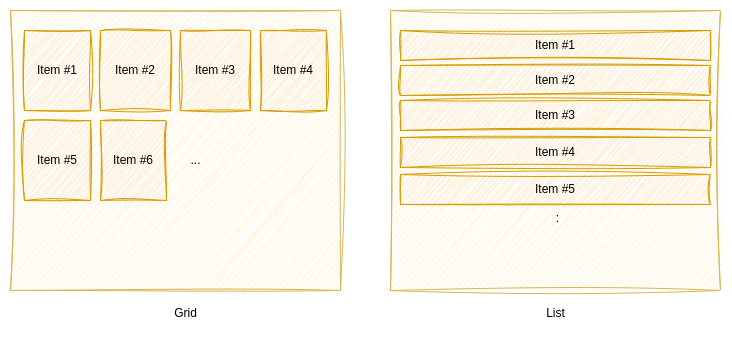

# Collections

**Collections** are specialized components used to render collection of objects. 

The **KDK** provides a set of pre-built **Collections** components. These components are based on the [useCollection](../composables.md#usecollection) composable which can also be used to develop your own **Collection** components.

## Pre-built Collections

### KGrid

The **KGrid** component provides two different ways to render a collection: using _pagination_ or _infinite scroll_.

* `pagination` mode

  

  The items are rendered page per page and the **Pagination** part enables the user to navigate though the pages. It is implemented using the **Quasar** [Pagination](https://quasar.dev/vue-components/pagination) component.

* `infinite scroll` mode

  

  The items are rendered as long as the user scroll down. In that mode, two buttons are displayed :
    * a **Scroll down** which is displayed as long as there are items to be loaded.
    * a **Scroll to top** which allows the user to return to the top of the page.

  ::: tip
  These buttons can be hidden if needed.
  :::

In both modes, the **KGrid** component let you provide a **Header** or **Footer** which are implemented using a **KPanel**:

Regarding the items, the **KGrid** component, rely on a **Renderer** to render an item. A **Renderer** is an abstract objet that define:
* the component used to render each item, called [Items](./items.md) component
* the _props_ to be applied to the **Item** component
* the _layout_ to be used to render the items. By default, the items are rendered using a **Grid** layout. But you can easily define the layout you desire using **Quasar** [responsive classes](https://quasar.dev/layout/grid/row#responsive-classes). For example, assigning the `class="col-12"` to the renderer allows you to display the items as a **List**.

  

### KTable

_TODO_

### KTimeLine

_TODO_

## Custom Collections