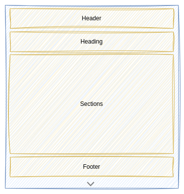
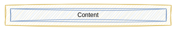
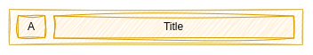
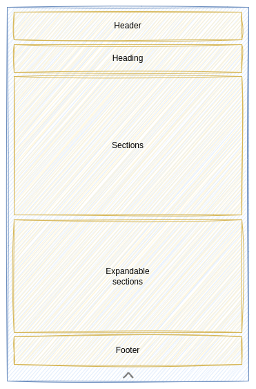
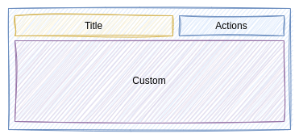

# Items

**Items** are specialized components used to render elements within a [Collection](./collections.md).

The **KDK** provides a set of pre-built **Items** components that can be used directly or serve as a foundation for developing your own custom items.

## Pre-built Items

### KItem

_TODO_

### KCard

A **KCard** display the item information using a **card**. The **KCard** is divided into multiple parts:

* both **Header** and **Footer** parts are implemented using a **KPanel**. That means you car provide any **Content** you want.

  

* the **Heading** part displays data into two areas:

  

  * a **Title** extracted from a `name` property
  * an **Avatar** using the initials of the title

* the **Sections** part is implemented using 2 **KPanel**. One panel to display the _visible_ sections, and a second panel to display _expandable_ sections. Depending on whether you provide _expandable_ sections or not, an **expand** button is displayed to expand or to reduce the card.

  

A section is typically implemented using the **KCardSection** component as its base. A **KCardSection** follows the schema below:

* the **Title** of the section
* the **Actions** assigned to the section and implemented using a **KPanel**
* the **Custom** part you need to implement.

## Custom Items

_TODO_
