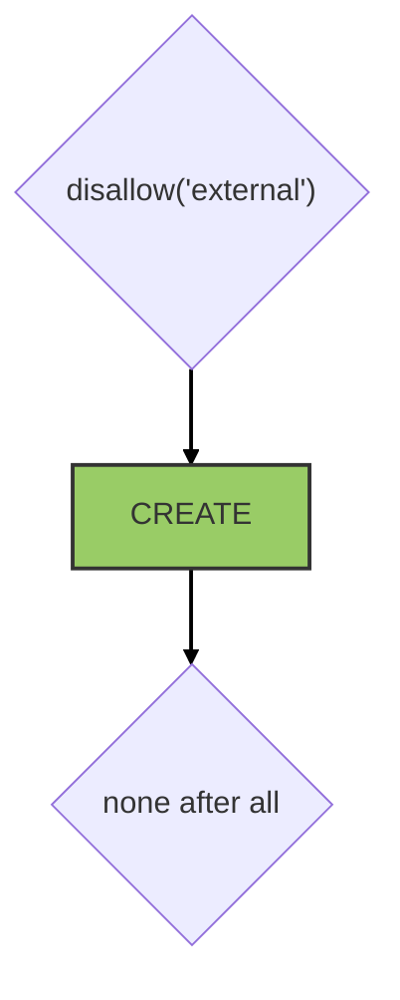
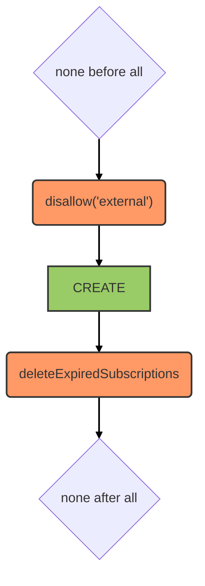
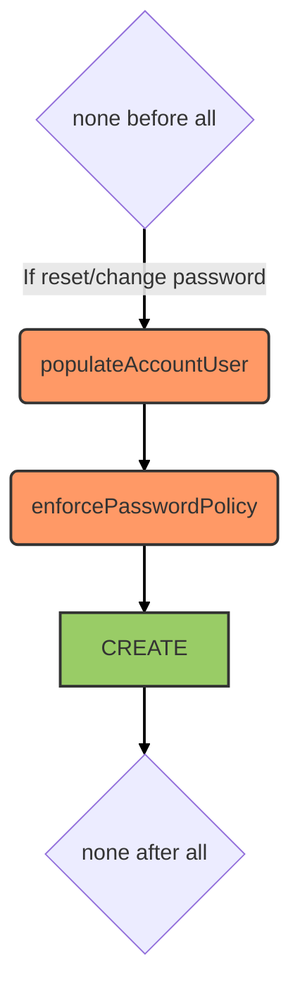
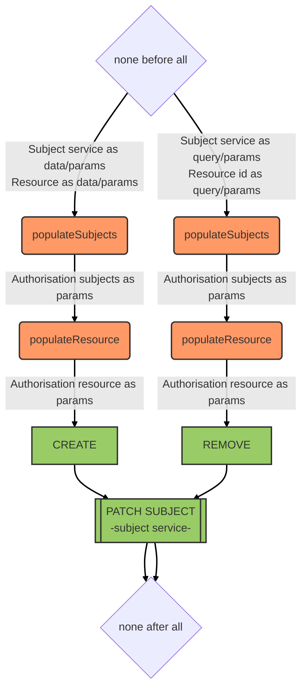
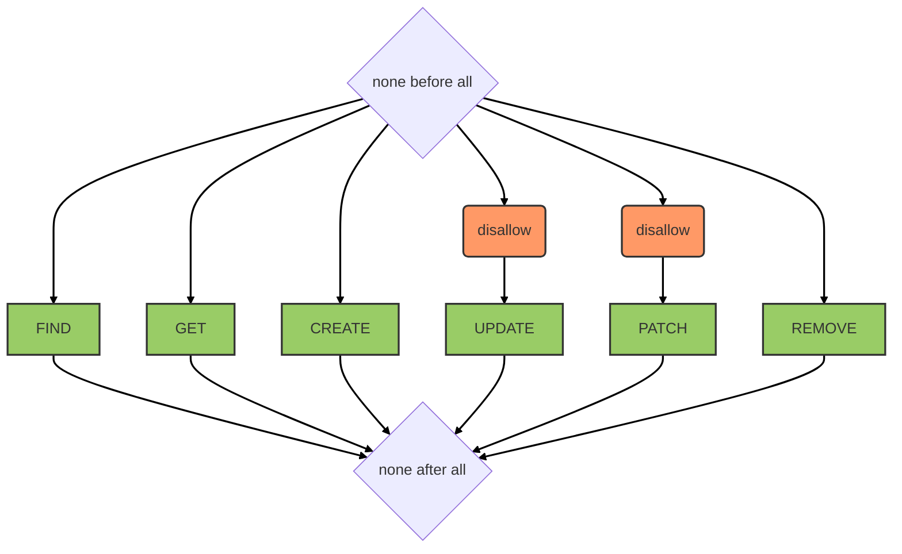
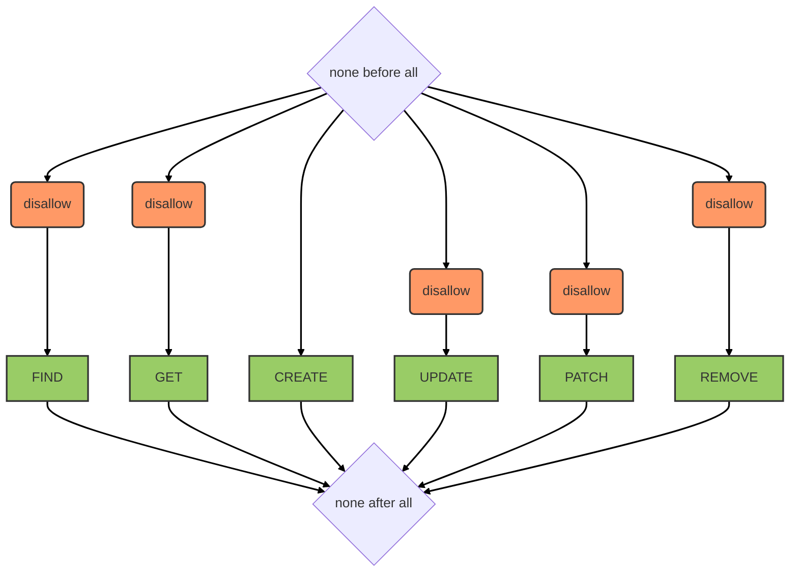
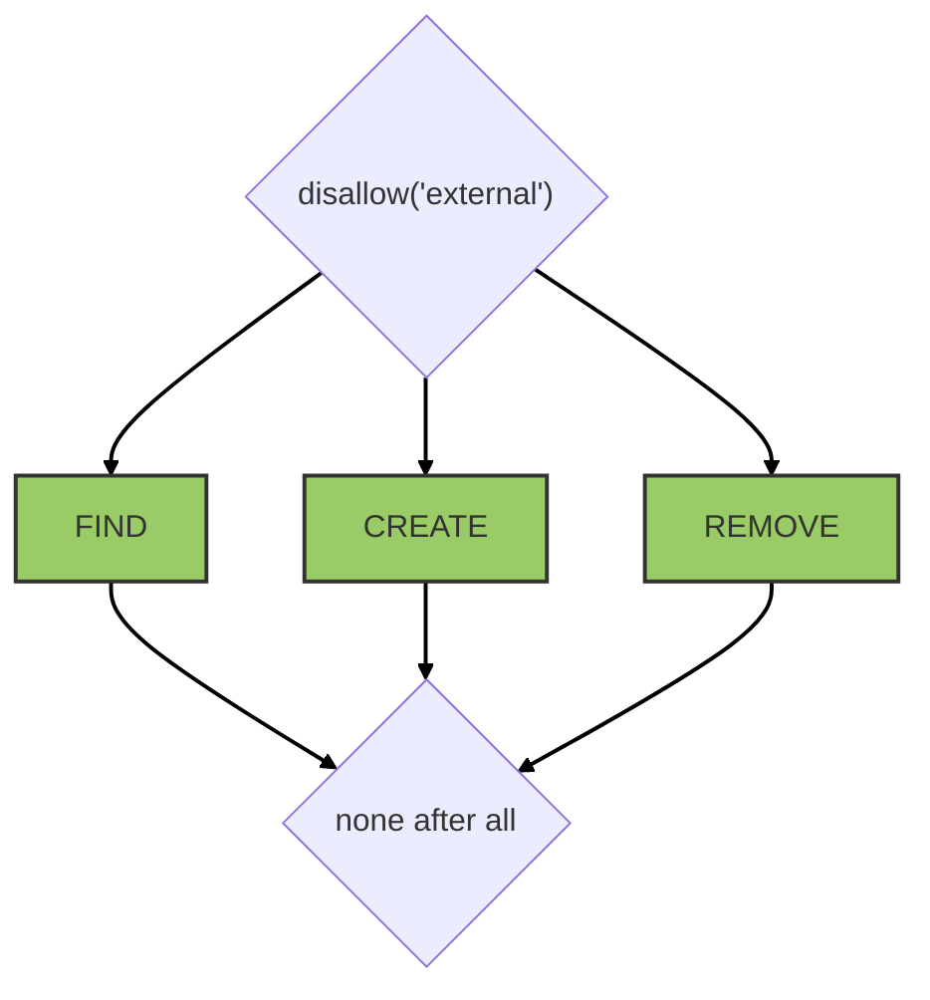

# Services

## Users service

::: tip
Available as a global service
:::

### Data model

The data model of a user as used by the API is [detailed here](../../architecture/data-model-view.md#user-data-model).

### Hooks

The following [hooks](./hooks.md) are executed on the `users` service:

```mermaid
graph TB
  beforeAll{none before all}
  afterAll{after all}
  afterAll --> hook1("discard('passwords')")
  hook1 -- Email/Name extracted from profile --> hook2("serialize('profile')")
  beforeAll --> FIND[FIND]
  FIND --> afterAll
  beforeAll --> GET[GET]
  GET --> afterAll
  beforeAll --> hook4("serialize('profile')")
  hook4 -- Email/Name set in profile --> hook5("serialize('clearPassword')")
  hook5 -- Clear password saved --> hook6("hashPassword")
  hook6 -- Password hashed --> hook7("enforcePasswordPolicy")
  hook7 -- Clear password validated --> hook8("discard('clearPassword')")
  hook8 -- Clear password removed --> CREATE[CREATE]
  CREATE --> hook9(updateAbilities)
  hook9 -- Abilities initialized in cache --> afterAll
  beforeAll --> hook10(populatePreviousObject)
  hook10 -- Previous user as params --> hook11(storePreviousPassword)
  hook11 -- Previous password list updated --> UPDATE[UPDATE]
  UPDATE --> afterAll
  beforeAll --> hook12(populatePreviousObject)
  hook12 -- Previous user as params --> hook13(storePreviousPassword)
  hook13 -- Previous password list updated --> PATCH[PATCH]
  PATCH --> hook3(sendNewSubscriptionEmail)
  hook3 --> Email sent if new subscription --> afterAll
  beforeAll --> REMOVE[REMOVE]
  REMOVE --> afterAll
  linkStyle default stroke-width:2px,fill:none,stroke:black
  classDef hookClass fill:#f96,stroke:#333,stroke-width:2px
  class hook1,hook2,hook3,hook4,hook5,hook6,hook7,hook8,hook9,hook10,hook11,hook12,hook13 hookClass
  classDef operationClass fill:#9c6,stroke:#333,stroke-width:2px
  class FIND,GET,CREATE,UPDATE,PATCH,REMOVE operationClass
```

## Mailer service

::: tip
Available as a global service
:::

This service is powered by [feathers-mailer](https://github.com/feathersjs-ecosystem/feathers-mailer). It acts as a proxy to send emails through an SMTP server.

::: warning
Service methods are only allowed from the server side. `create` is the sole available method used to send an email.
:::

::: warning DEPRECATION NOTICE
The email account can authorise connection by email/password on [https://myaccount.google.com/lesssecureapps](https://myaccount.google.com/lesssecureapps). Before that the domain admin should allow him to manage this setting (*Admin Console > Security > General > Less secure apps settings*). To avoid changing it for all users first create a group, add the user to the group and let the group manage less secure apps setting.
:::

On 15 february 2021 Gmail API requires OAuth2 authentication to send emails. The simplest solution is to create a [service account](https://medium.com/@imre_7961/nodemailer-with-g-suite-oauth2-4c86049f778a) and to [delegate the domain-wide authority to the service account](https://developers.google.com/identity/protocols/oauth2/service-account) with scope `https://mail.google.com`.

### Hooks

The following [hooks](./hooks.md) are executed on the `databases` service:



## Push service

This service is powered by [feathers-webpush](https://github.com/kalisio/feathers-webpush).

::: tip
Available as a global service
:::

::: warning
Service methods are only allowed from the server side. `create` is the sole available method used to send a notification.
:::

### Data model

Subscription and notification data model is provided by [feathers-webpush](https://github.com/kalisio/feathers-webpush).

### Hooks

The following [hooks](./hooks.md) are executed on the `push` service:



## Account service

::: tip
Available as a global service
:::

This service is powered by [feathers-authentication-management](https://github.com/feathersjs-ecosystem/feathers-authentication-management).

### Data model

This service consists in associating verification tokens to users so that they can safely reset their password or change their email, please refer to [feathers-authentication-management docs](https://github.com/feathersjs-ecosystem/feathers-authentication-management).

### Hooks

The following [hooks](./hooks.md) are executed on the `account` service:



### Testing

To make test run we need two gmail accounts:
* `email-notifications@kalisio.com` used as email sender
* `test@kalisio.com` used as user test email

> When testing identity change we also use the `test@kalisio.xyz` address as user test email. However to avoid creating a new account in Google you can simply add an alias for this address to the `test@kalisio.com` account.

The first email account is used by the [mailer service](./services.md#mailer-service) to send email notifications. The second email account requires OAuth2 authentication to be able to read emails using the GMail API. The simplest way is by creating a service account for a JWT-based authentication. Interesting issue to make all the configuration work can be found [here](https://stackoverflow.com/a/29328258), notably you have to delegate domain-wide authority to the service account in order to authorize your app to access user data on behalf of users and authorise the client ID of the service account with scopes `https://mail.google.com/,https://www.googleapis.com/auth/gmail.readonly`.

Standard OAuth2 with refresh token might also be used as detailed [here](https://medium.com/@pandeysoni/nodemailer-service-in-node-js-using-smtp-and-xoauth2-7c638a39a37e) and [here](https://medium.com/@pandeysoni/nodemailer-service-in-node-js-using-smtp-and-xoauth2-7c638a39a37e).

Details on how to use Google APIs from Node.js [here](https://github.com/google/google-api-nodejs-client#authorizing-and-authenticating).

> Some anti-virus or firewalls softwares intercept HTTPS traffic, decrypting it, and then encrypting it using a self-signed certificate causing a "*Self-Signed Certificate in Certificate Chain*" error. If so deactivate the SSL analysys in your software, [this might help](https://github.com/CawaMS/StorageExplorerTroubleshootingGuide/blob/master/se-troubleshooting-guide.md).


## Authorisations service

::: tip
Available as a global service
:::

::: warning
`create` and `remove` methods are the only one allowed from the client/server side
:::

### Data model

An authorisation consists in associating a *resource* object (e.g. a group) with a *subject* object (e.g. a user) according to a *permission* (i.e. a role or a right). The resource object information and the permission are directly stored on the target subject(s) in a property called the *scope* of the authorisation (e.g. `groups` to store all groups a user belongs to). 

For instance the groups a user belongs to with different roles will result in the following structure on the user:
```js
groups: [
  {
      _id: ObjectId('5f568ba1fc54a1002fe6fe37'),
      name: 'Centre de Castelnaudary',
      context: '5f55f4169f6d47002f05f4ac',
      permissions: 'owner'
      ...
  },
  {
      _id: ObjectId('5f64a3791a1714002f68437d'),
      name: 'Kalisio',
      context: '5f532d439f6d47002f04f07e',
      permissions: 'manager'
      ...
  },
  {
      _id: ObjectId('5f65e34a75b663003095f52e'),
      name: 'LTD',
      context: '5f65d98084f9d5003039b55b',
      permissions: 'member'
      ...
  }
]
```

### Hooks

The following [hooks](./hooks.md) are executed on the `authorisations` service:



## Storage service

::: tip
Available as a global and a contextual service
:::

::: warning
From the client side and even if most of the methods are available, we higly recomment to use the helper functions provide by the storage singleton.
:::

Blobs can be created directly using this service or through "attachment" to a target resource (e.g. a user).

This service relies on [feathers-s3](https://github.com/kalisio/feathers-s3)

### Data model

No data model, data are directly stored on target storage backend.

### Hooks

The following [hooks](./hooks.md) are executed on the `storage` service:



## Import-Export service

::: tip
Available as a global service
:::

::: warning
`create` methods are the only one allowed from the client side
:::

This service relies on [feathers-import-export](https://github.com/kalisio/feathers-import-export) library.

::: info
The `import-export` service instanciantes its own **S3** service to avoid mixing temporary objects with the objects you want to manage with the [Storage service](#storage-service)
:::

### Data model

No data model, data are directly stored on a storage backend (i.e. AWS S3).

### Hooks



::: tip
For performance issues, we do not recommend to install after/before hooks to trasnform the data before importing/exporting. You can install your own [transaformation functions](https://github.com/kalisio/feathers-import-export#transform-function).
:::

## Databases service

::: tip
Available as a global service
:::

This service is powered by [feathers-mongodb-management](https://github.com/feathersjs-ecosystem/feathers-mongodb-management). It acts as a proxy to perform MongoDB operations like creating databases, collections or users.

::: warning
Service methods are only allowed from the server side
:::

### Hooks

The following [hooks](./hooks.md) are executed on the `databases` service:



## Local settings service

This **client-side** service allows to restore/save persistent settings to/from the [global store](./application.md#store) from/to [local storage](https://developer.mozilla.org/en-US/docs/Web/API/Window/localStorage).

::: warning
`get` and `patch` methods are the only one allowed, `id` parameter is ignored and methods will always target the whole settings object
:::

::: warning
This service has to be instanciated at application level, none provided by default
:::

To create your own service use the following code:
```js
import { Store, LocalSettingsService } from '@kalisio/kdk/core.client'

// Setup defaults in global store
Store.set('app-settings', { x: y, ... })
// Create a service targeting only settings in store
const settingsService = api.createService('settings', {
  service: LocalSettingsService,
  propertyMapping: {
    x: 'app-settings.x',
    ...
  }
})
// Restore previous settings from local storage if any
settingsService.restoreSettings()
```

::: tip
Because settings are available through a service interface you can edit it using the [editor system](./components.md#editors). The `propertyMapping` will be used to match form field names and corresponding global store properties.
:::

For instance the following schema can be used to edit the previous sample:
```json
{
  "$schema": "http://json-schema.org/draft-07/schema#",
  "$id": "http://www.kalisio.xyz/schemas/settings.update.json#",
  "title": "schemas.UPDATE_SETTINGS_TITLE",
  "type": "object",
  "properties": {
    "x": {
      "type": "string", 
      "field": {
        "component": "form/KTextField",
        "helper": "schemas.X_FIELD_LABEL"
      }
    }
  },
  "required": ["x"]
}

```