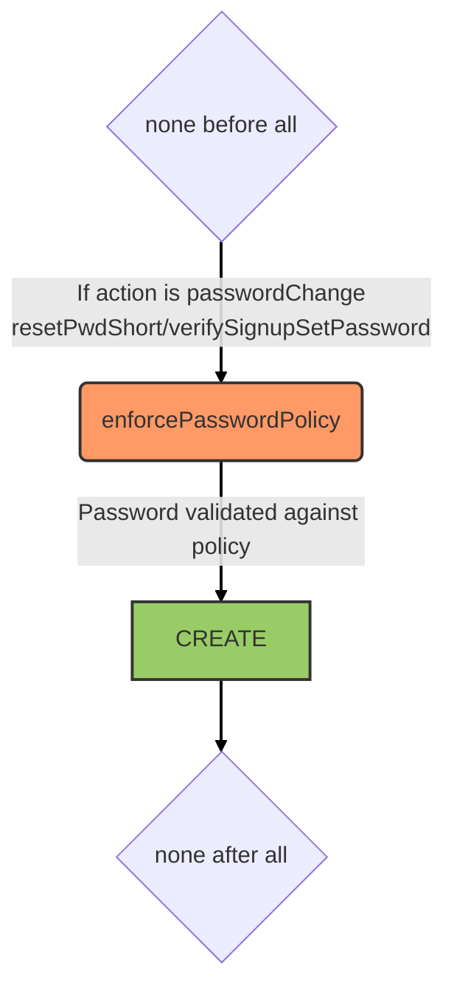

# Account service

::: tip
Available as a global service
:::

## Overview

This service is powered by [feathers-authentication-management](https://github.com/feathersjs-ecosystem/feathers-authentication-management). It handles user account verification workflows such as email verification, password reset, and identity changes. A custom `verifyEmail` method is added to trigger email verification programmatically.

A `notifier` function is registered to dispatch transactional emails (via the [mailer service](./mailer.md)) for each account management action (sign-up, password reset, email change, etc.).

## Data model

This service associates verification tokens with users to safely reset passwords or change emails. Refer to the [feathers-authentication-management docs](https://github.com/feathersjs-ecosystem/feathers-authentication-management) for the full data model.

## Hooks

The following [hooks](../hooks.md) are executed on the `account` service:

## Testing

To make tests run we need two Gmail accounts:
- `email-notifications@kalisio.com` used as email sender
- `test@kalisio.com` used as user test email

> When testing identity change we also use the `test@kalisio.xyz` address as user test email. However to avoid creating a new account in Google you can simply add an alias for this address to the `test@kalisio.com` account.

The first email account is used by the [mailer service](./mailer.md) to send email notifications. The second email account requires OAuth2 authentication to be able to read emails using the GMail API. The simplest way is by creating a service account for a JWT-based authentication. Interesting issue to make all the configuration work can be found [here](https://stackoverflow.com/a/29328258), notably you have to delegate domain-wide authority to the service account in order to authorize your app to access user data on behalf of users and authorise the client ID of the service account with scopes `https://mail.google.com/,https://www.googleapis.com/auth/gmail.readonly`.

Standard OAuth2 with refresh token might also be used as detailed [here](https://medium.com/@pandeysoni/nodemailer-service-in-node-js-using-smtp-and-xoauth2-7c638a39a37e).
