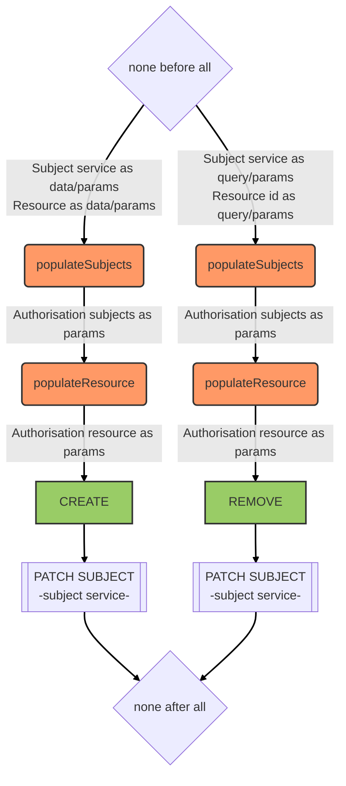

# Authorisations service

::: tip
Available as a global service
:::

::: warning
`create` and `remove` are the only methods allowed from the client or server side.
:::

## Overview

Manages role-based permissions by associating resources (e.g. groups) with subjects (e.g. users) under a given permission level. Uses an LRU cache to store computed CASL abilities per user for fast access control checks.

When an authorisation is created, the subject's scope is patched on the subject service to add the resource with its permission. When an authorisation is removed, the resource is removed from the subject's scope.

## Data model

An authorisation consists in associating a *resource* object (e.g. a group) with a *subject* object (e.g. a user) according to a *permission* (i.e. a role or a right). The resource object information and the permission are directly stored on the target subject(s) in a property called the *scope* of the authorisation (e.g. `groups` to store all groups a user belongs to).

For instance the groups a user belongs to with different roles will result in the following structure on the user:
```js
groups: [
  {
    _id: ObjectId('5f568ba1fc54a1002fe6fe37'),
    name: 'Centre de Castelnaudary',
    context: '5f55f4169f6d47002f05f4ac',
    permissions: 'owner'
  },
  {
    _id: ObjectId('5f64a3791a1714002f68437d'),
    name: 'Kalisio',
    context: '5f532d439f6d47002f04f07e',
    permissions: 'manager'
  }
]
```

## Hooks

The following [hooks](../hooks.md) are executed on the `authorisations` service:


