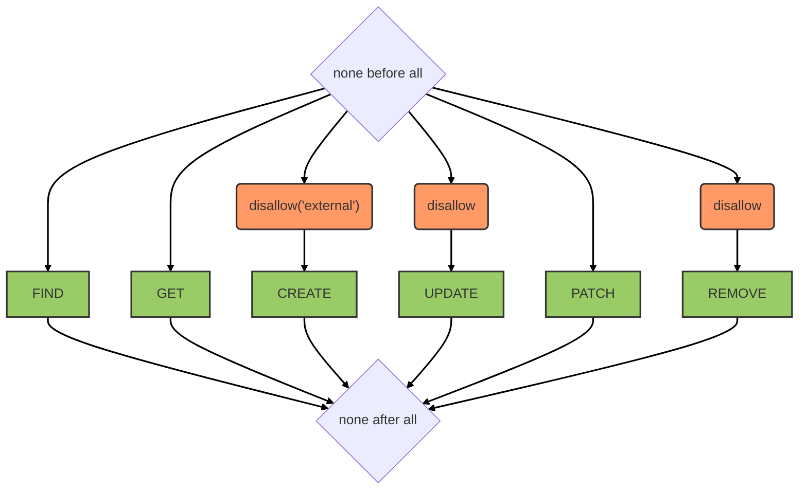

# Configurations service

::: tip
Available as a global and a contextual service
:::

::: warning
From the client side, even though most methods are available, we highly recommend using the helper functions provided by the [configurations](../client.md#configurations) singleton.
:::

## Overview

This service allows managing generic named objects designed to store application-specific configuration options that can be edited client-side.

Creation from external clients is blocked. Updates are entirely disabled (use `patch` to modify existing configurations). Deletion from external clients is also blocked, restricting removal to server-side operations.

## Data model

The data model is a named object associated with a generic value:

| Field | Type | Description |
|-------|------|-------------|
| `name` | String | Configuration identifier |
| `value` | Any | Configuration value |

## Hooks

The following [hooks](../hooks.md) are executed on the `configurations` service:

