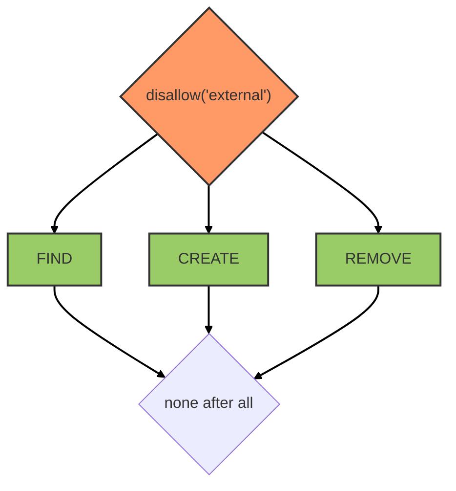

# Databases service

::: tip
Available as a global service
:::

::: warning
Service methods are only allowed from the server side.
:::

## Overview

This service is powered by [feathers-mongodb-management](https://github.com/feathersjs-ecosystem/feathers-mongodb-management). It acts as a proxy to perform MongoDB administrative operations such as creating databases, collections, or users.

All external access is blocked via a `disallow('external')` hook applied to all operations.

## Hooks

The following [hooks](../hooks.md) are executed on the `databases` service:

