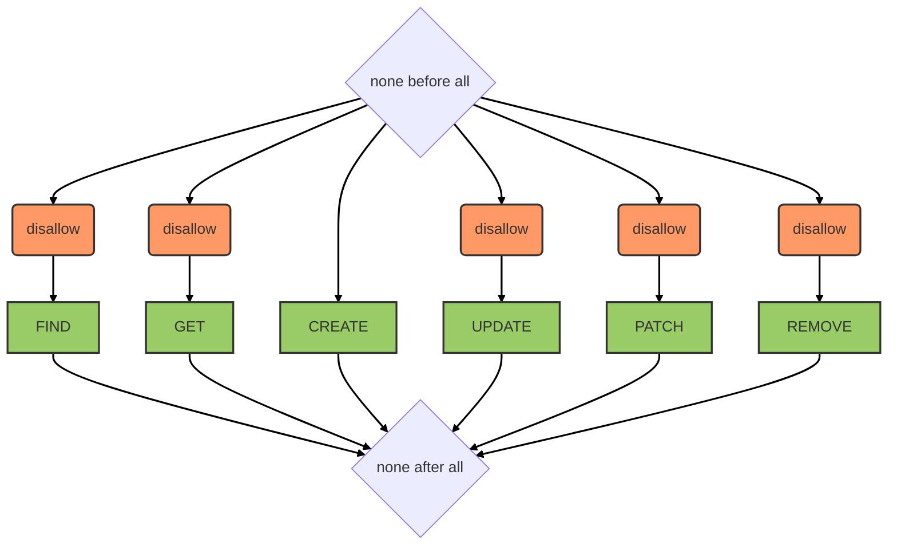

# Import-Export service

::: tip
Available as a global service
:::

::: warning
`create` is the only method allowed from the client side.
:::

## Overview

This service relies on [feathers-import-export](https://github.com/kalisio/feathers-import-export). It provides bulk data import and export capabilities backed by an S3-compatible storage layer.

::: info
The `import-export` service instantiates its own internal **S3** service to avoid mixing temporary objects with the objects managed by the [Storage service](./storage.md).
:::

::: tip
For performance reasons, we do not recommend installing before/after hooks to transform data during import/export. Instead, use the [transformation functions](https://github.com/kalisio/feathers-import-export#transform-function) provided by the library.
:::

## Data model

No data model — data are stored directly on an S3-compatible storage backend.

## Hooks

The following [hooks](../hooks.md) are executed on the `import-export` service:

