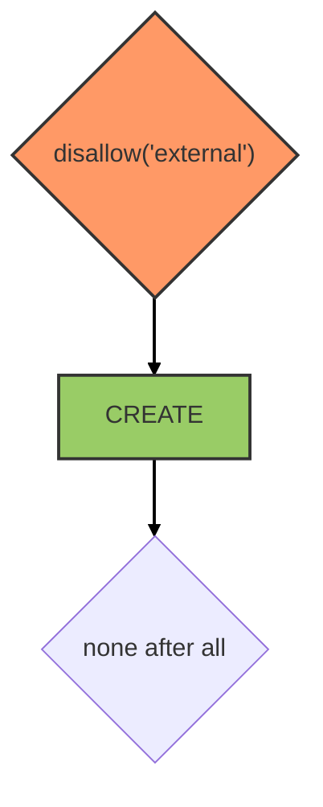

# Mailer service

::: tip
Available as a global service
:::

::: warning
Service methods are only allowed from the server side. `create` is the sole available method, used to send an email.
:::

## Overview

This service is powered by [feathers-mailer](https://github.com/feathersjs-ecosystem/feathers-mailer). It acts as a proxy to send transactional emails through an SMTP server.

It is used internally by the [account service](./account.md) notifier to dispatch verification and password-reset emails.

::: warning DEPRECATION NOTICE
Gmail API requires OAuth2 authentication to send emails. The simplest solution is to create a [service account](https://medium.com/@imre_7961/nodemailer-with-g-suite-oauth2-4c86049f778a) and to [delegate the domain-wide authority to the service account](https://developers.google.com/identity/protocols/oauth2/service-account) with scope `https://mail.google.com`.
:::

## Hooks

The following [hooks](../hooks.md) are executed on the `mailer` service:

