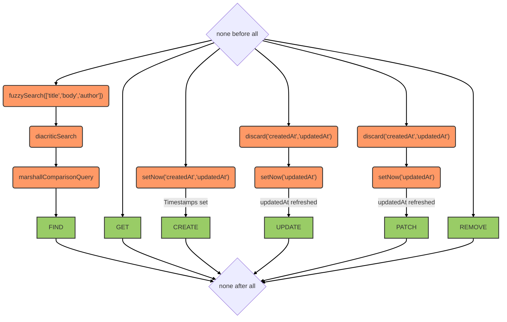

# Messages service

::: tip
Available as a contextual service
:::

## Overview

Manages messages within a context. Supports fuzzy and diacritic-insensitive full-text search across `title`, `body`, and `author` fields. Timestamps are automatically set on creation and kept in sync on update.

## Data model

| Field | Type | Description |
|-------|------|-------------|
| `title` | String | Message title |
| `body` | String | Message body text |
| `author` | String | Author identifier |
| `createdAt` | Date | Creation timestamp (set automatically) |
| `updatedAt` | Date | Last update timestamp (set automatically) |

MongoDB indexes:
- `createdAt` — for time-based sorting
- `title`, `body`, `author` — collation-aware text indexes (English and French)

## Hooks

The following [hooks](../hooks.md) are executed on the `messages` service:

