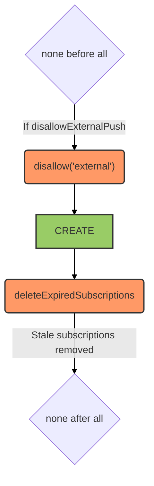

# Push service

::: tip
Available as a global service
:::

::: warning
Service methods are only allowed from the server side. `create` is the sole available method, used to send a push notification.
:::

## Overview

This service is powered by [feathers-webpush](https://github.com/kalisio/feathers-webpush). It manages Web Push subscriptions and dispatches push notifications to subscribed clients.

External access can be disabled via the `disallowExternalPush` configuration flag. Expired subscriptions are automatically cleaned up after each successful notification.

## Data model

Subscription and notification data models are provided by [feathers-webpush](https://github.com/kalisio/feathers-webpush).

## Hooks

The following [hooks](../hooks.md) are executed on the `push` service:

