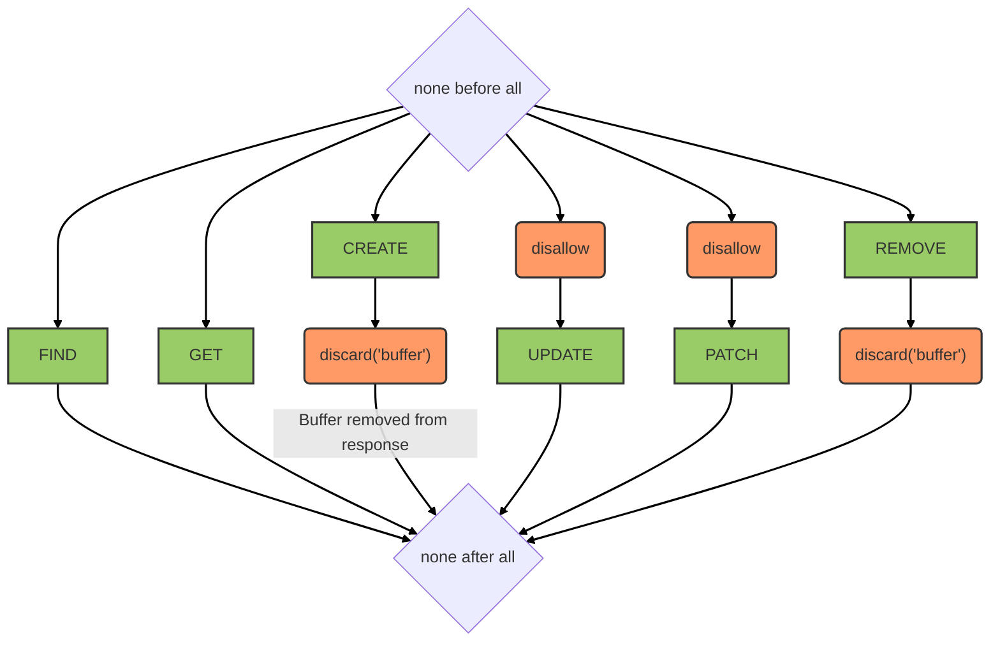

# Storage service

::: tip
Available as a global and a contextual service
:::

::: warning
From the client side, even though most methods are available, we highly recommend using the helper functions provided by the storage singleton.
:::

## Overview

This service relies on [feathers-s3](https://github.com/kalisio/feathers-s3). It provides object storage backed by an S3-compatible backend (e.g. AWS S3, MinIO).

Blobs can be created directly using this service or through "attachment" to a target resource (e.g. a user). A custom `getObject` route is available to retrieve objects with JWT authentication.

`update` and `patch` operations are disabled as S3 objects are immutable; re-upload via `create` followed by `remove` is the expected pattern. The `buffer` property is discarded from responses to avoid sending large payloads.

## Data model

No data model — data are stored directly on the target S3-compatible storage backend.

## Hooks

The following [hooks](../hooks.md) are executed on the `storage` service:

