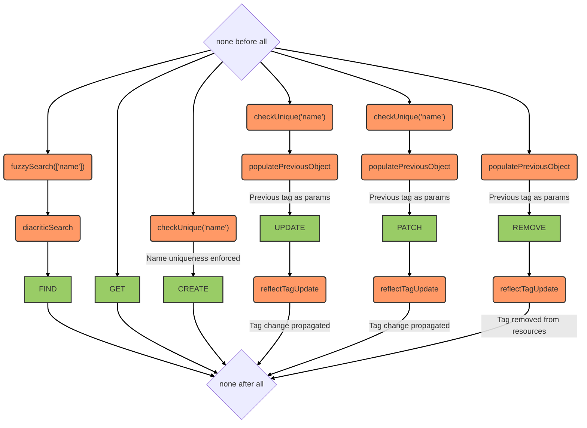

# Tags service

::: tip
Available as a contextual service
:::

## Overview

Manages tags that can be attached to resources within a context. Supports fuzzy and diacritic-insensitive search. Enforces uniqueness of tag names within the same service context. When a tag is updated or removed, the change is propagated to all resources that reference it via the `reflectTagUpdate` hook.

## Data model

A tag is a simple named object:

| Field | Type | Description |
|-------|------|-------------|
| `name` | String | Tag label (unique per service) |
| `value` | Any | Optional tag value |
| `scope` | String | Service scope/context |

MongoDB indexes:
- `name` — collation-aware text index (English and French)

## Hooks

The following [hooks](../hooks.md) are executed on the `tags` service:

