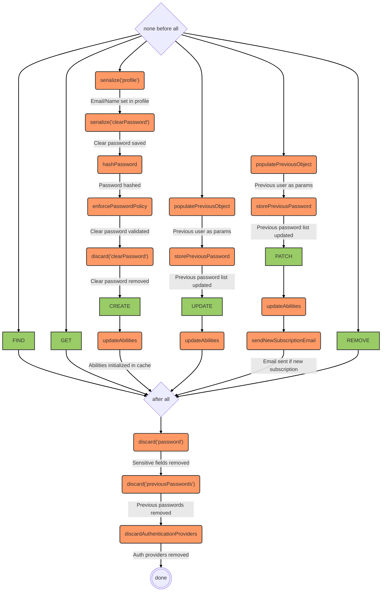

# Users service

::: tip
Available as a global service
:::

## Overview

Manages user accounts, including creation, profile updates, and password management. Emits a `logout` event when a user is removed. Integrates with the password policy and abilities system.

## Data model

The data model of a user as used by the API is [detailed here](../../../architecture/data-model-view.md#user-data-model).

## Hooks

The following [hooks](../hooks.md) are executed on the `users` service:

::: tip
The `discard`, `hashPassword`, `serialize`, `populatePreviousObject`, and `storePreviousPassword` hooks are only applied when the relevant features (local authentication, password policy) are enabled.
:::

::: tip
The `discard('password')` and related hooks in `after.all` are only applied when the request comes from an external provider (i.e. a client request), keeping password fields accessible internally.
:::
