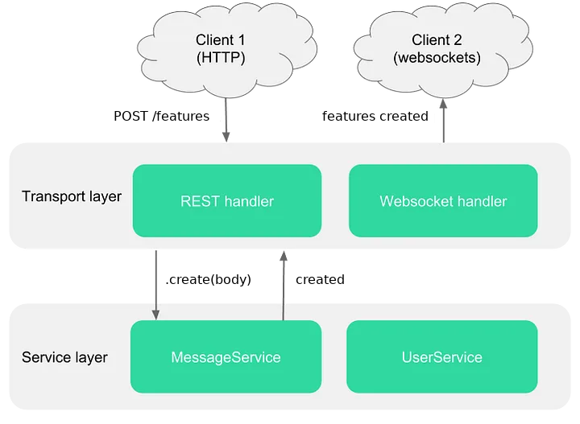
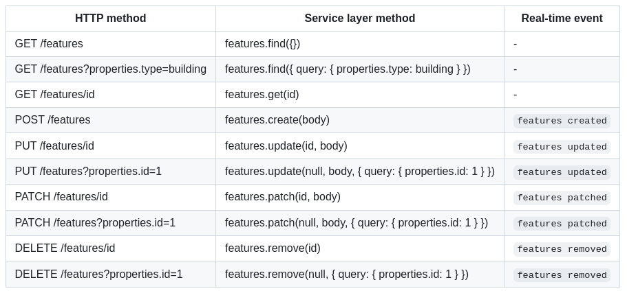

# API

These sections details the available external (i.e. REST/Websocket) as well as the internal (i.e. Classes/Functions) [API](https://en.wikipedia.org/wiki/Application_programming_interface) within each module of the KDK. If you'd like to check the detailed API of a given module please select it in the menu.

> Modules are published under the `@kalisio` namespace in NPM, e.g. `kdk` NPM package is named `@kalisio/kdk`

Each submodule, e.g. `core`, is internally broken into 3 different parts.

* client API (`client` folder in submodule folder) to be used within the browser and imported like this:

`import { xxx } from '@kalisio/kdk/core.client'`

* common API (`common` folder in submodule folder)  to be used within the browser or NodeJS and imported like this:

`import { xxx } from '@kalisio/kdk/core.common'`

* backend API (all other files in submodule folder) to be used within NodeJS and imported like this:

`import { xxx } from '@kalisio/kdk/core.api'`

## Services

On the client/server side each service API is exposed using the [Feathers isomorphic API](https://docs.feathersjs.com/api/client.html) and the [Feathers common database query API](https://docs.feathersjs.com/api/databases/querying.html). Although only web sockets are usually used on the client side, both the [REST](https://docs.feathersjs.com/api/express.html) and the [Socket](https://docs.feathersjs.com/api/socketio.html) interfaces are configured.



KDK usually exposes the available items of a service (e.g. users) through the `items` (e.g. `users`) service. For example you can request the available users like this on the client side:
```javascript
let response = await api.getService('users').find({})
response.data.forEach(user => {
  // Do something with the current user
})
```

> Depending on the permissions set on the user by the application he might not have access to all items of the service.

The following table illustrates the correspondance between REST operations, service methods and real-time events:



## Hooks

KDK modules provide a collection of [hooks](https://docs.feathersjs.com/api/hooks.html) to be used by modules or [client applications](https://docs.feathersjs.com/api/client.html). They often rely on [Feathers common hooks](https://docs.feathersjs.com/api/hooks-common.html).

> [Hooks](https://docs.feathersjs.com/api/hooks.html) are the main way to introduce business logic into applications and modules so we recommend to understand them well first before reading this.

Each service can include a set of *internal* [hooks](https://docs.feathersjs.com/api/hooks.html), i.e. hooks required to make the service work. They are built-in with the service and cannot usually be removed.

Each module then exposes a set of *external* [hooks](https://docs.feathersjs.com/api/hooks.html) you can use to extend the capabilities of your application. They are not built-in with the services and are usually added or removed on-demand by your application. The main reason is that you must have control over the order of execution when mixing different hooks to best fit your application logic and avoid any side effect.

We try to organise hooks in different categories:
* *query* for hooks targetting the processing of input query
* *data model* for hooks targetting the processing of output data
* *logs* for hooks targetting logging features
* *service* for hooks targetting generic service setup
* *schemas* for hooks targetting [validation schemas](https://docs.feathersjs.com/api/schema/validators.html)

Others hooks are usually service-centric and so attached to the target service.

## Client

KDK modules provide a collection of reusable *mixins*, *composables* and *components* to be used by modules or applications.

[Mixins](https://vuejs.org/v2/guide/mixins.html) are a flexible way to distribute reusable functionalities for [Vue components](https://vuejs.org/v2/guide/components.html). A mixin object can contain any component options. When a component uses a mixin, all options in the mixin will be "mixed" into the component's own options. [Composables](https://vuejs.org/guide/reusability/composables.html) are functions that leverage Vue 3’s Composition API to encapsulate and reuse stateful logic. You can nest them to compose complex logic using small, isolated units, similar to how you compose an entire application using components.

Although `.vue` [single file components](https://vuejs.org/v2/guide/single-file-components.html) are stored at the module level to ensure synchronized configuration management with backend code they are not "processed" within. Instead, the application processes them directly using [WebPack dynamic imports](https://medium.com/front-end-hacking/webpack-and-dynamic-imports-doing-it-right-72549ff49234).

::: warning
Single component files are temporarily copied into the application folder during the build process, in development mode they are directly imported from (linked) modules using hot reload.
:::
  
## Testing

You will find [here](https://documenter.getpostman.com/view/3473756/RztfxCRc) a collection of ready-to-go REST requests to test the API with the great [POSTMAN](https://www.getpostman.com/) tool. Simply download it and import it in your POSTMAN installation.

You should do the following:
1. make your application run (the collection is configured for default dev port `8080` but you can easily switch to `8081` for production mode for instance or any other)
2. use the authenticate request with a registered user e-mail/password to retrieve an authorization token
3. set this token in the header of other requests in order to be authorized to perform the request
4. renew your token when expired (step 2)
