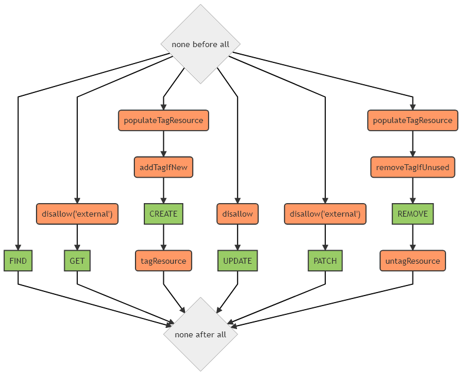

# Services

## Users service

::: tip
Available as a global service
:::

### Data model

The data model of a user as used by the API is [detailed here](../../architecture/data-model-view.md#user-data-model).

### Hooks

The following [hooks](./hooks.md) are executed on the `users` service:

## Authorisations service

::: tip
Available as a global service
:::

::: warning
`create` and `remove` methods are the only one allowed from the client/server side
:::

### Data model

No data model, authorisations are directly stored on target subject(s).

### Hooks

The following [hooks](./hooks.md) are executed on the `authorisations` service:

## Tags service

::: tip
Available as a global and a contextual service
:::

::: warning
`update` method is not available
`get`, `patch` methods are only allowed from the server side
clients can only `create`, `remove` and `find` tags
:::

### Data model

The data model of a user as used by the API is [detailed here](../../architecture/data-model-view.md#tag-data-model).

### Hooks

The following [hooks](./hooks.md) are executed on the `tags` service:

## Storage service

::: tip
Available as a global and a contextual service
:::

::: warning
`get`, `create` and `remove` methods are the only one allowed from the client/server side
:::

This service heavily relies on [feathers-blob](https://github.com/feathersjs-ecosystem/feathers-blob) and [multer](https://github.com/expressjs/multer) for handling [multipart/form-data](https://docs.feathersjs.com/guides/advanced/file-uploading.html#feathers-blob-with-multipart-support).

### Data model

No data model, data are directly stored on target storage backend (i.e. AWS S3).

### Hooks

The following [hooks](./hooks.md) are executed on the `storage` service:

