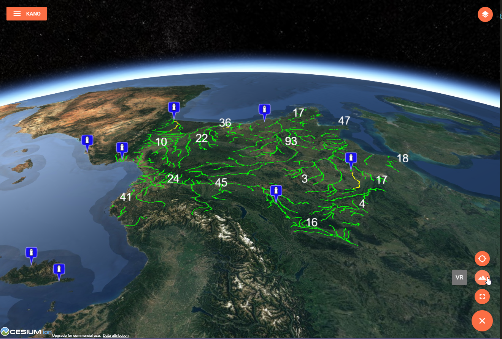

# Overview

The map module includes basic features to create web mapping applications: [geocoding](./services.md#geocoder-service), [data layer catalog](./services.md#catalog-service), [dynamic feature layers](./services.md#feature-service), [2D visualisation](./components#2d-map), [3D visualisation](./components#3d-map).

