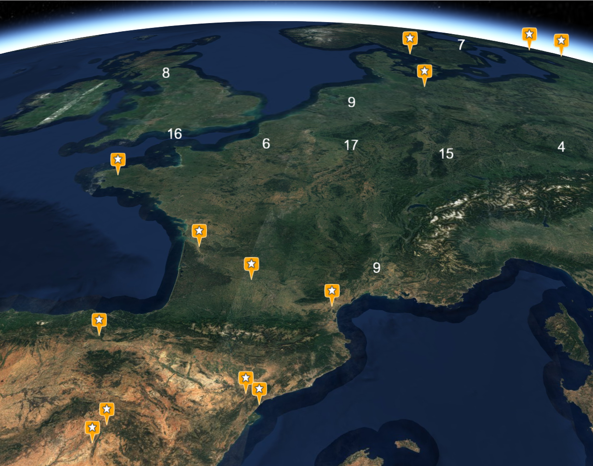

# Mixins

## Geolocation

Make your component automatically retrieve the user's location on initialization or when he has logged in (the [Geolocation API](https://developer.mozilla.org/en-US/docs/Web/API/Geolocation_API) is used under-the-hood):
* **updatePosition()** launches a geolocation

> Will make the position available in the `user.position` property of the currently authenticated user in the [global store](../kcore/application.md#store).

::: tip
Will raise an error toast on geolocation error
:::

## Navigator

::: warning
Only available on mobile devices
:::

Allow to launch native route navigation apps to go to a given location (the [launch navigator cordova plugin](https://github.com/dpa99c/phonegap-launch-navigator) is used under-the-hood):
* **canNavigate()** check if navigation is possible (mobile device and navigation app installed)
* **navigate(longitude, latitude)** launches native route navigation app for the given location

## Feature Service

Ease requests to a [feature service](./services.md#feature-service) in order to get real-time updates:
* **getProbeFeatures(options)** retrieve the probe locations (if any) for a given [catalog layer descriptor](./services.md#catalog) to initialize the feature layer
* **getFeatures(options, queryInterval)** get the latest available features for a given [catalog layer descriptor](./services.md#catalog) at current time or in a given elapsed time range if a query interval in milliseconds is given

Please refer to [feature service API](./services.md#time-based-feature-aggregation) for more details.

## Map

The underlying map object is based on [Leaflet](http://leafletjs.com/) and some mixins also rely on [Leaflet plugins](https://leafletjs.com/plugins.html). The following set of mixins is to be used to construct a new map activity and underlying Leaflet objects.

### Base Map

::: danger
This mixin is a mandatory one to build a map activity
:::

Make it possible to manage map layers and extend supported layer types:
* **setupMap(domElement, options)** creates the underlying Leaflet map object with given options
* **addLayer(options)/removeLayer(name)** registers/destroys a layer based on a [catalog layer descriptor](./services.md#catalog)
* **showLayer/hideLayer(name)** (un)hides the given layer in map, on first show the layer will be lazily created
* **hasLayer(name)** check if a given layer is already registered
* **isLayerVisible(name)** check if a given layer is visible and underlying Leaflet object created
* **zoomToLayer(name)** fits the map view to visualize a given layer
* **getLayerByName(name)** retrieve the [catalog layer descriptor](./services.md#catalog) for a given layer
* **getLeafletLayerByName(name)** retrieve the underlying Leaflet object for a given layer
* **createLeafletLayer(options)** creates the underlying Leaflet object based on a [catalog layer descriptor](./services.md#catalog), will check all registered constructor for any one matching
* **registerLeafletConstructor(constructor)** registers a Leaflet constructor function for a given type of layer
* **center(longitude, latitude, zoomLevel)** centers the map view to visualize a given point at a given zoom level
* **setCurrentTime(datetime)** sets the current time to be used for time-based visualisation (e.g. weather forecast data or dynamic features)

This mixin automatically includes some Leaflet plugins: [leaflet-fa-markers](https://github.com/danwild/leaflet-fa-markers) to create markers using Font Awesome icons, [Leaflet.fullscreen](https://github.com/Leaflet/Leaflet.fullscreen) to manage fullscreen mode, [Leaflet.markercluster](https://github.com/Leaflet/Leaflet.markercluster) to create marker clusters, [Leaflet.VectorGrid](https://github.com/Leaflet/Leaflet.VectorGrid) to display [vector tiles](https://github.com/mapbox/vector-tile-spec). 

### GeoJson Layer

Make it possible to manage and style raw or time-based GeoJson map layers ([Leaflet.Realtime plugin](https://github.com/perliedman/leaflet-realtime) is used under-the-hood):
* **createLeafletGeoJsonLayer(options)** automatically registered GeoJson Leaflet layer constructor
* **convertFromSimpleStyleSpec(style)** helper function to convert from [simple style spec options](https://github.com/mapbox/simplestyle-spec) to [Leaflet style options](https://leafletjs.com/reference.html#path-option)
* **createMarkerFromStyle(latlng, style)** helper function create a [Leaflet marker](https://leafletjs.com/reference.html#marker) from marker style options:
  * **icon** icon style options 
    * **type** type name (ie class) of the icon to be created for the marker
    * **options** icon constructor options
  * **type** type name (ie class) of the marker to be created
  * **options** marker constructor options
* **register/unregisterLeafletStyle(type, generator)** (un)registers a function generating a Leaflet object depending on the given type:
  * `markerStyle` => **f(feature, latlng, options)** returns a [Leaflet marker](https://leafletjs.com/reference.html#marker)
  * `featureStyle` => **f(feature, options)** returns a [Leaflet style object](https://leafletjs.com/reference.html#path-option)
  * `tooltip` => **f(feature, layer, options)** returns a [Leaflet tooltip](https://leafletjs.com/reference.html#tooltip)
  * `popup` => **f(feature, layer, options)** returns a [Leaflet popup](https://leafletjs.com/reference.html#popup)

The mixin automatically registers defaults styling:
  * `markerStyle` => will create a marker based on the following options merged with the following order of precedence
    * [simple style spec options](https://github.com/mapbox/simplestyle-spec) set on **feature.style** or **feature.properties**
    * [simple style spec options](https://github.com/mapbox/simplestyle-spec) set on layer descriptor
    * [Leaflet style options](https://leafletjs.com/reference.html#path-option) set on the **pointStyle** property in the component
  * `featureStyle` => will create a style based on the following options merged with the following order of precedence
    * [simple style spec options](https://github.com/mapbox/simplestyle-spec) set on **feature.style** or **feature.properties**
    * [simple style spec options](https://github.com/mapbox/simplestyle-spec) set on layer descriptor
    * [Leaflet style options](https://leafletjs.com/reference.html#path-option) set on the **featureStyle** property in the component
  * `tooltip` => will create a tooltip based on the following options with the following order of precedence
    * **tooltip**: set on layer descriptor or in the component
      * **property**: property name to appear in the tooltip
      * **template**: [Lodash template](https://lodash.com/docs/#template) to generate tooltip content with feature and its properties as context
  * `popup` => will create a popup displaying a property name/value table based on the following options with the following order of precedence
    * **popup**: set on layer descriptor or in the component
      * **pick**: array of property names to appear in the popup
      * **omit**: array of property names not to appear in the popup
      * **options**: Leaflet [popup options](https://leafletjs.com/reference.html#popup-option)

If your component has a **onLeafletFeature(feature, layer, options)** method it will be called each time a new GeoJson feature is created.

::: tip
Marker cluster options are to be provided in the **cluster** property of the Leaflet layer options
:::

The following configuration illustrates a GeoJson marker cluster layer using options set on the layer descriptor (see image below):
```js
{
  name: 'Layer',
  description: 'My sites',
  tags: [ 'business' ],
  icon: 'star',
  attribution: '(c) My company',
  type: 'OverlayLayer',
  leaflet: {
    type: 'geoJson',
    source: 'https://s3.eu-central-1.amazonaws.com/kargo/nuclear-sites.json',
    cluster: {},
    'marker-color': 'orange',
    'icon-color': 'white',
    'icon-classes': 'fa fa-star',
    popup: {
      pick: [ 'NAME' ]
    },
    tooltip: {
      property: 'LABEL'
    }
  }
}
```


### File Layer

Make it possible to drag'n'drop GeoJson or KML file on the map ([Leaflet.FileLayer plugin](https://github.com/makinacorpus/Leaflet.FileLayer) is used under-the-hood). It will automatically create a new [GeoJson layer](./mixins.md#geojson-layer) named after the filename on drop. As a consequence it has to be used with the GeoJson layer mixin and will use the configured styling.

### Forecast Layer

Make it possible to manage [Weacast map layers](https://weacast.github.io/weacast-docs/api/layers.html#forecast-data-layers):
* **createLeafletForecastLayer(options)** automatically registered Weacast Leaflet layer constructor
* **setupForecastModels()** retrieve available [forecast models](https://github.com/mapbox/simplestyle-spec) from [Weacast API](https://weacast.github.io/weacast-docs/api/forecast.html)
* **getForecastForLocation(long, lat, startTime, endTime)** helper function to dynamically probe weather elements at a given location in a given time range using the [Weacast API](https://weacast.github.io/weacast-docs/api/probe.html#probes-api)
* **getForecastForFeature(featureId, startTime, endTime)** helper function to get weather element at static probe location in a given time range using the [Weacast API](https://weacast.github.io/weacast-docs/api/probe.html#probe-results-api)
* **getProbedLocationForecastAtCurrentTime()** computes element values at current time once a location has been probed (dynamically or statically)
* **getProbedLocationForecastMarker(feature, latlng)** generates a marker using a [wind barb](http://weather.rap.ucar.edu/info/about_windbarb.html) according to element values in feature

::: warning
This mixin assumes that your component has initialized its [Weacast client](https://weacast.github.io/weacast-docs/api/application.html#client-setup) in the `weacastApi` property
:::

### Service Layer

**TODO**

### Collection Layer

**TODO**

### Geotiff Layer

**TODO**

## Globe

The underlying globe object is based on [Cesium](https://cesium.com/).

### Base Globe

::: danger
This mixin is a mandatory one to build a globe activity
:::

Make it possible to manage globe layers and extend supported layer types:
* **setupGlobe(domElement, token)** creates the underlying Cesium globe object with given Cesium Ion token
* **addLayer(options)/removeLayer(name)** registers/destroys a layer based on a [catalog layer descriptor](./services.md#catalog)
* **showLayer/hideLayer(name)** (un)hides the given layer in globe, on first show the layer will be lazily created
* **hasLayer(name)** check if a given layer is already registered
* **isLayerVisible(name)** check if a given layer is visible and underlying Cesium object created
* **zoomToLayer(name)** fits the globe view to visualize a given layer
* **getLayerByName(name)** retrieve the [catalog layer descriptor](./services.md#catalog) for a given layer
* **getCesiumLayerByName(name)** retrieve the underlying Cesium object for a given layer
* **createCesiumLayer(options)** creates the underlying Cesium object based on a [catalog layer descriptor](./services.md#catalog), will check all registered constructor for any one matching
* **registerCesiumConstructor(constructor)** registers a Cesium constructor function for a given type of layer
* **center(longitude, latitude, altitude, heading, pitch, roll)** centers the globe view to visualize a given point at a given altitude with and orientation (default is pointing ground vertically [0, 0, -90])

### GeoJson Layer

Make it possible to manage and style raw or time-based GeoJson map layers:
* **createCesiumGeoJsonLayer(options)** automatically registered GeoJson Cesium layer constructor
* **convertFromSimpleStyleSpec(style)** helper function to convert from [simple style spec options](https://github.com/mapbox/simplestyle-spec) to [Cesium style options](https://cesiumjs.org/Cesium/Build/Documentation/GeoJsonDataSource.html#.load)
* **convertToCesiumObjects(style)** helper function to convert from JSON description to Cesium objects
* **register/unregisterCesiumStyle(type, generator)** (un)registers a function generating a Cesium object depending on the given type:
  * `entityStyle` => **f(entity, options)** returns a [Cesium entity style object](https://cesium.com/docs/tutorials/creating-entities/)
  * `clusterStyle` => **f(entities, cluster, options)** returns a [Cesium cluster style object](https://cesiumjs.org/Cesium/Build/Documentation/EntityCluster.html#~newClusterCallback)

The mixin automatically registers defaults styling:
  * `entityStyle` => will create a style based on the following options merged with the following order of precedence
    * [simple style spec options](https://github.com/mapbox/simplestyle-spec) set on **feature.style** or **feature.properties**
    * [Cesium entity style options](https://cesium.com/docs/tutorials/creating-entities/) set on layer descriptor
    * [Cesium entity style options](https://cesium.com/docs/tutorials/creating-entities/) set on the **entityStyle** property in the component
  * `clusterStyle` => will create a style based on the following options merged with the following order of precedence
    * [Cesium cluster style options](https://cesiumjs.org/Cesium/Build/Documentation/EntityCluster.html#~newClusterCallback) set on layer descriptor
    * [Cesium cluster style options](https://cesiumjs.org/Cesium/Build/Documentation/EntityCluster.html#~newClusterCallback) set on the **clusterStyle** property in the component

Cesium styles often rely on dynamically created objects while the input styling configuration is a static JSON. As a consequence the following rules are used to convert from JSON to Cesium objects:
* constants are expressed as strings starting with `'Cesium.'`
* object instances are expressed as a `{ type, options }` object where type is a string starting with `'Cesium.'` followed by the class name like `'Cesium.CheckerboardMaterialProperty'`, options are constructor options for the object instance
The following Cesium code:
```
ellipse.material = new Cesium.CheckerboardMaterialProperty({
  evenColor : Cesium.Color.WHITE,
  oddColor : Cesium.Color.BLACK,
  repeat : new Cesium.Cartesian2(4, 4)
})
```
will result in the following layer configuration:
```
ellipse: {
  material: {
    type: 'Cesium.CheckerboardMaterialProperty',
    options: {
      evenColor: 'Cesium.Color.WHITE',
      oddColor: 'Cesium.Color.BLACK',
      repeat: {
        type: 'Cesium.Cartesian2',
        options: [4, 4]
    }
  }
}
```

::: tip
Marker cluster options are to be provided in the **cluster** property of the Cesium layer options
:::

The following configuration illustrates a GeoJson marker cluster layer using options set on the layer descriptor (see image below):
```js
{
  name: 'Layer',
  description: 'My sites',
  tags: [ 'business' ],
  icon: 'star',
  attribution: '(c) My company',
  type: 'OverlayLayer',
  cesium: {
    type: 'geoJson',
    source: 'https://s3.eu-central-1.amazonaws.com/kargo/nuclear-sites.json',
    cluster: {
      pixelRange: 50
    },
    'marker-symbol': 'star',
    'marker-color': '#FFA500'
  }
}
```



### File Layer

Make it possible to drag'n'drop GeoJson or KML file on the globe. It will automatically create a new [GeoJson layer](./mixins.md#geojson-layer) named after the filename on drop. As a consequence it has to be used with the GeoJson layer mixin and will use the configured styling.
