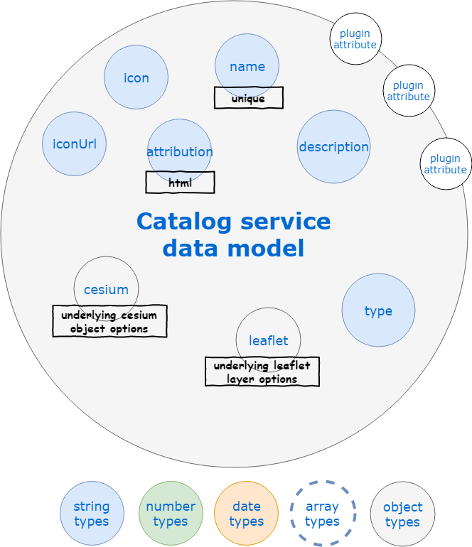

# Services

## Geocoder service

::: tip
Available as a global service
:::

::: warning
`create` method is the only one allowed from the client/server side
:::

Rely on [node-geocoder](https://github.com/nchaulet/node-geocoder) under-the-hood.

### Data model

The data model of a geocoding request as used by the API only contains the **address** field specifying the string to be looked for.

The request response depends on the geocoding provider.

### Hooks

No [hooks](./hooks.md) are executed on the `geocoder` service for now.

## Catalog service

::: tip
Available as a global service
:::

### Data model

The data model of a layer as used by the API is detailed below.

### Hooks

The sole [hook](./hooks.md) executed on the `catalog` service is one that sets the default query type to layer (ie `$ne: 'service'`) when not provided.

## Feature service

::: tip
Available as a global and a contextual service
:::

### Data model

The data model of a feature as used by the API is detailed below, first the raw model when no aggregation is performed, second when some elements of the feature are aggregated over time.

### Hooks

The following [hooks](./hooks.md) are executed on the `feature` service:

**TODO**