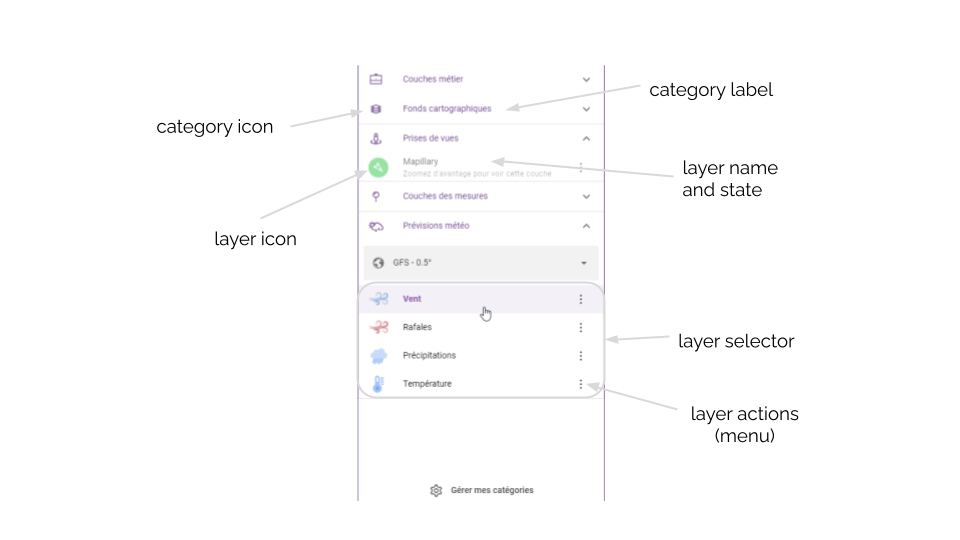
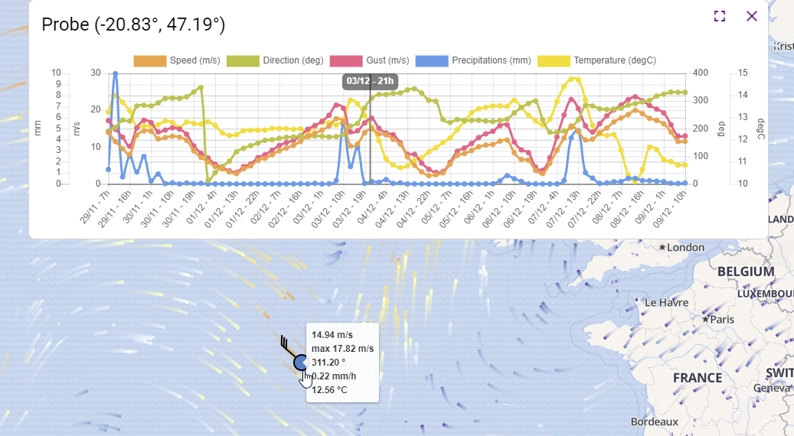
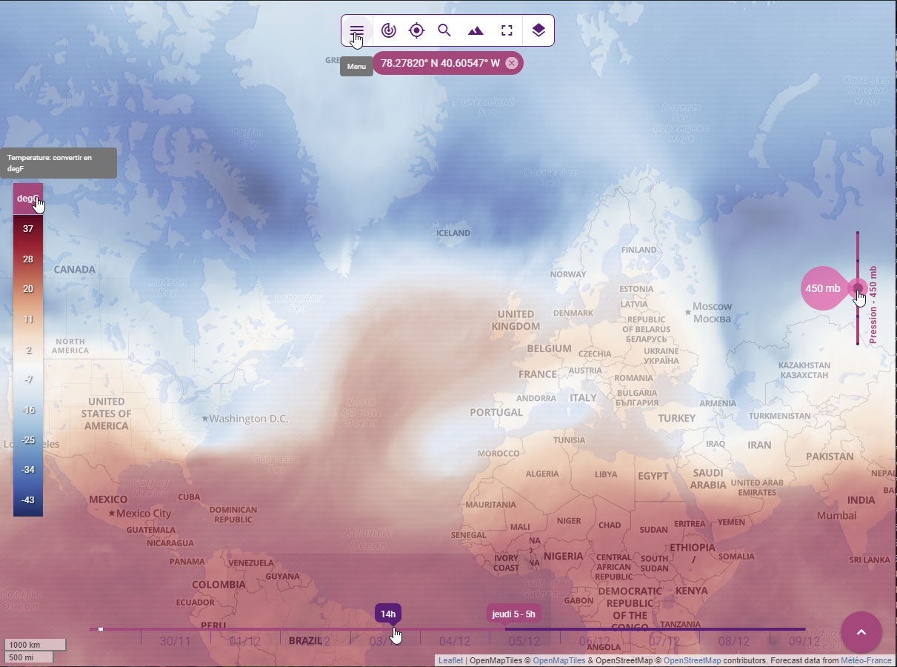

# Components

## Catalog

The **k-catalog** is used to list all available layers in [catalog](./services.md#catalog-service) and organize them by category. A category is defined by the following properties:
* **name**: internal name,
* **label**: display label,
* **icon**: display icon,
* **order**: weight to order the category within the catalog. You can specify a value between 1 and 100. Categories with the lowest weight are displayed first. Basemaps are displayed last with a weight of 100.
* **options**:
  * **exclusive**: `true` if layer selection in the category should be exclusive (defaults to `false`),
  * **open**: `true` if layer category should initially be open in the catalog component (defaults to `false`),
  * **filter**: a filter supported by [sift](https://github.com/crcn/sift.js) to select layers from the catalog belonging to the category



This component relies on some others internal components:
* **k-layers-selector** used to list a set of layers and manage the selection
* **k-weather-layers-selector** used to list all available weather related layers (forecasts and archives) and for each model provided by **Weacast**

## Color legend

The **k-color-legend** is used to display the legend associated to color mapped layers in [catalog](./services.md#catalog-service) and allow to switch between different display units whenever required.

::: tip
Will automatically hide/show whenever a layer with appropriate configuration is hidden/shown.
:::

## Level slider

The **k-level-slider** is used to display [available levels](./mixins.md#levels) on e.g. weather layers and allow to switch between them whenever required.

::: tip
Will automatically hide/show whenever a layer with appropriate configuration is hidden/shown.
:::

## Position indicator

The **k-position-indicator** is used to display the geographical coordinates of the current mouse position.

## Timeline

The **k-timeline** is used to display the time range of the weather prediction model associated to a [weather layer](./mixins.md#weacast). It allows to jump in time whenever required.

The main methods are the following:
* **setupTimeline()** setups the timeline according to currently selected forecast model time range if any (see [Weacast mixin](./mixins.md#weacast)) or based on the following global frontend [configuration](../../guides/basics/step-by-step.md#configuring-a-kapp) properties:
  * **start**: offset in seconds from now the timeline should begin
  * **end**: offset in seconds from now the timeline should end
* **getTimelineInterval()** default timeline interval function
* **getTimelineFormatter()** default timeline formatting function

## Widgets

### Timeseries 

The **k-time-series-widget** is used to display weather probes or measurements at a specific location as a set of timeseries graphs in mapping activities and allow to show/hide relevent elements.

Here is a view of the widget:



The main methods are the following:
* **refresh()** updates the marker layer used to locate where the probe measurements come from and updates the probe timeseries graph

::: tip
The component keeps in sync the timeseries widget visibility state and any change in time format, forecast model (see [Weacast mixin](./mixins.md#weacast)), or current time.
:::

### Infobox 

The **k-information-box** is used to display feature properties as a table.

The main methods are the following:
* **refresh()** updates the information box content based on the layer or feature schema

::: tip
The component allows to copy-paste feature properties or export feature as GeoJson.
:::

### Mappilary Viewer 

The **k-mapillary-viewer** is used to display street-level imagery coming from [Mapillary](https://www.mapillary.com/).

The main methods are the following:
* **refresh()** updates the imagery based on the currently selected position or feature

::: tip
The component keeps in sync the viewer widget and any change in current time.
:::

## Map

Although some dedicated components do exist, you usually rely on provided [mixins](./map-mixins.md) to build your own map.

Kano provides a good starting point to build your own [Map Activity](https://github.com/kalisio/kano/blob/master/src/components/MapActivity.vue).

### Location

The **KLocationMap** allows to display a location on a map using a marker.

The **k-location-field** provides you with an autocomplete address search input powered by the [geocoder service](./services.md#geocoder-service) to be embedded in a [**k-form**](../core/components.md#forms).

## Globe

No dedicated component exist at the moment, you usually rely on provided [mixins](./globe-mixins.md) to build your own globe.

Kano provides a good starting point to build your own [Globe Activity](https://github.com/kalisio/kano/blob/master/src/components/GlobeActivity.vue).

## Navigation Bar

The **k-navigation-bar** groups together the main actions available on a [mapping activity](./mixins.md#activity). See e.g. [Kano configuration options](../kano/configuration.md) for more details.

Here is a view of some of the components presented previously:



## Legend

The **KLegend** component acts as a container of multiple **layer legends** which are grouped in **sublegends**. 

Each of these sublegends is rendering using an [Expansion Item](https://quasar.dev/vue-components/expansion-item).

Tipically, **sublegends** declaration is done within the application's API configuration and is accessible using the `catalog` service. 

```js
{
  name: 'Sublegends.HYDROGRAPHY', // name as i18n translation key
  i18n: {  // i18n translations
    fr: { Sublegends: { HYDROGRAPHY: 'Hydrographie' } },
    en: { Sublegends: { HYDROGRAPHY: 'Hydrography' } }
  },
  headerClass: 'bg-grey-3 text-weight-regular',  // class to be used to render the q-expansion-item header
  options: { 
    open: true,  // set the q-expansion-item default opened
    filter: { type: 'OverlayLayer' , tags: { $in: ['hydrography'] } }  // layers filter
  } 
}
```

And **layer legends** information is part of the layer declaration in a dedicated `legend` object. It consists in a legend **objet** or an **array**. 
A legend objet is defined by the folowwing properties:
* a _type_ defining the type of the legend to be rendered. It is mandatory.
* a _label_ defining the caption of this legend
* a _minZomm_ definig the minimum zoom 
* a _mawZomm_ definig the miximum zoom
* a _content_ describing the content of the legend which must conform the _type_ formalism.

It exists 3 different _types_ of legend:

* **KImageLegend**: a legend represented as an image

```js
legend: {
  type: 'image',
  label: 'An image'
  minZoom: 9 
  content: {
      src: 'https://wxs.ign.fr/static/legends/INSEE.FILOSOFI.POPULATION-tot-legend-2017.png',
      width: '234px',
      height: '58px'
    }
  }
}
```

* **KColorScaleLegend**: a legend represented as a **color scale**

```js
legend: {
  type: 'color-scale',
  label: 'A color scale'
  content: {
    classes: [
       0, 1, 5, 10, 100, 1000
    ],
    colors: 'Reds',
    label: 'Reds color scale',
    unit: 'ml'
  }
}
```

* **KSymbolsLegend**: a legend represented a multi map of pair of symbols and labels.

```js
legend: {
  type: 'symbols',
  label: 'Multiple sections legend',
  content: [{
    section1: [
      { symbol: { 'media/KShape': { type: 'rect', color: 'blue' } }, label: 'Blue' },
      { symbol: { 'media/KShape': { type: 'rect', color: 'red' } }, label: 'Red' },
      { symbol: { 'media/KShape': { type: 'rect', color: '#green' } }, label: 'Green' }
    ],
    section2: [
      { symbol: { 'media/KShape': { type: 'circle', color: 'purple' } }, label: 'Purple' },
      { symbol: { 'media/KShape': { type: 'circle', color: 'yellow' } }, label: 'Yellow' },
      { symbol: { 'media/KShape': { type: 'circle', color: 'orange' } }, label: 'Orange' }
    ]
  }]
}
```

The content of a legend can be adapted according to the zoom level using multiple legends:

```js
legend: [
  {
    type: 'symbols',
    label: 'Adaptative zoom legend',
    minZoom: 6,
    maxZoom: 13,  
    content: {
      symbols: [
        { symbol: { 'media/KShape': { type: 'rect', color: 'blue' } }, label: 'Blue' },
        { symbol: { 'media/KShape': { type: 'rect', color: 'red' } }, label: 'Red' },
        { symbol: { 'media/KShape': { type: 'rect', color: '#green' } }, label: 'Green' }
      ]
    }
  }, 
  {
    type: 'symbols',
    label: 'Adaptative zoom legend',
    minZoom: 14,
    content: {
      symbols: [
        { symbol: { 'media/KShape': { type: 'circle', color: 'purple' } }, label: 'Purple' },
        { symbol: { 'media/KShape': { type: 'circle', color: 'yellow' } }, label: 'Yellow' },
        { symbol: { 'media/KShape': { type: 'circle', color: 'orange' } }, label: 'Orange' }
      ]
    }
  }
]
```

::: tip
It is also possible to add your own type of legend. You must implement the component responsible of the rendering and register it to the **KLegend** through the `renderers` prop. The component must overload the abstract **KLegendRenderer** component.
:::

## Attribution ##

* **Kattribution** : a component that dynamically displays visible layer attributions (credits and copyright information) in map activities. This component guarantees compliance with copyright rules for data displayed on the map.

### How it works ###

The component listens to layer visibility events to add or remove attributions as layers are displayed or hidden. The main allocation is displayed in a popup that the user can open by clicking on a circle with the *"i ”* symbol.

This popup has several sections:

1.  **Header**: Optional, configured via the ‘header’ section in configuration.

2.  **Dynamic body**: Generates and displays allocations based on visible layers.

3.  **Footer**: Optional, configured via the `footer` section.

### Configuration ###

**KAttribution** is configured in `config/default.js`. It must be configured as a sticky in `mapActivity` and `globeActivity`, and is systematically positioned bottom-right (`position: 'bottom-right'`) offset (`offset: [80, 24]`) to the left of the FAB.

Example configuration :

```js
module.exports = {
  mapActivity: {
  ...
    stickies: {
    content: [
      { id: 'attribution', position: 'bottom-right', offset: [80, 24], component: 'KAttribution' },
      // Other components if required
    ]
    },
  }
}
```

::: tip
If the FAB does not exist, the offset must be adjusted: (`offset: [24, 24]`).
:::

You can also customize the header and footer sections :

- *header* and *footer*: allow you to add additional information (for example, a `KStamp` component to display a specific text).

- *headerClass* and *footerClass*: define CSS classes to style the header and footer.

Example configuration:

```js
attribution: {
  header: [
    {
    id: 'attribution-header',
    component: 'KStamp',
    text: 'Map credits'
    }
  ],
  headerClass: ['bg-secondary'],
  footer: [
    {
    id: 'attribution-footer',
    component: 'KStamp',
    text: 'Please respect copyright'
    }
  ],
  footerClass: ['bg-secondary'],
}
```