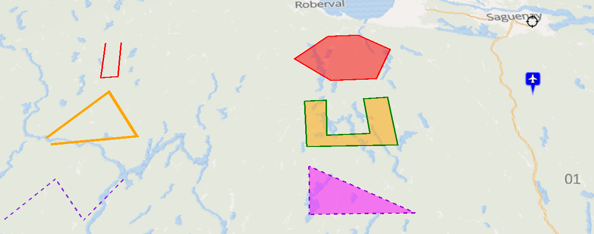

## Globe Mixins

The underlying globe object is based on [Cesium](https://cesium.com/).

## Base Globe

::: danger
This mixin is a mandatory one to build a globe activity
:::

Make it possible to manage globe layers and extend supported layer types:
* **setupGlobe(domElement, token, options)** creates the underlying Cesium globe object with given Cesium Ion token and viewer options
* **addLayer(options)/removeLayer(name)** registers/destroys a layer based on a [catalog layer descriptor](./services.md#catalog-service)
* **showLayer/hideLayer(name)** (un)hides the given layer in globe, on first show the layer will be lazily created
* **hasLayer(name)** check if a given layer is already registered
* **isLayerVisible(name)** check if a given layer is visible and underlying Cesium object created
* **zoomToLayer(name)** fits the globe view to visualize a given layer
* **zoomToBounds(bounds)** fits the globe view to visualize a given extent as bounds [ [south, west], [north, east] ]
* **getLayerByName(name)** retrieve the [catalog layer descriptor](./services.md#catalog-service) for a given layer
* **renameLayer(previousName, newName)** rename a given layer
* **removeLayer(name)** destroys a given layer
* **getCesiumLayerByName(name)** retrieve the underlying Cesium object for a given layer
* **createCesiumLayer(options)** creates the underlying Cesium object based on a [catalog layer descriptor](./services.md#catalog-service), will check all registered constructor for any one matching
* **registerCesiumConstructor(constructor)** registers a Cesium constructor function for a given type of layer
* **center(longitude, latitude, altitude, heading, pitch, roll, options)** centers the globe view to visualize a given point at a given altitude with and orientation (default is pointing ground vertically [0, 0, -90]),
 some options like an animation `duration` can also be added
  * an animation `duration` in seconds to perform the changes,
  * `offset` provided relative to the base frame
    * `{ x, y, z }` as an additional translation,
    * `{ heading, pitch, roll }` as an additional rotation,
* **trackEntity (entityId, options)/untrackEntity()** set or unset the entity that the camera is currently tracking with the following options:
  * `orientation` as `true` to enable camera auto orientation otherwise only the position is tracked,
  * `distance` as the horizontal distance from entity when orientation is tracked,
  * `heighAbove` as the vertical distance from entity when orientation is tracked,
  * `headingOffset` as the heading offset angle in degrees when orientation is tracked,
  * `pitchOffset` as the pitch offset angle in degrees when orientation is tracked,
* **getCenter()** get the current globe view center as `longitude`, `latitude` and `altitude` (note that the projected position on the ground is the one of the camera, it only matches the 2D version with orientation [0, 0, -90])
* **getCamera()** get the current globe view camera settings as `longitude`, `latitude` and `altitude` for position and `heading`, `pitch` and `roll` for orientation
* **getBounds()** get the current map view bounds as `[ [south, west], [north, east] ]`

This mixin also adds the following internal data properties:
* **layers** available layers as [catalog layer descriptors](./services.md#catalog-service)

### Scene post processing

Post processing can be enabled on the globe, you can use the following methods to control this feature:
* **setupPostProcess(postProcessName, options)** handles setup of 3d post process on the scene
* **selectFeaturesForPostProcess(postProcessName, layerName, featureIdList)** can be used for post process that requires *selected* features to operate

:: tip
Inputs for layers and features can also be provided as arrays to `selectFeaturesForPostProcess` in order to select features coming from multiple layers
:::

We currently only support `desaturate` post process. The `options` parameter in **setupPostProcess** only expects an `enabled: true|false` field. This post process requires *selected* feature to operate, it'll desaturate the whole scene, except features that are *selected*.


## Globe Style

Globe partly supports KDK style specification as detailled for [map](./mixins.md#map-style) but provide additionnal capabilities specific to 3D entities.

::: tip
All style properties can be templated using [lodash string templates](https://lodash.com/docs/4.17.15#template). Their final values will be computed at creation/update time.
:::

Make it possible to setup Cesium entities objects with style based on (Geo)Json (feature) properties stored in entities:
* **convertFromSimpleStyleSpec(style)** helper function to convert from [simple style spec options](https://github.com/mapbox/simplestyle-spec) to [Cesium style options](https://cesium.com/learn/cesiumjs/ref-doc/GeoJsonDataSource.html#.LoadOptions)
* **convertToCesiumObjects(style)** helper function to convert from JSON description to Cesium objects

Use **register/unregisterStyle(type, generator)** to (un)register a function generating a Cesium object depending on the given type:
  * `entityStyle` => **f(entity, options)** returns a [Cesium entity style object](https://cesium.com/learn/cesiumjs-learn/cesiumjs-creating-entities/)
  * `clusterStyle` => **f(entities, cluster, options)** returns a [Cesium cluster style object](https://cesium.com/learn/cesiumjs/ref-doc/EntityCluster.html#.newClusterCallback)

The mixin automatically registers defaults styling:
  * `entityStyle` => will create a style based on the following options merged with the following order of precedence
    * [simple style spec options](https://github.com/mapbox/simplestyle-spec) set on **feature.style** or **feature.properties**
    * [Cesium entity style options](https://cesium.com/learn/cesiumjs-learn/cesiumjs-creating-entities/) set on the **entityStyle** property in the layer descriptor
    * [Cesium entity style options](https://cesium.com/learn/cesiumjs-learn/cesiumjs-creating-entities/) set on the **entityStyle** property in the feature
  * `clusterStyle` => will create a style based on the following options merged with the following order of precedence
    * [Cesium cluster style options](https://cesium.com/learn/cesiumjs/ref-doc/EntityCluster.html#.newClusterCallback) set on the **clusterStyle** property in the layer descriptor
    * [Cesium cluster style options](https://cesium.com/learn/cesiumjs/ref-doc/EntityCluster.html#.newClusterCallback) set on the **clusterStyle** property in the feature

Cesium styles often rely on dynamically created objects while the input styling configuration is a static JSON. As a consequence the following rules are used to convert from JSON to Cesium objects:
* constants are expressed as strings starting with `'Cesium.'`
* object instances are expressed as a `{ type, options }` object where type is a string starting with `'Cesium.'` followed by the class name like `'Cesium.CheckerboardMaterialProperty'`, options are constructor options for the object instance
The following Cesium code:
```js
ellipse.material = new Cesium.CheckerboardMaterialProperty({
  evenColor : Cesium.Color.WHITE,
  oddColor : Cesium.Color.BLACK,
  repeat : new Cesium.Cartesian2(4, 4)
})
```
will result in the following Json configuration:
```js
ellipse: {
  material: {
    type: 'Cesium.CheckerboardMaterialProperty',
    options: {
      evenColor: 'Cesium.Color.WHITE',
      oddColor: 'Cesium.Color.BLACK',
      repeat: {
        type: 'Cesium.Cartesian2',
        options: [4, 4]
    }
  }
}
```

::: details Example

The following collection is rendered as illustrated below:

```json
{
  "type": "FeatureCollection",
  "crs": { "type": "name", "properties": { "name": "urn:ogc:def:crs:OGC:1.3:CRS84" } },                                                                              
  "features": [
    { 
      "type": "Feature", 
      "style": { "color": "magenta", "opacity": 0.5, "width": 3 },
      "properties": { "name": "Parc de la Colline",
        "entityStyle": { "polyline": { "material": { "type": "Cesium.PolylineDashMaterialProperty", "options": { "dashPattern": 255, "color": "Cesium.Color.DARKVIOLET" }  } } } }, 
      "geometry": { "type": "Polygon", "coordinates": [ [ [ -72.357206347890767, 47.72858763003908 ], [ -71.86027854004486, 47.527648291638172 ], [ -72.37075892446839, 47.539848426151735 ], [ -72.357206347890767, 47.72858763003908 ] ] ] } 
    },
    { 
      "type": "Feature", 
      "properties": { "name": "Centre Paul-Étienne Simard", "fill-color": "orange", "stroke-color": "green", "stroke-width": 3 }, 
      "geometry": { "type": "Polygon", "coordinates": [ [ [ -72.357206347890767, 48.013440900213297 ], [ -72.239750684218109, 48.013440900213297 ], [ -72.253303260795718, 47.856056000888501 ], [ -72.027426984502114, 47.856056000888501 ], [ -72.036462035553868, 48.013440900213297 ], [ -71.905453795303586, 48.01646283861713 ], [ -71.891901218725963, 47.801464984333364 ], [ -72.361723873416651, 47.810567474765456 ], [ -72.357206347890767, 48.013440900213297 ] ] ] } 
    },
    { 
      "type": "Feature", 
      "properties": { "name": "Loisirs Rivière du Moulin" }, 
      "geometry": { "type": "Polygon", "coordinates": [ [ [ -72.194575428959382, 48.33278115872843 ], [ -72.018391933450374, 48.33278115872843 ], [ -71.846725963467236, 48.251628525276693 ], [ -71.950629050562299, 48.107038644740094 ], [ -72.203610480011122, 48.107038644740094 ], [ -72.397864077623623, 48.221539261269051 ], [ -72.194575428959382, 48.33278115872843 ] ] ] } 
    },
    { 
      "type": "Feature",
      "style": { "opacity": 0.5, "width": 3 }, 
      "properties": { "name": "Saint-Remy-en-Bouzemont-Saint-Genest-et-Isson",
        "entityStyle": { "polyline": { "material": { "type": "Cesium.PolylineDashMaterialProperty", "options": { "dashPattern": 255, "color": "Cesium.Color.BLUEVIOLET" }  } } } }, 
      "geometry": { "type": "LineString", "coordinates": [ [ -73.839785615317746, 47.564240180362376 ], [ -73.627461915601779, 47.716431476953346 ], [ -73.455795945618627, 47.552045722357249 ], [ -73.279612450109633, 47.710352336655504 ] ] } 
    },
    { 
      "type": "Feature",
      "properties": { "name": "Sainte-Geneviève", "stroke-color": "orange", "stroke-width": 6 }, 
      "geometry": { "type": "LineString", "coordinates": [ [ -73.716981531178234, 47.889388912080449 ], [ -73.423342371996569, 48.091953743979651 ], [ -73.242641350961676, 47.883329977544491 ], [ -73.685358852497131, 47.862118125007399 ] ] } 
    },
    { 
      "type": "Feature", 
      "properties": { "name": "Saint-Anicet" }, 
      "geometry": { "type": "LineString", "coordinates": [ [ -73.485142395986983, 48.338787334581873 ], [ -73.480624870461128, 48.161307640513321 ], [ -73.385756834417805, 48.164320903012829 ], [ -73.394791885469544, 48.338787334581873 ] ] } 
    },
    { 
      "type": "Feature", 
      "style": { "color": "black", "text": { "label": "01", "size": "36" } },
      "properties": { "name": "Sydenham" }, 
      "geometry": { "type": "Point", "coordinates": [ -71.051641470913779, 47.610352336655504 ] } 
    },
    { "type": "Feature", 
      "style": { "shape": "airport", "color": "blue", "radius": 16 },
      "properties": { "name": "Saint-Luc" }, 
      "geometry": { "type": "Point", "coordinates": [ -71.110369302750115, 47.998430466372736 ] }
    },
    { 
      "type": "Feature", 
      "style": { "color": "transparent", "radius": 24, "icon": { "url": "kdk/position-cursor.png" } },
      "properties": { "name": "Loisirs du Fjord du Saguenay" }, 
      "geometry": { "type": "Point", "coordinates": [ -70.988396113551573, 48.32977780546792 ] }
    }
  ]
}
```


:::

## Globe Popup

Make it possible to generate [Cesium labels](https://cesium.com/learn/cesiumjs/ref-doc/LabelGraphics.html) as popups based on GeoJson feature properties stored in entities. Use **register/unregisterStyle(`popup`, generator)** to (un)register a function **f(entity, options)** returning a [Cesium entity style object](https://cesium.com/learn/cesiumjs-learn/cesiumjs-creating-entities/)

The mixin automatically registers a default generator that will create a popup displaying a property name/value table based on the following options with the following order of precedence
  * **popup**: set on **entity.properties** or layer descriptor or in the **popup** property of component options
    * **pick**: array of property names to appear in the popup
    * **omit**: array of property names not to appear in the popup
    * **template**: [Lodash template](https://lodash.com/docs/#template) to generate popup content with `feature`, its `properties` and translation function `$t` as context
    * **html**: HTML content of the popup, if provided will override default display
    * **options**: Cesium [label options](https://cesium.com/learn/cesiumjs/ref-doc/LabelGraphics.html)

::: tip
If you want to disable a default popup configuration like `popup: { }` (i.e. display all properties) on a per-layer basis you have to explicitely unset it on your layer options using `popup: null` or `popup: false`.
:::

## Globe Tooltip

Make it possible to generate [Cesium labels](https://cesium.com/learn/cesiumjs/ref-doc/LabelGraphics.html) as tooltips based on GeoJson feature properties stored in entities. Use **register/unregisterStyle(`tooltip`, generator)** to (un)register a function **f(entity, options)** returning a [Cesium entity style object](https://cesium.com/learn/cesiumjs-learn/cesiumjs-creating-entities/)

The mixin automatically registers a default generator that will create a tooltip based on the following options with the following order of precedence
  * **tooltip**: set on **entity.properties** or layer descriptor or in the **tooltip** property of component options
    * **property**: property name to appear in the tooltip
    * **template**: [Lodash template](https://lodash.com/docs/#template) to generate tooltip content with `feature`, its `properties` and translation function `$t` as context
    * **html**: HTML content of the tooltip, if provided will override default display
    * **options**: Cesium [label options](https://cesium.com/learn/cesiumjs/ref-doc/LabelGraphics.html)

::: tip
If you want to disable a default tooltip configuration like `tooltip: { property: 'name' }` (i.e. display all properties) on a per-layer basis you have to explicitely unset it on your layer options using `tooltip: null` or `tooltip: false`.
:::

## GeoJson Layer

Make it possible to manage and style raw or time-based GeoJson map layers:
* **createCesiumGeoJsonLayer(options)** automatically registered GeoJson Cesium layer constructor
* **updateLayer(name, geoJson, options)** update underlying GeoJson data of a given layer, options like the following can also be added:
  * `removeMissing` when `true` it will remove given features from the layer, otherwise it will add new ones found and update matching ones based on the `featureId` property of the layer definition
  * `remove` when `true` it will remove given features from the layer based on the `featureId` property of the layer definition

::: danger
The [style mixin](./globe-mixins.md#globe-style) is mandatory when using this mixin. If you'd like to support popups/tooltips you should also use the [popup mixin](./globe-mixins.md#globe-tooltip) and/or [tooltip mixin](./globe-mixins.md#globe-tooltip).
:::

::: tip
Marker cluster options are to be provided in the **cluster** property of the Cesium layer options
:::

The following configuration illustrates a GeoJson marker cluster layer using options set on the layer descriptor (see image below):
```js
{
  name: 'Layer',
  description: 'My sites',
  tags: [ 'business' ],
  icon: 'star',
  attribution: '(c) My company',
  type: 'OverlayLayer',
  cesium: {
    type: 'geoJson',
    source: 'https://s3.eu-central-1.amazonaws.com/kargo/nuclear-sites.json',
    cluster: {
      pixelRange: 50
    },
    'marker-symbol': 'star',
    'marker-color': '#FFA500'
  }
}
```


### Additional feature types

The following options can be set as feature `properties` to manage more geometry types:
* **wall** boolean set to `true` on a `LineString` will result in an additional [WallGraphics](https://cesium.com/learn/cesiumjs/ref-doc/WallGraphics.html), which uses the styling options of the feature
* **corridor** boolean set to `true` on a `LineString` will result in a [CorridorGraphics](https://cesium.com/learn/cesiumjs/ref-doc/CorridorGraphics.html) instead, which uses the styling options of the feature
* **geodesic** boolean set to `true` on a `Point` will result in a great circle represented as a [EllipseGraphics](https://cesium.com/learn/cesiumjs/ref-doc/EllipseGraphics.html), which **radius** must be specified in meters and uses the styling options of the feature
* **icon-text** string set on a `Point` will result in a [LabelGraphics](https://cesium.com/learn/cesiumjs/ref-doc/LabelGraphics.html) instead of a [BillboardGraphics](https://cesium.com/learn/cesiumjs/ref-doc/BillboardGraphics.html), which uses the styling options of the feature


There are a few additional specific geometry types that can be instanciated for features. When using these, they replace the 3d object used to display the feature in the scene, you can't use them in addition to some other geometries. You can instanciate:
* an **animated wall** using the following properties:
```js
feature.properties.entityStyle = {
    wall: {
        minimumHeights: 200,            // height (altitude) for lowest edge of wall, can be an array if per point altitude is required
        maximumHeights: 250,            // height (altitude) for highest edge of wall, can be an array if per point altitude is required
        animateMaterialAlongPath: true, // true to trigger material animation along wall geometry
        material: {
            image: '/iframe/arrow-green.png', // source for animated texture
            animationSpeed: 50,               // animation speed, in ‘units of scene’ per second
            scale: 2,                         // texture scale factor (default to 1), can be an array to specify x and y scale factors
                                              // if both factors are equal, texture aspect ratio is maintained on the geometry
            reverseAnimation: true,           // true to reverse animation (default false)
                                              // animation flows by default from first point of geometry to last
            translucent: true,                // set to true if the geometry with this material is expected to appear translucent
            useAsDiffuse: false               // set to true to use texture as diffuse color, will be emissive otherwise (default false)
        }
    }
}
```
* an **animated corridor** using the following properties:
```js
feature.properties.entityStyle = {
    corridor: {
        width: 200,                     // width, in units of scene, of the corridor
        height: 250,                    // height (altitude) for the corridor
        animateMaterialAlongPath: true, // true to trigger material animation along wall geometry
        material: {
            image: '/iframe/arrow-green.png', // source for animated texture
            animationSpeed: 50,               // animation speed, in ‘units of scene’ per second
            scale: 2,                         // texture scale factor (default to 1), can be an array to specify x and y scale factors
                                              // if both factors are equal, texture aspect ratio is maintained on the geometry
            reverseAnimation: true,           // true to reverse animation (default false)
                                              // animation flows by default from first point of geometry to last
            translucent: true,                // set to true if the geometry with this material is expected to appear translucent
            useAsDiffuse: false               // set to true to use texture as diffuse color, will be emissive otherwise (default false)
        }
    }
}
```


> [!NOTE]
> The `animateMaterialAlongPath` property in the `wall` (or `corridor`) object will create a custom wall (or corridor) object, don’t expect it to behave like a regular CesiumJS [WallGraphics](https://cesium.com/learn/cesiumjs/ref-doc/WallGraphics.html) (or [CorridorGraphics](https://cesium.com/learn/cesiumjs/ref-doc/CorridorGraphics.html)) object.

### Dynamic styling

The same than for [dynamic map style](./map-mixins.md#dynamic-styling) applies for globe. Note however that templating will be applied once the 3D entities have been created, which means that you cannot use templating on [simple style spec options](https://github.com/mapbox/simplestyle-spec) but rather on Cesium object options set on the `entityStyle` layer option.

For instance you can change the marker color or image based on a given features's property like this:
```js
entityStyle: {
  billboard: {
    image: `<% if (properties.visibility < 75) { %>/statics/windyblack.png<% }
              else if (properties.visibility < 300) { %>/statics/windyred.png<% }
              else if (properties.visibility < 1500) { %>/statics/windyorange.png<% }
              else if (properties.visibility < 3000) { %>/statics/windyyellow.png<% }
              else { %>/statics/windygreen.png<% } %>`,
    color: `Cesium.Color.<% if (properties.visibility < 75) { %>BLACK<% }
              else if (properties.visibility < 300) { %>ORANGERED<% }
              else if (properties.visibility < 1500) { %>GOLD<% }
              else if (properties.visibility < 3000) { %>YELLOW<% }
              else { %>LIMEGREEN<% } %>"/>`
  },
  template: ['billboard.image', 'billboard.color']
}
```

You can also draw a path with a different styling on each part like this:
```js
{
  type: 'FeatureCollection',
  features: [{
    type: 'Feature',
    properties: { stroke: '#000000', weight: 1 },
    geometry: { type: 'LineString', coordinates: [...] }
  }, {
    type: 'Feature',
    properties: { stroke: '#FF00FF', weight: 3 },
    geometry: { type: 'LineString', coordinates: [...] }
  }]
}
```

## File Layer

Make it possible to drag'n'drop GeoJson or KML file on the globe. It will automatically create a new [GeoJson layer](./globe-mixins.md#geojson-layer) named after the filename on drop. As a consequence it has to be used with the GeoJson layer mixin and will use the configured styling.

## Globe Activity

Make it easier to create 3D mapping activities:
* **initializeGlobe(token)** setup the render engine with given Cesium ion access token, **should be called first before any other method**
* **finalizeGlobe()** destroy the render engine

::: danger
It assumes that the DOM element used by the render engine has a ref named `globe`
:::
