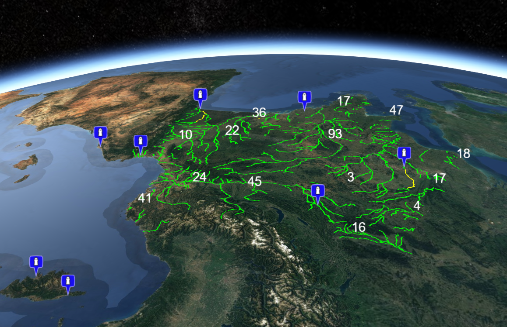

# Overview

The map module includes basic features to create web mapping applications: [geocoding](./services.md#geocoder-service), [data catalog](./services.md#catalog-service), [dynamic feature layers](./services.md#feature-service), [2D visualisation](./components.md#map), [3D visualisation](./components.md#globe).

In order to avoid loading too much resources on the client side, the `map` client module is internally broken into 2 different parts.

* 2D mapping API to be used within the browser and imported like this:

`import { xxx } from '@kalisio/kdk/map.client.map'`

* 3D mapping API (i.e. virtual globe) API to be used within the browser and imported like this:

`import { xxx } from '@kalisio/kdk/map.client.globe'`

If you use the standard way of importing the client API within the browser like the following you will load both 2D and 3D mapping API:

`import { xxx } from '@kalisio/kdk/map.client'`

## API

* [Services](./services.md)
* [Hooks](./hooks.md)

## Client 

* [Utilities](./utilities.md)
* [Mixins](./mixins.md)
* [Map Mixins](./map-mixins.md)
* [Globe Mixins](./globe-mixins.md)
* [Composables](./composables.md)
* [Components](./components.md)
