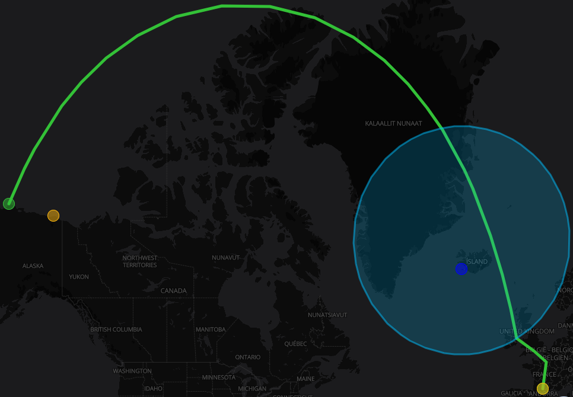
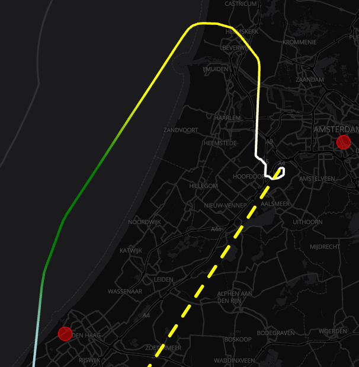
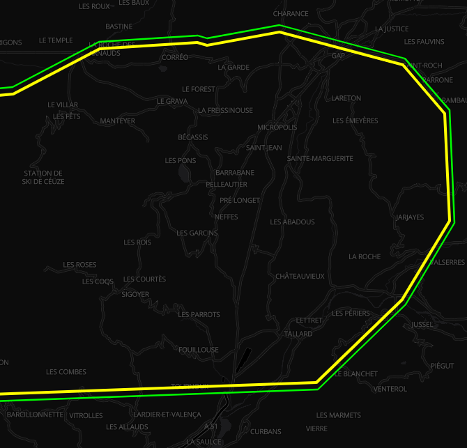
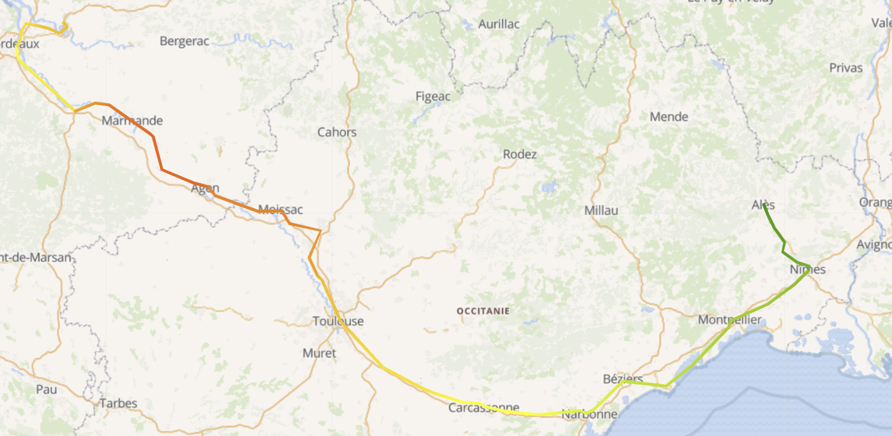

# Map Mixins

The underlying map object is based on [Leaflet](http://leafletjs.com/) and some mixins also rely on [Leaflet plugins](https://leafletjs.com/plugins.html). The following set of mixins is to be used to construct a new map activity and underlying Leaflet objects.

## Base Map

::: danger
This mixin is a mandatory one to build a map activity
:::

Make it possible to manage map layers and extend supported layer types:
* **setupMap(domElement, options)** creates the underlying Leaflet map object with given options
* **addLayer(options)/removeLayer(name)** registers/destroys a layer based on a [catalog layer descriptor](./services.md#catalog-service)
* **showLayer/hideLayer(name)** (un)hides the given layer in map, on first show the layer will be lazily created
* **hasLayer(name)** check if a given layer is already registered
* **isLayerVisible(name)** check if a given layer is visible and underlying Leaflet object created
* **zoomToLayer(name)** fits the map view to visualize a given layer
* **zoomToBounds(bounds)** fits the map view to visualize a given extent as bounds [ [south, west], [north, east] ]
* **getLayerByName(name)** retrieve the [catalog layer descriptor](./services.md#catalog-service) for a given layer
* **renameLayer(previousName, newName)** rename a given layer
* **removeLayer(name)** destroys a given layer
* **getLeafletLayerByName(name)** retrieve the underlying Leaflet object for a given layer
* **createLeafletLayer(options)** creates the underlying Leaflet object based on a [catalog layer descriptor](./services.md#catalog-service), will check all registered constructor for any one matching
* **getLeafletPaneByName(name)** retrieve the underlying Leaflet object for a given pane
* **createLeafletPane(name)** creates the underlying Leaflet object for a pane
* **removeLeafletPane(name)** destroys the underlying Leaflet object for a given pane
* **isPaneVisible(name)** check if a given pane is visible
* **showPane/hidePane(name)** (un)hides the given pane in map
* **registerLeafletConstructor(constructor)** registers a Leaflet constructor function for a given type of layer
* **center(longitude, latitude, zoomLevel, bearing, options)** centers the map view to visualize a given point at a given zoom level, and possibly bearing when the [leaflet-rotate](https://github.com/Raruto/leaflet-rotate) plugin is active, some options like the following can also be added:
  * an animation `duration` in seconds to perform the changes,
  * an `offset` with `x` and `y` coordinates in pixels for off-centered map
* **getCenter()** get the current map view center as `longitude`, `latitude` and `altitude`
* **getBounds()** get the current map view bounds as `[ [south, west], [north, east] ]`
* **setBearing(bearing, options)** change the current bearing of the map when the [leaflet-rotate](https://github.com/Raruto/leaflet-rotate) plugin is active, options like the following can also be added:
  * an `offset` with `x` and `y` coordinates in pixels for off-centered map rotation
* **setCurrentTime(datetime)** sets the current time to be used for time-based visualisation (e.g. weather forecast data or dynamic features)

You can perform smooth animation of map moves, including screen-space offset, with the `center()` method like this:
```js
center(longitude, latitude, zoomLevel, bearing, {
  // Animate during 1 second
  duration: 1,
  animate: {
    // Animate along rhumb line with cubic bezier easing function
    center: { easing: { function: 'cubicBezier' }, rhumb: true },
    // No animation on zoom
    zoom: false,
    bearing: { easing: { function: 'cubicBezier' } }
  },
  // Move the center 300 pixels down on the screen
  offset: { x: 0, y: -300 }
})
```

::: tip
The `rhumb` option is used to interpolate position along a [Rhumb line](https://en.wikipedia.org/wiki/Rhumb_line), otherwise the [Haversine formula](https://en.wikipedia.org/wiki/Haversine_formula) is used to account for global curvature.
:::

Available [easing functions](https://developer.mozilla.org/fr/docs/Web/CSS/easing-function) are `linear`, `easeOut` (ease power as parameter), `cubicBezier` (coordinates of points defining the curve - x1, y1, x2, y2 - as parameters): 
```js
animate: {
  center: { easing: { function: 'linear' } },
  zoom: { easing: { function: 'easeOut', parameters: [0.5] } },
  bearing: { easing: { function: 'cubicBezier', parameters: [0.42, 0, 0.58, 1] } }
}
```

This mixin also adds the following internal data properties:
* **layers** available layers as [catalog layer descriptors](./services.md#catalog-service)

This mixin automatically includes some Leaflet plugins like:
* [leaflet-fa-markers](https://github.com/danwild/leaflet-fa-markers) to create markers using Font Awesome icons,
* [Leaflet.fullscreen](https://github.com/Leaflet/Leaflet.fullscreen) to manage fullscreen mode,
* [Leaflet.markercluster](https://github.com/Leaflet/Leaflet.markercluster) to create marker clusters,
* [Leaflet.donutcluster](https://github.com/kalisio/Leaflet.DonutCluster) to create donut clusters,
* [leaflet-graphicscale](https://github.com/kalisio/leaflet-graphicscale) to add enhanced scale bar controls,
* [leaflet.locatecontrol](https://github.com/domoritz/leaflet-locatecontrol) to display user's location,
* [leaflet-geoman](https://github.com/geoman-io/leaflet-geoman) to edit layers,
* [leaflet.geodesic](https://github.com/henrythasler/Leaflet.Geodesic) to draw geodesic lines and circles,
* [leaflet-timedimension](https://github.com/socib/Leaflet.TimeDimension) to manage time dimension on some layers (typically WMS),
* [leaflet-rotate](https://github.com/Raruto/leaflet-rotate) to add rotation capabilities,
* [Leaflet.VectorGrid](https://github.com/Leaflet/Leaflet.VectorGrid) to display [vector tiles](https://github.com/mapbox/vector-tile-spec).

It also enhance the Leaflet Grid Layer class with an additional `edgeBufferTiles` property to control tiles pre-loading outside the current viewport like does this [plugin](https://github.com/TolonUK/Leaflet.EdgeBuffer).

### Managing panes

Although DOM-based layers like [Markers](https://leafletjs.com/reference.html#marker) could make use of a `z-index` to possibly manage render order between them, SVG or canvas-based layers used to manage [GeoJson features](https://leafletjs.com/reference.html#geojson) like [Polylines](https://leafletjs.com/reference.html#polyline) provided no mean to do so. Similarly, there was no simple way to render some layers only at some specific zoom levels. This is the reason why Leaflet 1.0 introduced the concept of [panes](https://leafletjs.com/reference.html#map-pane).

If you add a `zIndex` option to your layer descriptor we will create a dedicated pane for you under-the-hood so that the layer will be rendered at its right rank. Check the `z-index` value of [the default panes](https://leafletjs.com/reference.html#map-pane) to select the appropriate one.

If you add a `panes` option to your layer descriptor we will create the dedicated panes for you under-the-hood so that you can then set in the `pane` option of any sublayer the pane it will belong to. Each pane must have a unique name, an optional z-index and can be visible at specific zoom levels:
```js
{
  name: 'Layer',
  ...
  panes: [{
    name: 'waypoints',
    zIndex: 450,
    minZoom: 7,
    maxZoom: 14
  }]
}
```

::: tip
In the case you only specify a `zIndex` the name will be the `zIndex` (as string)
:::

::: tip
Features that are not attached to specific panes through the `pane` property in a layer will end up with the `zIndex` value of the layer (if none the default value is 400).
:::

::: danger
Specifying `zIndex` or `minZoom/maxZoom` at layer level is mutually exclusive with defining `panes` at layer level.
:::

Althought the visibility of the panes will be automatically updated based on the current zoom level of your map, you can also programmatically change it using the `showPane/hidePane(name)` methods.

## Map Style

**KDK** intoduces its own style specification as described below:

```js
style: {
  visibility: true, // a boolean (or a string with "true" or "false" when templated) controlling feature's visibility, defaults to true
  // Line geometry
  line: {
    color: 'black' // any HTML color or [Quasar color](https://quasar.dev/style/color-palette/)
    width:  1 // any positive value
    opacity: 1.0 // range from 0.0 (transparent) to 1.0 (opaque)
    cap: 'round', // https://developer.mozilla.org/en-US/docs/Web/SVG/Attribute/stroke-linecap
    join: 'round', // https://developer.mozilla.org/en-US/docs/Web/SVG/Attribute/stroke-linejoin
    dashArray: 'none', // https://developer.mozilla.org/en-US/docs/Web/SVG/Attribute/stroke-dasharray
    dashOffset: 0 // https://developer.mozilla.org/en-US/docs/Web/SVG/Attribute/stroke-dashoffset
  },
  // Polygon geometry
  polygon: {
    color: 'black', // fill color, any HTML color or [Quasar color](https://quasar.dev/style/color-palette/)
    opacity: 1.0, // fill opacity
    fillRule: 'evenodd' // https://developer.mozilla.org/en-US/docs/Web/SVG/Attribute/fill-rule
    stroke: {
        color: 'black', // any HTML color or [Quasar color](https://quasar.dev/style/color-palette/)
        width: 1, // any positive value
        opacity: 1.0, // range from 0.0 (transparent) to 1.0 (opaque)
        cap: 'round', // https://developer.mozilla.org/en-US/docs/Web/SVG/Attribute/stroke-linecap
        join: 'round', // https://developer.mozilla.org/en-US/docs/Web/SVG/Attribute/stroke-linejoin
        dashArray: 'none', // https://developer.mozilla.org/en-US/docs/Web/SVG/Attribute/stroke-dasharray
        dashOffset: 0, // https://developer.mozilla.org/en-US/docs/Web/SVG/Attribute/stroke-dashoffset
    }
  },
  // Point geometry
  point: {
    shape: 'circle', // represent a registered SVG shape
    size: ['24px', '24px'], // array of HTML sizes
    radius: undefined,  // alternative to the size property.
    color: 'black', // any HTML color or [Quasar color](https://quasar.dev/style/color-palette/)
    opacity: 1.0, // range from 0.0 (transparent) to 1.0 (opaque)
    stroke: { 
        color: 'black', // any HTML color or [Quasar color](https://quasar.dev/style/color-palette/)
        width: 1, // any positive value
        opacity: 1.0, // range from 0.0 (transparent) to 1.0 (opaque)
        cap: 'round', // https://developer.mozilla.org/en-US/docs/Web/SVG/Attribute/stroke-linecap
        join: 'round', // https://developer.mozilla.org/en-US/docs/Web/SVG/Attribute/stroke-linejoin
        dashArray: 'none', // https://developer.mozilla.org/en-US/docs/Web/SVG/Attribute/stroke-dasharray
        dashOffset: 0 // https://developer.mozilla.org/en-US/docs/Web/SVG/Attribute/stroke-dashoffset
    },
    icon: {
      classes: undefined // must be specified, e.g 'las la-home'
      url: '' // url to the image to be displayed. Alternative to the classes property
      color: 'black', // any HTML color or [Quasar color](https://quasar.dev/style/color-palette/)
      opacity: 1.0, // range from 0.0 (transparent) to 1.0 (opaque)
      size: '14px', // any HTML size
      translation: ['-50%', '-50%'], // translation to apply to render the icon relative to the shape
      rotation: 0 // rotation to apply to render the icon relative to the shape
    },
    text: {
      label: undefined, // text to be displayed
      color: 'black', // any HTML color or [Quasar color](https://quasar.dev/style/color-palette/)
      size: '12px', // any HTML size
      translation: ['-50%', '-50%'], // translation to apply to render the text relative to the shape
      rotation: 0, // rotation to apply to render the text relative to the shape
      extraStyle: 'background-color: #1A1A1A' // additional CSS to be applied to text
    },
    html: null // an HTML element to be rendered
  }
}
```

**KDK** comes with a set of predefined marker shapes: `circle`, `rect`, `rounded-rect`, `diamond`, `triangle`, `triangle-down`, `triangle-left`, `triangle-right`, `star`, `marker-pin`, `square-pin`. But it allows you to register you own shape. See the [Shapes](../core/components.md#shapes) section to understaned how to register a new shape.

In addition and for backward compatibility, **KDK** supports an enhanced [simple style spec options](https://github.com/mapbox/simplestyle-spec) with the following mapping:

| SimpleStyleSpec | KDK Style |
|---|---|
| `z-index` | `pane` |
| pane | `pane` |
| stroke | `color` |
| `stroke-color` | `color` |
| `stroke-opacity` | `opacity` |
| `stroke-width` | `weight` |
| fill | `fillColor` |
| `fill-opacity` | `fillOpacity` |
| `fill-color` | `fillColor` |
| weight | `weight` |
| radius | `radius` |
| `line-cap` | `lineCap` |
| `line-join` | `lineJoin` |
| `dash-array` | `dashArray` |
| `dash-offset` | `dashOffset` |
| `marker-symbol` | `style.point.shape` |
| `marker-size` | `style.point.size` |
| `marker-color` | `style.point.color` |
| `marker-anchor` | `style.point.anchor` |
| `icon-url` | `style.point.icon.url` |
| `icon-html` | `style.point.html` |
| `icon-color` | `style.point.icon.color` |
| `icon-size` | `style.point.icon.size` |
| `icon-anchor` | `style.point.anchor` |
| `icon-class` | `style.point.icon.classes` |
| `icon-opacity` | `style.point.icon.opacity` |
| `icon-classes` | `style.point.icon.classes` |
| `icon-x-offset` | `style.point.icon.xOffset` |
| `icon-y-offset` | `style.point.icon.yOffset` |

The mixin automatically registers defaults styling for the the following type: `point`, `line` and `polygon`. For each type, the following options are  merged with the following order of precedence:
  * feature style:  **feature.style** or [simple style spec options](https://github.com/mapbox/simplestyle-spec) located in **feature.properties**
  * layer style set on layer descriptor
  * engine style set on engine descriptor

::: tip
All these style properties can be templated using [lodash string templates](https://lodash.com/docs/4.17.15#template). Their final values will be computed at creation/update time.
:::


::: details Example

The following collection is rendered as illustrated below:

```json
{
  "type": "FeatureCollection",
  "crs": { "type": "name", "properties": { "name": "urn:ogc:def:crs:OGC:1.3:CRS84" } },                                                                              
  "features": [
    { 
      "type": "Feature", 
      "style": { "color": "magenta", "opacity": 0.5, "stroke": { "color": "yellow", "width": 3 } },
      "properties": { "name": "Parc de la Colline" }, 
      "geometry": { "type": "Polygon", "coordinates": [ [ [ -72.357206347890767, 47.72858763003908 ], [ -71.86027854004486, 47.527648291638172 ], [ -72.37075892446839, 47.539848426151735 ], [ -72.357206347890767, 47.72858763003908 ] ] ] } 
    },
    { 
      "type": "Feature", 
      "properties": { "name": "Centre Paul-Étienne Simard", "fill": "orange", "stroke": "green", "stroke-width": 3 }, 
      "geometry": { "type": "Polygon", "coordinates": [ [ [ -72.357206347890767, 48.013440900213297 ], [ -72.239750684218109, 48.013440900213297 ], [ -72.253303260795718, 47.856056000888501 ], [ -72.027426984502114, 47.856056000888501 ], [ -72.036462035553868, 48.013440900213297 ], [ -71.905453795303586, 48.01646283861713 ], [ -71.891901218725963, 47.801464984333364 ], [ -72.361723873416651, 47.810567474765456 ], [ -72.357206347890767, 48.013440900213297 ] ] ] } 
    },
    { 
      "type": "Feature", 
      "properties": { "name": "Loisirs Rivière du Moulin" }, 
      "geometry": { "type": "Polygon", "coordinates": [ [ [ -72.194575428959382, 48.33278115872843 ], [ -72.018391933450374, 48.33278115872843 ], [ -71.846725963467236, 48.251628525276693 ], [ -71.950629050562299, 48.107038644740094 ], [ -72.203610480011122, 48.107038644740094 ], [ -72.397864077623623, 48.221539261269051 ], [ -72.194575428959382, 48.33278115872843 ] ] ] } 
    },
    { 
      "type": "Feature",
      "style": { "color": "blue", "opacity": 0.5, "width": 3, "dashArray": "0 8 0" },
      "properties": { "name": "Saint-Remy-en-Bouzemont-Saint-Genest-et-Isson" }, 
      "geometry": { "type": "LineString", "coordinates": [ [ -73.839785615317746, 47.564240180362376 ], [ -73.627461915601779, 47.716431476953346 ], [ -73.455795945618627, 47.552045722357249 ], [ -73.279612450109633, 47.710352336655504 ] ] } 
    },
    { 
      "type": "Feature",
      "properties": { "name": "Sainte-Geneviève", "stroke": "orange", "stroke-width": 6 }, 
      "geometry": { "type": "LineString", "coordinates": [ [ -73.716981531178234, 47.889388912080449 ], [ -73.423342371996569, 48.091953743979651 ], [ -73.242641350961676, 47.883329977544491 ], [ -73.685358852497131, 47.862118125007399 ] ] } 
    },
    { 
      "type": "Feature", 
      "properties": { "name": "Saint-Anicet" }, 
      "geometry": { "type": "LineString", "coordinates": [ [ -73.485142395986983, 48.338787334581873 ], [ -73.480624870461128, 48.161307640513321 ], [ -73.385756834417805, 48.164320903012829 ], [ -73.394791885469544, 48.338787334581873 ] ] } 
    },
    { 
      "type": "Feature", 
      "style": { "shape": "star", "size": [48, 45], "color": "orange", "stroke": { "color": "green", "width": 2 }, "text": { "label": "01" } },
      "properties": { "name": "Sydenham" }, 
      "geometry": { "type": "Point", "coordinates": [ -71.051641470913779, 47.610352336655504 ] } 
    },
    { "type": "Feature", 
      "style": { "shape": "circle", "color": "blue", "size": [32, 32], "stroke": { "color": "white", "width": 1 }, "icon": { "classes": "las la-home", "color": "white", "size": "20" } },
      "properties": { "name": "Saint-Luc" }, 
      "geometry": { "type": "Point", "coordinates": [ -71.110369302750115, 47.998430466372736 ] }
    },
    { 
      "type": "Feature", 
      "style": { "shape": "none", "color": "transparent", "size": [64, 64], "icon": { "url": "icons/kdk/position-cursor.png" } },
      "properties": { "name": "Loisirs du Fjord du Saguenay" }, 
      "geometry": { "type": "Point", "coordinates": [ -70.988396113551573, 48.32977780546792 ] }
    }
  ]
}
```


:::

## Map Popup

Make it possible to generate [Leaflet popups](https://leafletjs.com/reference.html#popup) based on GeoJson feature properties. Use **register/unregisterStyle(`popup`, generator)** to (un)register a function **f(feature, layer, options)** returning a [Leaflet popup](https://leafletjs.com/reference.html#popup)

The mixin automatically registers a default generator that will create a popup displaying a property name/value table based on the following options with the following order of precedence
  * **popup**: set on **feature.properties** or layer descriptor or in the **popup** property of component options
    * **pick**: array of property names to appear in the popup
    * **omit**: array of property names not to appear in the popup
    * **template**: [Lodash template](https://lodash.com/docs/#template) to generate popup content with `feature`, its `properties` and translation function `$t` as context
    * **text**: text content of the popup, if provided will override default display
    * **options**: Leaflet [popup options](https://leafletjs.com/reference.html#popup-option)

::: tip
If you want to disable a default popup configuration like `popup: { }` (i.e. display all properties) on a per-layer basis you have to explicitely unset it on your layer options using `popup: null` or `popup: false`.
:::

## Map Tooltip

Make it possible to generate [Leaflet tooltips](https://leafletjs.com/reference.html#tooltip) based on GeoJson feature properties. Use **register/unregisterStyle(`tooltip`, generator)** to (un)register a function **f(feature, layer, options)** returning a [Leaflet tooltip](https://leafletjs.com/reference.html#tooltip)

The mixin automatically registers a default generator that will create a tooltip based on the following options with the following order of precedence
  * **tooltip**: set on **feature.properties** or layer descriptor or in the **tooltip** property of component options
    * **property**: property name to appear in the tooltip
    * **template**: [Lodash template](https://lodash.com/docs/#template) to generate tooltip content with `feature`, its `properties` and translation function `$t` as context
    * **text**: text content of the tooltip, if provided will override default display
    * **options**: Leaflet [tooltip options](https://leafletjs.com/reference.html#tooltip-option)

::: tip
If you want to disable a default tooltip configuration like `tooltip: { property: 'name' }` (i.e. display all properties) on a per-layer basis you have to explicitely unset it on your layer options using `tooltip: null` or `tooltip: false`.
:::

## GeoJson Layer

Make it possible to manage and style raw or time-based GeoJson map layers ([Leaflet.Realtime plugin](https://github.com/perliedman/leaflet-realtime) is used under-the-hood):
* **createLeafletGeoJsonLayer(options)** automatically registered GeoJson Leaflet layer constructor
* **updateLayer(name, geoJson, options)** update underlying GeoJson data of a given layer, options like the following can also be added:
  * `removeMissing` when `true` it will remove features from the layer that do not exist in the updated data, otherwise it will add new ones found and update matching ones based on the `featureId` property of the layer definition
  * `remove` when `true` it will remove given features from the layer based on the `featureId` property of the layer definition
  * `replace` when `true` it will replace given features from the layer, otherwise it will update matching ones based on the `featureId` property of the layer definition

You can perform smooth animation of map features using the following `options`  with the `updateLayer()` method like this:
```js
updateLayer('MyLayer', { type: 'FeaturesCollection', features: [...] }, {
  // Animate during 1 second
  duration: 1,
  animate: {
    // Animate along rhumb line with cubic bezier easing function
    geometry: { easing: { function: 'cubicBezier' }, rhumb: true },
    // Animation on the feature track property, which is actually a bearing angle
    track: { easing: { function: 'cubicBezier' }, bearing: true }
  }
})
```

::: tip
The `rhumb` option is used to interpolate position along a [Rhumb line](https://en.wikipedia.org/wiki/Rhumb_line), otherwise the [Haversine formula](https://en.wikipedia.org/wiki/Haversine_formula) is used to account for global curvature.
The `bearing` option is used to properly interpolate angles in [0, 360°[ using the "shortest path" and not all the way round.
:::

Available [easing functions](https://developer.mozilla.org/fr/docs/Web/CSS/easing-function) are `linear`, `easeOut` (ease power as parameter), `cubicBezier` (coordinates of points defining the curve - x1, y1, x2, y2 - as parameters): 
```js
animate: {
  geometry: { easing: { function: 'linear' } },
  track: { easing: { function: 'easeOut', parameters: [0.5] }, bearing: true },
  value: { easing: { function: 'cubicBezier', parameters: [0.42, 0, 0.58, 1] } }
}
```

::: danger
The [style mixin](./mixins.md#map-style) is mandatory when using this mixin. If you'd like to support popups/tooltips you should also use the [popup mixin](./mixins.md#map-tooltip) and/or [tooltip mixin](./mixins.md#map-tooltip).
:::

### Clustering

Marker [clustering options](https://github.com/Leaflet/Leaflet.markercluster#options) are to be provided in the **cluster** property of the Leaflet layer options or in the **cluster** property of component options, with this order of precedence. The following configuration illustrates a GeoJson marker cluster layer using options set on the layer descriptor (see image below):
```js
{
  name: 'Layer',
  description: 'My sites',
  tags: [ 'business' ],
  icon: 'star',
  attribution: '(c) My company',
  type: 'OverlayLayer',
  leaflet: {
    type: 'geoJson',
    source: 'https://s3.eu-central-1.amazonaws.com/kargo/nuclear-sites.json',
    cluster: {},
    'marker-color': 'orange',
    'icon-color': 'white',
    'icon-classes': 'fa fa-star',
    popup: {
      pick: [ 'NAME' ]
    },
    tooltip: {
      property: 'LABEL'
    }
  }
}
```


::: tip
If you want to disable a default clustering configuration like `cluster: { disableClusteringAtZoom: 18 }` on a per-layer basis you have to explicitely unset it on your layer options using `cluster: null` or `cluster: false`.
:::

### Additional feature types

The following options can be set as feature `properties` to manage more geometry types:
* **geodesic** boolean set to `true` on a `LineString` will result in a geodesic line from the [Leaflet.Geodesic](https://github.com/henrythasler/Leaflet.Geodesic) plugin
* **geodesic** boolean set to `true` on a `Point` will result in a great circle from the [Leaflet.Geodesic](https://github.com/henrythasler/Leaflet.Geodesic) plugin, which **radius** must be specified in meters
* **gradient** color array set on a `LineString` will result in a color ramp applied to the line by mapping each point to the corresponding color in the array 
* **mask** boolean set to `true` on a `Polygon` or `MultiPolygon` will result in the polygon(s) acting as a mask over the map
* **offset** integer set to a number of pixels on a `LineString` will result in the line being offset by the specified number of pixels when drawn







### Dynamic styling

Usually the same style is used for all features of a GeoJson layer, you might however require a more dynamic style base on each feature properties. To handle this use case you can either:
* provide styling options for each feature in their `properties` or `style` field
* use [Lodash templating](https://lodash.com/docs/#template) on layer styling options with feature and its properties as context

::: warning
Templating can only be efficient if compilers are created upfront, as a consequence you need to declare the list of templated options in your layer styling using the `template` property.
:::

For instance you can change the marker color or image based on a given features's property like this:
```js
'marker-color': `<% if (properties.visibility < 75) { %>#000000<% }
                  else if (properties.visibility < 300) { %>#d20200<% }
                  else if (properties.visibility < 1500) { %>#f9b40f<% }
                  else if (properties.visibility < 3000) { %>#eef52f<% }
                  else { %>#33c137<% } %>`,
'marker-symbol': `<% if (properties.visibility < 75) { %>/statics/windyblack.png<% }
                    else if (properties.visibility < 300) { %>/statics/windyred.png<% }
                    else if (properties.visibility < 1500) { %>/statics/windyorange.png<% }
                    else if (properties.visibility < 3000) { %>/statics/windyyellow.png<% }
                    else { %>/statics/windygreen.png<% } %>`,
template: ['marker-color', 'marker-symbol']
```

You can also draw a path with a different styling on each part like this:
```js
{
  type: 'FeatureCollection',
  features: [{
    type: 'Feature',
    properties: { stroke: '#000000', weight: 1 },
    geometry: { type: 'LineString', coordinates: [...] }
  }, {
    type: 'Feature',
    properties: { stroke: '#FF00FF', weight: 3 },
    geometry: { type: 'LineString', coordinates: [...] }
  }]
}
```

### Dynamic building

You might want to dynamically build new GeoJSON features based on existing ones, such as creating a gradient color line from a set of points depending on a specific property value. To handle this use case, you can define build options in the layer's `variables` section.

::: warning
Only one build option can be defined per layer.
:::

#### Dynamically building a gradient path

A gradient path is a line string where each point has a color and the rendering of that line interpolates colors along each line segment. Generally a color map is used to map between arbitrary feature properties and a color.

You can dynamically build gradient paths adding a `gradientPath` object to the `variable` you want to use as source for the color map. The color map used to compute the color of each point is the one defined in the `variable` object. The line will be built by linking all the GeoJSON points sorted by time. The layer's `featureId` property is used to perform the aggregation and group related points.

The following example will group features by `sensorId`, produce a line string for each unique `sensorId` and for each of those lines, will use the `accuracy` property of each point to compute the color along the lines.

```js
featureId: 'sensorId',
variables: [
  {
    name: 'accuracy',
    chromajs: {
      colors: ['#00FF00', '#FFFF00', '#FFAA00', '#FF0000'],

      classes: [0, 500, 1000, Number.MAX_VALUE] // For predefined colors 
      // or
      domain: [0, 1500],                        // For continuous color gradient
    },
    gradientPath: {
      properties: {
        weight: 7,
        opacity: 0.65,
      }
    }
  }
]
```

The required fields are:
* `chromajs`: this is what will be used to compute the mapping between `accuracy` values and color for each point
* `gradientPath`: this is what triggers the construction of the gradient path line, the following properties have a special meaning:
  * `svg`: a boolean, if true the rendering will be done using an SVG element, otherwise it'll use WebGL and pixi.js
  * `opacity`: a floating point value `[0,1]` to blend the gradient path with the map
  * `weight`: if `svg` is set, this is a pixel value (independent of zoom level) to use to draw the line. If not set that's a way to specify the width of the line.

Every property in the `gradientPath.properties` section will be added to the produced GeoJSON line string.



## Edit Layer

Make it possible to edit features of a [GeoJson layer](./map-mixins.md#geojson-layer) (geometry and properties):
* **editLayer(name)** start/stop layer edition on a given layer
* **updateFeatureProperties(feature, layer, leafletLayer)** update feature properties action handler that will open an [editor](../core/components.md#editors) to define feature properties

::: warning
It has to be used with the GeoJson layer mixin and will use the configured styling.
:::

## File Layer

Make it possible to drag'n'drop GeoJson or KML file on the map ([Leaflet.FileLayer plugin](https://github.com/makinacorpus/Leaflet.FileLayer) is used under-the-hood). It will automatically create a new [GeoJson layer](./map-mixins.md#geojson-layer) named after the filename on drop. As a consequence it has to be used with the GeoJson layer mixin and will use the configured styling.

## Forecast Layer

Make it possible to manage [Weacast map layers](https://weacast.github.io/weacast-docs/api/layers.html#forecast-data-layers):
* **createLeafletForecastLayer(options)** automatically registered Weacast Leaflet layer constructor

::: warning
This mixin assumes that your component has initialized its [Weacast client](https://weacast.github.io/weacast-docs/api/application.html#client-setup) in the `weacastApi` property by using e.g. the [Weacast mixin](./mixins.md#weacast)
:::

## Canvas Layer

Make it possible to draw custom graphic elements on top of other layers using HTML canvas elements. These custom graphic elements are defined by their draw function and are run in the client application, using a controlled draw context. It is not possible for these draw functions to access anything outside the specified context.

* **createLeafletCanvasLayer (options)** is automatically registered to allow creation of such Leaflet layer. The following fields can be set on the **options** object:
  * **draw** an array containing the same information as given to **setCanvasLayerDrawCode** **drawCode** parameter.
  * **userData** an object containing user data that'll be usable in the draw code.
  * **autoRedraw** boolean set to true if the canvas should automatically be redrawn every frame.
  * **pointerEventsEnabled** boolean set to true to enable pointer events on the canvas layer (required if you use clickable elements).
  * **clickThroughEnabled** boolean set to true to allow click events to go through the canvas layer when no clickable elements were clicked (requires **pointerEventsEnabled** to work).

* **setCanvasLayerDrawCode (layerName, drawCode, autoRedraw)** define the draw code used by the layer named `layerName`. `autoRedraw` is a boolean used to enable automatic refresh of the layer at each displayed frame (required eg. to animate elements). `drawCode` is expected to be an array of objects where each object is of the following form :
  * `{ feature: 'LAYER_NAME?FEATURE_NAME', code: '... some javascript draw code ...' }` will run the given draw code only for the feature named `FEATURE_NAME` in the layer named `LAYER_NAME`.
  * `{ layer: 'LAYER_NAME', code: '... some javascript draw code ...' }` will run the given draw code for each feature of the layer named `LAYER_NAME`.

* **setCanvasLayerUserData (layerName, userData)** is used to add some custom user data to the draw context. The `userData` object parameter will be merged into the `userData` object available on the draw context. This allows users to push partial updates, there's no need to push the whole user data every time a single member changes.

* **setCanvasLayerAutoRedraw (layerName, autoRedraw)** is used to enable or disable automatic redraw of the canvas layer named `layerName`. Automatic redraw may be required for example when animating objects. By default automatic redraw is off, which means that the canvas layer will only redraw when :
  * the user moves the map
  * `setCanvasLayerDrawCode` is called
  * `setCanvasLayerUserData` is called

The following configuration illustrates a layer used to draw feature property **name** as text at the feature position for all features of the layer named **Airports**.

```js
{
  name: 'AirportNames',
  type: 'OverlayLayer',
  icon: 'local_airport',
  leaflet: {
    type: 'kanvasLayer',
    isVisible: true,
    draw: [
      layer: 'Airports', code: `
        const props = ctx.feature.properties
        const coords = {
          lat: ctx.feature.geometry.coordinates[1],
          lon: ctx.feature.geometry.coordinates[0]
        }

        const pos = ctx.latLonToCanvas(coords)
        ctx.canvas.font = '10px sans-serif'
        ctx.canvas.fillStyle = '#ffb300'
        ctx.canvas.fillText(ctx.feature.properties.name, pos.x, pos.y)
      `
    ]
  }
}
```

The `ctx` object is the draw context and is the only object available from the draw code.

By default, the following fields are available on the draw context :
* **canvas** the canvas rendering interface by which the drawing will occur. Draw api is available [here](https://developer.mozilla.org/en-US/docs/Web/API/CanvasRenderingContext2D).
* **now** the time of the draw function call, can be useful to animate things.
* **zoom** the current map zoom value.
* **latLonToCanvas (coords)** project from latitude/longitude to canvas coordinates (pixels).
* **addClickableFeature (geojson, path, clickStyle)** add a clickable [path element](https://developer.mozilla.org/en-US/docs/Web/API/Path2D) associated with the `geojson` feature. When clicked, it will emit a 'clicked' event with the associated feature as event data.
* **clearClickableFeatures ()** clear all the clickable features that have been added so far.
* **userData** object where all the user data pushed through `setCanvasLayerUserData` has been merged.
* **vec2 (a, b)** build a vec2 object from two points (where points and vec2 are objects with `x` and `y` members ).
* **len2 (vec)** compute length of a vec2 vector.
* **scale2 (vec, value)** scale a vec2 vector by `value`.
* **norm2 (vec)** return the corresponding normalized vec2 vector.

::: tip
It is possible to extend what's available in the draw context from the application using the `CanvasDrawContext` singleton. In this case you should call `CanvasDrawContext.merge(contextAdditionObject)` to merge the content of `contextAdditionObject` with the draw context. This call must be done before the canvas layer mixin is created. This can be useful to build an application specific library of draw functions and make these available to the canvas layer instances.
:::

## Map Activity

Make it easier to create 2D mapping activities:
* **initializeMap()** setup the mapping engine, **should be called first before any other method**
* **finalizeMap()** destroy the mapping engine

::: danger
It assumes that the DOM element used by the render engine has a ref named `map`
:::
