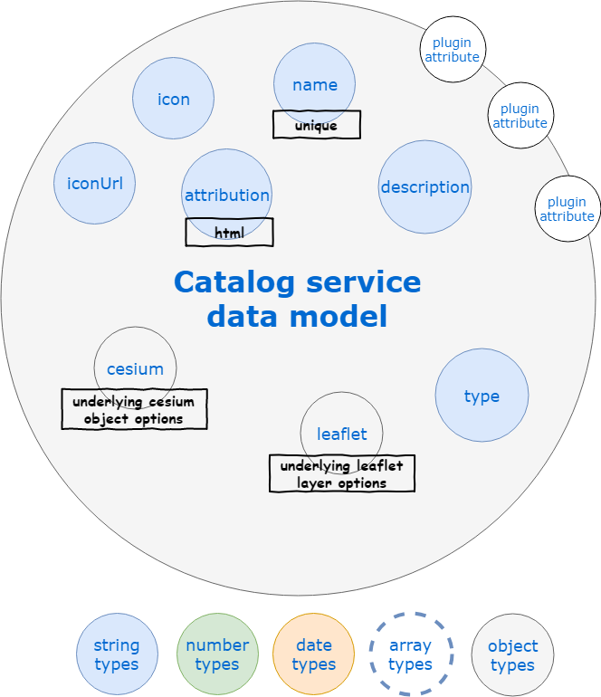
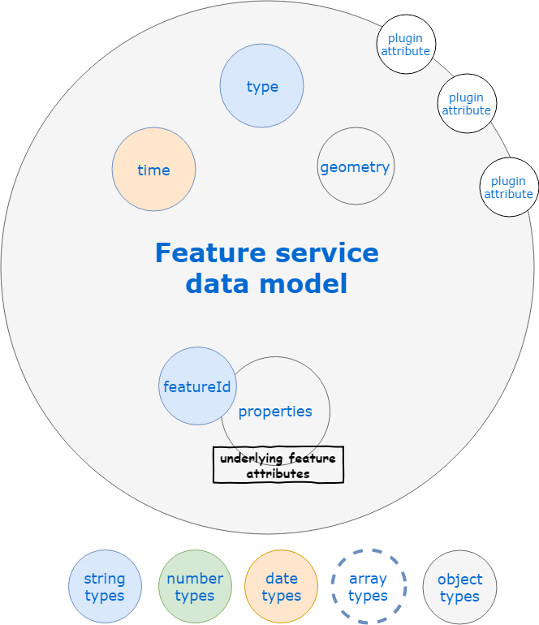
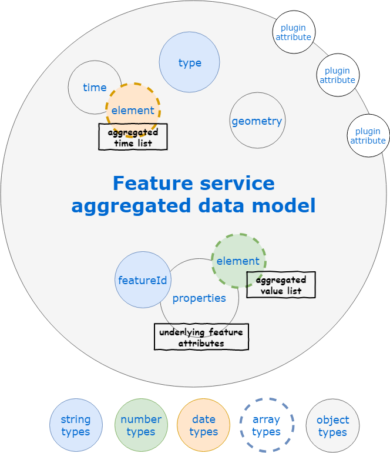
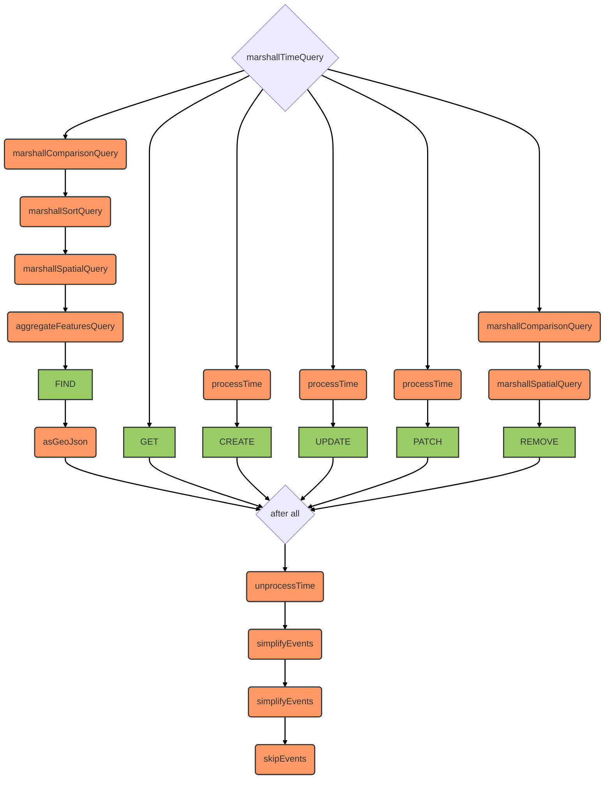
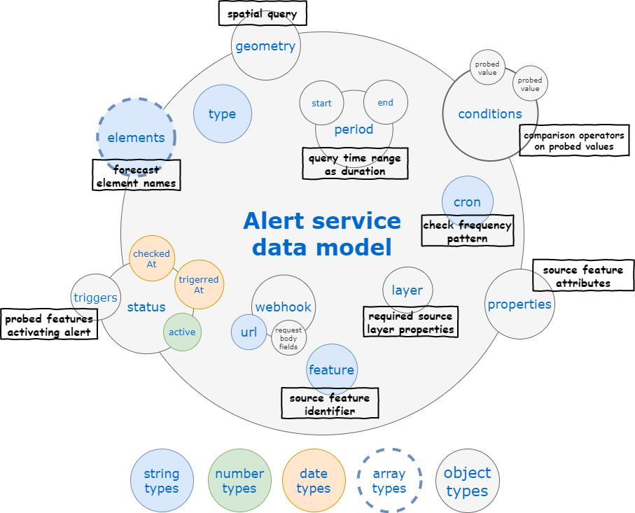
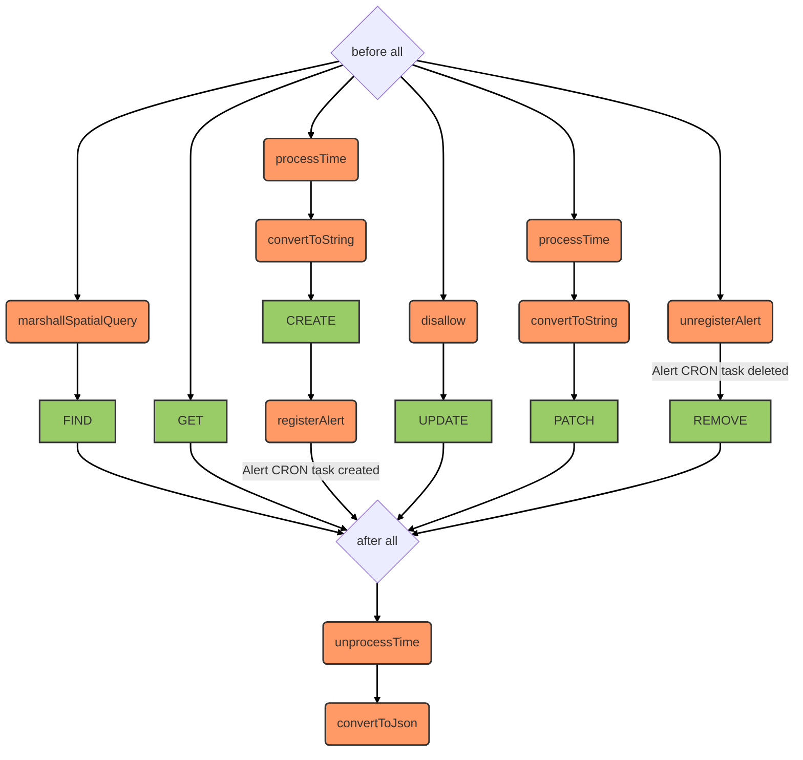

# Services

## Geocoder service

::: danger
Deprecated as per KDK version >= 2.1, now supported by https://github.com/kalisio/geokoder.
:::

::: tip
Available as a global service
:::

::: warning
`create` method is the only one allowed from the client/server side
:::

Rely on [node-geocoder](https://github.com/nchaulet/node-geocoder) under-the-hood.

### Data model

The data model of a geocoding request as used by the API only contains the **address** field specifying the string to be looked for. The request response depends on the geocoding provider although there is a set of common properties, see example below.

```javascript
const service = app.getService('geocoder')
const results = await service.create({ address: '29 champs elysée paris' })
results.forEach(element => {
  let { latitude, longitude, country, state,
  		streetNumber, streetName, city, zipcode, administrativeLevels } = element
  ...
})
```

Reverse geocoding works the same way except the input is based on a **lon/longitude** and **lat/latitude** fields, or a GeoJson feature, specifying the location to be looked for. 

```javascript
const service = app.getService('geocoder')
const results = await service.create({ lat: 45.767, lon: 4.833 })
results.forEach(element => {
  let { latitude, longitude, country, state,
      streetNumber, streetName, city, zipcode, administrativeLevels } = element
  ...
})
```

### Hooks

No [hooks](./hooks.md) are executed on the `geocoder` service for now.

## Catalog service

This service aims at storing the definition of available:
- map layers,
- map layers categories,
- map layers legend categories (a.k.a. sublegends),
- map contexts (extent, active layers and current time).

::: tip
Available as a global and a contextual service
:::

The service can be created using the global **createCatalogService(context, db)** function, if no arguments provided it will be available as a global service otherwise as a contextual service (e.g. attached to a specific organization), please also refer to core module [**createService()**](../core/application.md#createservice-name-options).

Here is a sample code to retrieve all data layer descriptors available in the catalog:
```javascript
const catalogService = app.getService('catalog')
let response = await catalogService.find()
_.forEach(response.data, (layer) => {
	if (layer[engine]) {
	  // Process i18n if you need to
	  if (this.$t(layer.name)) layer.name = this.$t(layer.name)
	  if (this.$t(layer.description)) layer.description = this.$t(layer.description)
	  // Create the underlying layer object in the map/globe
	  this.addLayer(layer)
	}
})
```

::: tip
By default the catalog filters contexts and return layers only if the target object `type` is unspecified.
:::

Here is a sample code to retrieve the default context (i.e. home view) available in the catalog:
```javascript
const catalogService = app.getService('catalog')
let response = await catalogService.find({ query: { type: 'Context', isDefault: true } })
this.loadContext(response.data[0])

```

### Data model

#### Layer

The data model of a layer descriptor as used by the API is detailed below.



The catalog is typically populated at application startup with a default set of layers, as a consequence the best is to have a look at some of our application configuration files like the one of [Kano](https://github.com/kalisio/kano/blob/master/api/config/layers).

The details of each property are the following:
* **name** : the layer name, typically used in the [catalog panel](./components.md#catalog-panel)
* **description** : the layer short description, typically used in the [catalog panel](./components.md#catalog-panel)
* **i18n**: layer translations, see [application internationalization](../core/application.md#client-ecosystem) for details
  * **locale**: translations for a target locale eg `fr` or `en`
     * **Layers**: translation keys/values for layer fields
     * **Variables**: translation keys/values for variable fields
     * **Levels**: translation keys/values for levels fields
* **type** : usually `BaseLayer` for map backgrounds, `TerrainLayer` for 3D terrain, `OverlayLayer` for additionnal data layers
* **tags** : list of tags (i.e. array of strings) used to classify the layer
* **icon** : a [Quasar icon](https://quasar.dev/options/app-icons) for the layer, typically used in the [layers panel](./components.md#layers-panel)
* **iconUrl** : a link to an image to be used as icon for the layer, typically used in the [layers panel](./components.md#layers-panel)
* **attribution** : data attribution informaiton to be displayed along with the layer
* **leaflet** : options to be passed to the underlying Leaflet layer constructor
  * **type**: the type of Leaflet layer to be constructed (i.e. class/constructor function name), e.g. `tileLayer` or `geoJson`
  * **source**: if provided this property is reserved for the first argument to be passed to the underlying Leaflet layer constructor, typically the URL or the GeoJson data, in this case the options will be passed as the second argument
  * **option**: all others fields are considered as options to be passed to the layer constructor
* **cesium**: options to be passed to the underlying Cesium layer constructor
  * **type**: the type of Cesium layer to be constructed (i.e. class/constructor function name), e.g. `EllipsoidTerrainProvider` or `BingImageryProvider`
  * **option**: all others fields are considered as options to be passed to the layer constructor

::: tip
The `type` and `tags` attributes are typically used by the [catalog panel](./components.md#catalog-panel) to organize the layer selection in a meaningful way.
:::

If the layer is a feature layer based on a [feature service](./services.md#feature-service) the additional properties are the following:
* **service**: the name of the underlying feature service
* **serviceEvents**: if `true` means the layer will be automatically updated as events are received from the underlying feature service, otherwise the data will be updated at a constant frequency as per **every** and **queryFrom** options (see hereafter)
* **probeService**: the name of the underlying feature service containing probe locations
* **dbName** : the database holding service data if different from application database
* **featureId**: the name of the unique feature identifier in feature (relative to the nested `properties` object) - could be an array for compound identifiers
* **chronicleId**: the name of the unique timeseries identifier in feature (relative to the nested `properties` object) for measure features - could be an array for compound identifiers
* **featureLabel**: the name of the label identifier in feature (relative to the nested `properties` object) - could be an array, useful to search for features based on a syntaxical pattern using https://github.com/arve0/feathers-mongodb-fuzzy-search
* **from**: the oldest stored feature age in history as [ISO 8601 duration](https://en.wikipedia.org/wiki/ISO_8601#Durations)
* **to**: the newest stored feature age in history as [ISO 8601 duration](https://en.wikipedia.org/wiki/ISO_8601#Durations)
* **every**: the sample frequency of the features as [ISO 8601 duration](https://en.wikipedia.org/wiki/ISO_8601#Durations)
* **queryFrom**: the period to search for data before the current time when displaying the features as [ISO 8601 duration](https://en.wikipedia.org/wiki/ISO_8601#Durations)
* **variables**: array of available properties in feature to be [aggregated over time](./services.md#time-based-feature-aggregation), for each entry the following options are available:
  * **name**: property name in feature (relative to the nested `properties` object),
  * **label**: property label to use in UI,
  * **unit**: target unit of the underlying data, if not the currently used for display it will be converted from using [math.js](http://mathjs.org/docs/datatypes/units.html)
  * **range**: [minimum, maximum] variable value variation range
  * **step**: default tick spacing for variable value
  * **chartjs**: options to be passed to [chart.js](https://www.chartjs.org/docs/latest/charts/line.html#dataset-properties) when drawing timeseries

#### User context

A *user context* consists in a map extent and a set of layers to be activated. It is used to restore a specific user view context at anytime.

The data model of a user context as used by the API is the following:
* **name** : the context name, typically used when listing favorite views
* **type** : `Context`
* **south,west,north,east**: context extent,
* **time**: context time,
* **layers**: array of active layer names

#### Category

A *layer category* is a way to group layers of a same topic together.

* **name** : the category name, typically used in the [catalog panel](./components.md#catalog-panel)
* **i18n**: category translations, see [application internationalization](../core/application.md#client-ecosystem) for details
  * **locale**: translations for a target locale eg `FR`
     * **Categories**: translation keys/values for category fields
* **options** : options for this category
  * **open**: flag to indicate if the category should initially be open in the catalog component
  * **exclusive**: flag to indicate mutually exclusive layer selection inside category
  * **filter**: [sift](https://github.com/crcn/sift.js) to select layers belonging to the category
* **icon** : a [Quasar icon](https://quasar.dev/options/app-icons) for the category, typically used in the [catalog panel](./components.md#catalog-panel)

::: tip
Categories are not stored in the database but simply exposed through the service from configuration files.
:::

#### Sublegend

A *sublegend* or *legend category* is a way to group legends of a same topic together.

* **name** : the sublegend name, typically used in the [legend](./components.md#legend)
* **i18n**: sublegend translations, see [application internationalization](../core/application.md#client-ecosystem) for details
  * **locale**: translations for a target locale eg `FR`
     * **Categories**: translation keys/values for sublegend fields
* **options** : options for this sublegend
  * **open**: flag to indicate if the sublegned should initially be open in the catalog component
  * **filter**: [sift](https://github.com/crcn/sift.js) to select layers belonging to the sublegend
* **icon** : a [Quasar icon](https://quasar.dev/options/app-icons) for the sublegend, typically used in the [legend](./components.md#legend)

::: tip
Sublegends are not stored in the database but simply exposed through the service from configuration files.
:::

#### Service

A *service* consists in a description of a third-party web service providing support for [OGC](https://www.ogc.org/) protocols. It is used to easily import layers coming from these services.

The data model of a service as used by the API is the following:
* **name** : the context name, typically used when listing favorite views
* **type** : `Service`
* **request**: full request to perform `GetCapabilities` operation
* **baseUrl**: base service URL
* **searchParams**: additional parameters to be used to perform requests to the service
* **version**: OGC protocol version to be used (e.g. `1.1.1`)
* **protocol**: OGC protocol to be used (e.g. `WMS`)

### Hooks

The main [hooks](./hooks.md) executed on the `catalog` service for layers are used to convert from/to JS/MongoDB data types:
* [convertObjectIDs](../core/hooks.md) before hook for layer ID
* [convertToString](../core/hooks.md) before hook for layer schema
* [convertToJson](../core/hooks.md) after hook for layer schema

Additional hooks are run to update contexts whenever a layer name is updated or projects when one is removed.

## Features service

::: tip
Available as a global and a contextual service
:::

The service can be created using the global **createFeaturesService(options)** function, if no context provided it will be available as a global service otherwise as a contextual service (e.g. attached to a specific organization), please also refer to core module [**createService()**](../core/application.md#createservice-name-options).

::: warning
This service does not emit events with individual features when importing large batch of features as it could lead to big performance drop. For the same reason, any operation result contains only the feature identifier not the whole object as usual. See details in related section below.
:::

### Data model

The common model is a [GeoJSON feature](https://tools.ietf.org/html/rfc7946#section-3.2) with a [GeoJSON geometry](https://datatracker.ietf.org/doc/html/rfc7946#section-3.1). However, it also supports time-stamped features to manage the temporal evolution of either the geometry (e.g. a moving aircraft) or the attributes/properties (e.g. a probe). As a consequence it can also contains the following additional fields:
* **time** : the [ISO 8601](https://en.wikipedia.org/wiki/ISO_8601) date/time of the "measure" that produced the feature

The raw data model of a feature (i.e. when no aggregation is performed) as used by the API is detailed below.



::: tip 
The default features service response is a [GeoJson Feature Collection](https://datatracker.ietf.org/doc/html/rfc7946#section-3.3) so that it can be directly put on a map. You can avoid this by setting the `asFeatureCollection` query paramter to `false` on your request.
:::

::: details Example of non aggregated features request result
```json
{
  "type": "FeatureCollection",
  "features": [
    {
      "_id": "5f23ce6071b0b00008dff53f",
      "type": "Feature",
      "time": "2020-07-31T07:30:00.000Z",
      "geometry": {
          "type": "Point",
          "coordinates": [
              -0.12606156299146137,
              45.02191991211479
          ]
      },
      "properties": {
          "name": "L'Isle à Abzac",
          "code_station": "#P726151001",
          "H": 0.397
      }
    },
    {
      "_id": "5f23caea71b0b00008dfe457",
      "type": "Feature",
      "time": "2020-07-31T07:25:00.000Z",
      "geometry": {
          "type": "Point",
          "coordinates": [
              -0.12606156299146137,
              45.02191991211479
          ]
      },
      "properties": {
          "name": "L'Isle à Abzac",
          "code_station": "#P726151001",
          "H": 0.398
      }
    },
    ...
  ]
}
```
:::

### Measure networks

It is usual to create two different feature services for measure networks to get:
* the list of *stations* (i.e. measurement probes) in the network, which does not handle time information,
* the list of *observations* (i.e. measures) made by the different stations, which contains time information.

Typically, hydrological data from Hub'eau are managed using two services:
* `hubeau-stations` for the stations,
* `hubeau-observations` for the observations.

Each service is associated under-the-hood to a MongoDB collection storing the related data.

### Time-based feature aggregation

It can be useful to retrieve a single result aggregating all the times for a given feature (i.e. timeseries) instead of multiple single results (i.e. one per time). It can also ease data management when a sensor generates different features for different *variables* (i.e. physical or logical measured elements), e.g. one feature owing the measure of one variable and another feature the measure of another variable because they are not probed at the same frequency.

You can perform such an aggregation based on [MongoDB capabilities](https://docs.mongodb.com/manual/core/aggregation-pipeline/) like this:

```javascript
let result = await app.getService('features').find({
  query: {
    time: { // Target time range
      $gte: '2017-05-24T12:00:00.000Z',
      $lte: '2017-05-25T12:00:00.000Z'
    },
    $groupBy: 'properties.iata_code', // Will perform aggregation based on this unique feature identifier
    'properties.iata_code': 'LFBO', // The target feature to aggregate, if omitted all will be or you can provide a list with $in
    $aggregate: ['geometry', 'speed'] // List of properties to aggregate over time
  }
})
// Do something with the aggregated feature
```

When performing aggregation, **time** will become an object containing a key per aggregated element according to its name (e.g. `geometry`, `speed`). The value of each key will be the ordered list of available times for the element (unless you specified a different `$sort` order). The value of each aggregated element property (e.g. `properties.speed`) will become an array of values ordered according to ascending time (replacing the scalar property of the raw feature). 

The data model of a feature as returned by the API when some elements of the feature are aggregated over time is detailed below.



::: details Example of aggregated features request result
```json
{
  "type": "FeatureCollection",
  "features": [
    {
      "_id": {
        "code_station": "#X331001001"
      },
      "time": {
        "H": [
          "2020-07-29T13:40:00.000Z",
          "2020-07-29T13:45:00.000Z",
          "2020-07-29T13:50:00.000Z",
          ...
        ],
        "Q": [
          "2020-07-29T13:40:00.000Z",
          "2020-07-29T13:45:00.000Z",
          "2020-07-29T13:50:00.000Z",
          ...
        ]
      },
      "type": "Feature",
      "properties": {
        "name": "La Durance à Cavaillon",
        "code_station": "#X331001001",
        "H": [
          0.815,
          0.815,
          0.821,
          ...
        ],
        "Q": [
          36.87,
          36.87,
          37.458,
          ...
        ]
      },
      "geometry": {
        "type": "Point",
        "coordinates": [
          5.032432216493836,
          43.82748690979179
        ]
      }
    }
  ]
}
```
:::

### Advanced feature filtering

Features are spatially indexed based on [MongoDB capabilities](https://docs.mongodb.com/manual/applications/geospatial-indexes/). So you can perform a [geospatial query](https://docs.mongodb.com/manual/reference/operator/query-geospatial/) on your results like this:

```javascript
import api from 'src/api'

const collection = await app.getService('features').find({
  query: {
    geometry: {
      $near: {
        $geometry: {
          type: 'Point',
          coordinates: [longitude, latitude]
        },
        $maxDistance: 10000 // in meters, i.e. 10 Kms around
      }
    }
  }
})
// Do something with the resulting feature collection
```

Such a complex query is fine when using the [Feathers isomorphic API](https://docs.feathersjs.com/api/client.html#universal-isomorphic-api) but if to be expressed manually as HTTP REST request you have to convert nested objects to array notation like this: `/api/features?probeId=59248de38bb91d28d8155b3c&forecastTime=2017-05-27T07:00:00.000Z&geometry[$near][$maxDistance]=1000000&geometry[$near][$geometry][type]=Point&geometry[$near][$geometry][coordinates][]=5&geometry[$near][$geometry][coordinates][]=43`.

The service also supports some shortcuts for the most useful types of spatial requests:
* *within filter* will trigger a [`$geoIntersects`](https://www.mongodb.com/docs/manual/reference/operator/query/geoIntersects/) operation
  * **longitude**: location longitude
  * **latitude**: location latitude
* *proximity filter* will trigger a [`$near`](https://docs.mongodb.com/manual/reference/operator/query/near/) or [`$geoNear`](https://docs.mongodb.com/manual/reference/operator/aggregation/geoNear/) operation (if aggregation is performed)
  * **centerLon**: location longitude
  * **centerLat**: location latitude
  * **distance**: query distance from location in meters
* *bounding box filter* will trigger a [`$geoIntersects`](https://docs.mongodb.com/manual/reference/operator/query/geoIntersects/) operation
  * **south**: south coordinates of the bounding box in degrees
  * **north**: north coordinates of the bounding box in degrees
  * **west**: west coordinates of the bounding box in degrees
  * **east**: east coordinates of the bounding box in degrees

::: warning
Complex spatial queries can raise an issue when using REST HTTP requests due to their length, in that case use shortcuts presented above.
:::

You can also filter results according to the computed element values by using the [Feathers common database query API](https://docs.feathersjs.com/api/databases/querying.html), e.g. to get results with a speed between 2 m/s and 5 m/s in a given area:

```javascript
import api from 'src/api'

const collection = await api.getService('features').find({
  query: {
    'properties.speed': {
      $gte: 2,
      $lte: 5
    },
    south: 45,
    north: 50,
    west: 5,
    east: 10
  }
})
// Do something with the resulting feature collection
```

### Real-time events

Individual events are emitted as usual by default. However, as the `features` service might be used to import/export a lot of features by batch, multiple operations will only emit a single event with the affected bounding box (`bbox` field), time range (`startTime, endTime` fields) and list of layers (`layers` field). Moreover, result of such operations will only contain the `_id` of the features not the whole object. You can control this behaviour with the following service options:
* **simplifyResult**: array of methods where result simplification applies (defaults to `['create', 'update', 'patch', 'remove']`)
* **simplifyResultLimit**: upper number of operations allowed before simplifying results (defaults to `1`)
* **skipEvents**: array of individual events skipped on multiple operations (defaults to `['created', 'updated', 'patched', 'removed']`)
* **skipEventsLimit**: upper number of operations allowed before skipping individual events (defaults to `1`)

::: tip
You can always force event or full result emission with the `emitEvents/fullResult` query parameters.
:::

::: tip
Only layers with `serviceEvents` option set to `true` will be updated in the client by individual real-time events, multiple operations will not trigger any update.
:::

### Hooks

The following [hooks](./hooks.md) are executed on the `features` service:



These are mainly hooks to convert from/to JS/MongoDB data types.

## Projects service

::: tip
Available as a global and a contextual service
:::

The service can be created using the global **createProjectsService(options)** function, if no context provided it will be available as a global service otherwise as a contextual service (e.g. attached to a specific organization), please also refer to core module [**createService()**](../core/application.md#createservice-name-options).

### Data model

A *project* consists in a set of map layers and contexts taken from the whole catalog.

The data model of a project as used by the API is the following:
* **name** : the project name, typically used when listing projects in the [catalog panel](./components.md#catalog-panel)
* **description** : the project description
* **layers**: list of project layers by name (built-in layers) or ID (user-defined layers)
* **views**: list of project views by ID
* **identifier**: identifier to be used by thrid-party application to identify the project

### Hooks

The main [hooks](./hooks.md) executed on the `projects` service are used to convert from/to JS/MongoDB data types:
* [convertObjectIDs](../core/hooks.md) before hook for layer ID

Additional hooks are run to populate layers/context with more information like name and underlying service when using the `populate` query paramter.

## Alerts service

::: tip
Available as a global and a contextual service
:::

The service can be created using the global **createAlertsService(options)** function, if no context provided it will be available as a global service otherwise as a contextual service (e.g. attached to a specific organization), please also refer to core module [**createService()**](../core/application.md#createservice-name-options).

::: warning
`update` method is not allowed now, you have to recreate the alert if you'd like to update it.
`patch` method is only allowed from the server side in order to update the alert status.
:::

Alerts are user-defined conditions automatically and continuously evaluated as new time-based data are gathered and target sensor measures or forecast data. It can be viewed as an automated query of the [feature aggregation API](./services.md#feature-service) or [Weacast probe API](https://weacast.github.io/weacast-docs/api/probe.html#probes-api) that will raise an event or trigger a webhook whenever a matching result is found. With alerts you can create triggers which will fire on an occurrence of the selected measure or weather conditions (temperature, humidity, pressure, etc.) in a specified location and period of time.

### Data model

The common model is a [GeoJSON feature](https://tools.ietf.org/html/rfc7946#section-3.2) with the geometry of the source feature for measurements or a [GeoJSON point](https://tools.ietf.org/html/rfc7946#section-3.1.2) for weather.

The data model of an alert as used by the API is detailed below.



The details of some of the properties are the following:
* **cron**: a [CRON pattern](https://github.com/kelektiv/node-cron) to schedule the alert check at regular intervals, e.g. `* 0 * * * *` will run it every minute
* **feature**: the ID of the feature to be checked by the alert
* **layer**: the layer object owing the feature to be checked by the alert
* **elements**: array of names corresponding to the probed forecast element values to be checked by the alert (each element has to be declared in the [weacast configuration](https://weacast.github.io/weacast-docs/guides/basics.html#configuring))
* **period**: time interval used to do the matching between the forecast data and the trigger conditions
  * **start**: offset which needs to be added to the current timestamp at the moment of validation to compute the beginning of the time interval used to check the conditions, specified as [moment.js duration object](https://momentjs.com/docs/#/manipulating/add/)
  * **end**: offset which needs to be added to the current timestamp at the moment of validation to compute the end of the time interval used to check the conditions, specified as [moment.js duration object](https://momentjs.com/docs/#/manipulating/add/)
* **conditions**: query specification which contains nested objects:
  * **[probed element]**: for each checked element a filter according to the probed values specified using the [Feathers common database query API](https://docs.feathersjs.com/api/databases/querying.html)
* **geometry** specification of a [geospatial query](https://docs.mongodb.com/manual/reference/operator/query/geoWithin/)
* **webhook**: webhook to be triggered
  * **url**: webhook target URL
  * **xxx**: request body field values that will be POST on the URL

### Hooks

The following [hooks](./hooks.md) are executed on the `alerts` service:



These are mainly hooks to convert from/to JS/MongoDB data types.
