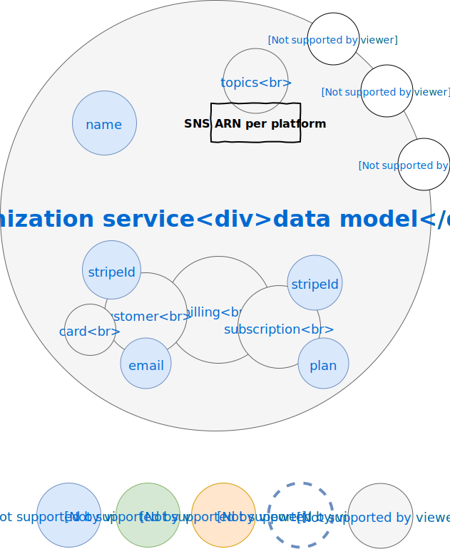

# Data model-oriented view of the architecture

> According to the [Feathers philosophy](https://docs.feathersjs.com/guides/about/philosophy.html) each data model is manipulated using a [service interface](https://docs.feathersjs.com/api/services.html) to perform [CRUD operations](https://en.wikipedia.org/wiki/Create,_read,_update_and_delete) of the [persistence layer](https://docs.feathersjs.com/api/databases/common.html). So this data model-oriented view is a service-oriented view in the same manner.

Because data models internally rely on [JSON](http://www.json.org/) they are by nature hierarchical. In the following diagrams each nested JSON object is represented as a smaller *bubble* in a bigger *bubble* (the nesting/parent object), the data model instance being the root JSON object or the *biggest* bubble. The name of the bubble is the name of the nesting object property owing the nested object.

Data models are dynamic by nature, allowing any plugin to add custom fields whenever required using [hooks](https://docs.feathersjs.com/api/hooks.html). Each data model includes an implicit [ObjectID](https://mongodb.github.io/node-mongodb-native/api-bson-generated/objectid.html) `_id` field provided by the database. 

## User data model

The most common properties of a user are described by the following data model:

The details of each property are the following:
* **email** : user e-mail used as an internal unique ID
* **password** : hashed user password
* **locale** : user locale when registering
* **previousPasswords** : hashed user password history if [password policy has been enabled](./../guides/basics/step-by-step.md#configuring)
* **profile** : user profile information including name
* **[provider]** : user profile information for associated OAuth provider, e.g. `google`
* **[scope]** : user permissions for associated scope, e.g. `groups`
* **tags** : user affected tags if any
* **devices** : user mobile devices if any, each time the user uses a new device it is registered, provided by [kNotify plugin](./../api/README.md)

## Tag data model

The most common properties of a tag object are described by the following data model:

This data model is manipulated through the [Tag API](./../api/kCore/services.md).

The details of each property are the following:
* **scope**: the scope of the tag (i.e. category), e.g. `skill`
* **value**: the value of the tag, e.g. `developer`
* **count**: the number of tagged objects
* **context**: the ID of the associated context object providing this tag if any (e.g. the organisation)
* **topics**: the ARN of associated SNS topics for each platform used to publish messages to tagged objects, provided by [kNotify plugin](./../api/README.md)

## Organization data model

The most common properties of an organization are described by the following data model, provided by [kTeam plugin](./../api/README.md):

This data model is manipulated through the [Organization API](./../api/kTeam/services.md).

The details of each property are the following:
* **name**: the name of the organisation
* **topics**: the ARN of associated SNS topics for each platform used to publish messages to organization' members, provided by [kNotify plugin](./../api/README.md)

> the organization ObjectID is used as the internal DB name

## Group data model

The most common properties of a group object are described by the following data model, provided by [kTeam plugin](./../api/README.MD):

This data model is manipulated through the [Group API](./../api/kTeam/services.md).

The details of each property are the following:
* **name**: the name of the group
* **description**: the description of the group
* **topics**: the ARN of associated SNS topics for each platform used to publish messages to group' members, provided by [kNotify plugin](./../api/README.md)
