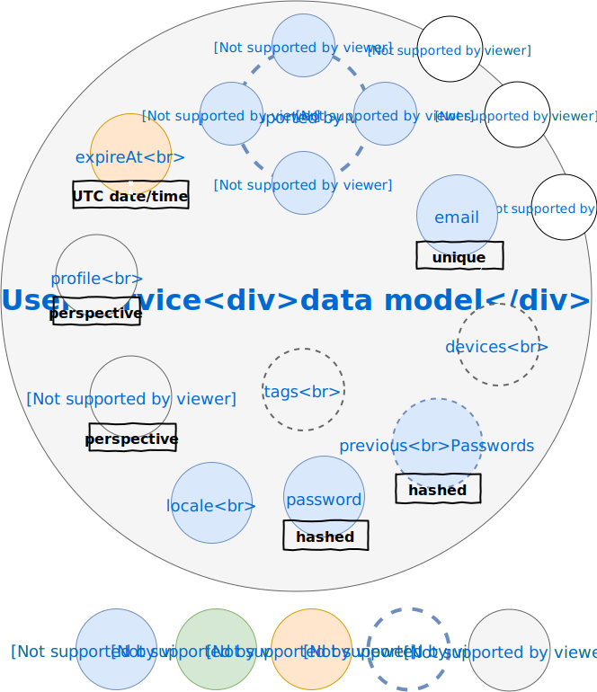

# Data model

According to the [Feathers philosophy](https://docs.feathersjs.com/guides/about/philosophy.html) each data model is manipulated using a [service interface](https://docs.feathersjs.com/api/services.html) to perform [CRUD operations](https://en.wikipedia.org/wiki/Create,_read,_update_and_delete) of the [persistence layer](https://docs.feathersjs.com/api/databases/common.html). So this data model-oriented view is a service-oriented view in the same manner.

Because data models internally rely on [JSON](http://www.json.org/) they are by nature hierarchical. In the following example diagrams each nested JSON object is represented as a smaller *bubble* in a bigger *bubble* (the nesting/parent object), the data model instance being the root JSON object or the *biggest* bubble. The name of the bubble is the name of the nesting object property owing the nested object.

Data models are dynamic by nature, allowing any plugin to add custom fields whenever required using [hooks](https://docs.feathersjs.com/api/hooks.html). Each data model includes an implicit [ObjectID](https://mongodb.github.io/node-mongodb-native/api-bson-generated/objectid.html) `_id` field provided by the database. 

## User data model

The most common properties of a user are described by the following data model:

The details of each property are the following:
* **email** : user e-mail used as an internal unique ID
* **password** : hashed user password
* **locale** : user locale when registering
* **previousPasswords** : hashed user password history if [password policy has been enabled](./../guides/basics/step-by-step.md#configuring-the-app)
* **profile** : user profile information including name
* **[provider]** : user profile information for associated OAuth provider, e.g. `google`
* **[scope]** : user permissions for associated scope, e.g. `groups`
* **subscriptions** : user web push subscriptions if any

## Subscription data model

As per [feathers-webpush](https://github.com/kalisio/feathers-webpush), subscriptions are attached to users through the `subscriptions` property.

## Notification data model

As per [feathers-webpush](https://github.com/kalisio/feathers-webpush), notifications are sent according to subscriptions are attached to users.

This data model is manipulated through the [push service](./../api/core/services.md#push-service).
