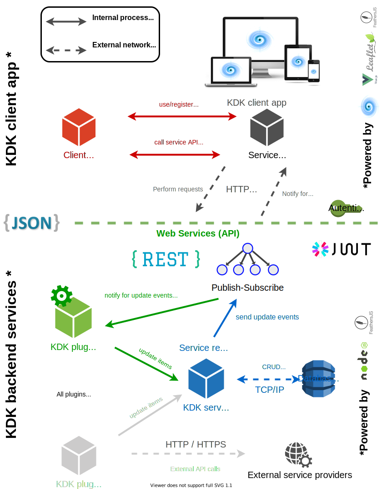

# Global architecture

## Overview

The typical global architecture and the underlying technologies of **KDK** are summarized in the following diagram.



## Architecture at scale

Although the typical architecture presented previously can be deployed in a single-server environment KDK has been developed as a loosely coupled set of modules to prevent it being a [monolithic piece of software](http://whatis.techtarget.com/definition/monolithic-architecture). The built-in [service layer](https://docs.feathersjs.com/guides/about/philosophy.html#services) helps decoupling the business logic from how it is being accessed based on a [simple and unambiguous interface](https://docs.feathersjs.com/guides/about/philosophy.html#uniform-interfaces). Kalisio applications can thus be deployed in a [microservice architectural style](http://searchmicroservices.techtarget.com/definition/microservices), which is typically used to provide high availability. The idea is to deploy different application instances on different *logical hosts* (can be physical machines as well as containers or virtual machines) each running the same or a different set of services.

However, you will have to face some [scaling configuration issues](https://docs.feathersjs.com/guides/advanced/scaling.html) first. You also have to setup the underlying logical infrastructure. To achieve high availability, different strategies may be used.

::: tip
It is recommended to have a single source of truth (SSOT) for your data (i.e. a single database), simplifying authentication, which requires you to setup a [MongoDB replica set](https://docs.mongodb.com/manual/tutorial/deploy-replica-set/) and configure the DB URL [accordingly](http://mongodb.github.io/node-mongodb-native/2.0/reference/connecting/connection-settings/). 
:::

### Monolithic application

This is the easiest strategy, you can rely on Cloud-ready solutions like [Kaabah](https://kalisio.github.io/kaabah/) to replicate and load-balance the different instances of your application and simply use [feathers-sync](https://github.com/feathersjs-ecosystem/feathers-sync) to synchronize service events.

::: tip
This approach is something between the true monolith and the true microservices architecture, i.e. you scale your entire application but not its underlying services according to their workload.
:::

### Distributed application

You can split up your application API manually on a per-responsibility basis (e.g. each module on a dedicated instance) and just communicate with each other through Feathers clients using all the infrastructure that is already in place. You could also deploy a frontend application serving as an [API gateway](http://microservices.io/patterns/apigateway.html). To configure the proxy rules, edit the `proxyTable` option in your configuration. The frontend server is using [http-proxy-middleware](https://github.com/chimurai/http-proxy-middleware) for proxying, so you should refer to its docs for a detailed usage but here's a simple example:

``` js
// config/default.js
module.exports = {
  // ...
  proxyTable: {
    // proxy all requests starting with /api/service
    '/api/service': {
      target: 'http://my.service.com',
      changeOrigin: true,
      pathRewrite: {
        '^/api/service': '/api'
      }
    }
  }
}
```

The above example will proxy the request `/api/service/1` to `http://my.service.com/api/1`.

However, all of this requires manual work, creates a tight coupling with your underlying infrastructure and will not allow auto-scaling unless you have some discovery mechanism. You can make each instance automatically aware of others instances to distribute services and related events using [feathers-distributed](https://github.com/kalisio/feathers-distributed). 
