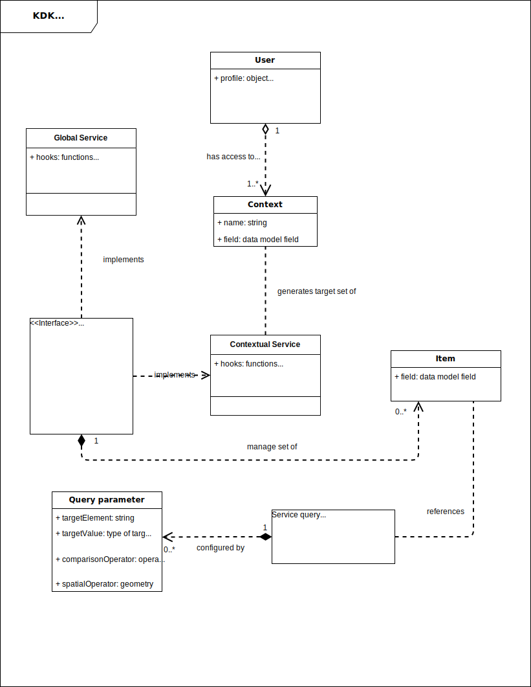

# Main concepts

::: warning
Although this page details the main data model used for SaaS applications the organisation part is optional and you can build legacy applications just by using services.
:::

## Services

According to the [Feathers philosophy](https://docs.feathersjs.com/guides/about/philosophy.html) each business operation should be performed through a [service interface](https://docs.feathersjs.com/api/services.html). As a consequence, these are are the building blocks at the heart of each KDK application.

## Data model and segregation

Each service managing business items is usually related to a database **collection** with an underlying data model formatted as a JSON document.

> All dates/times in KDK are internally managed as date or [moment](https://momentjs.com) objects and expressed in [UTC](https://en.wikipedia.org/wiki/Coordinated_Universal_Time).

### Context

One key aspect of access control is to filter the data resources a user can reach. The **KDK** can help to segregate data at the source level, ie the database, using what we call a **context** (more details in this [article](https://blog.feathersjs.com/access-control-strategies-with-feathersjs-72452268739d)). If it makes sense for your assets to only be accessed in a given business context (e.g. within an "organisation" or a "workspace") you can create a dedicated database with associated collections (respectively services) to hold (respectively manage) the data when the context is made available, and simply remove it when it is not anymore.

The context is usually also managed as a business object providing information about it like UUID, name, etc. and stored in a collection accessible through a service. For instance an application might manage a list of organisations as contexts, which can be listed using a service, and for each orgnisation provide a database storing all data collections related to the organisation with related services. Such services are called **contextual services** while services not related to a context are called **global services**.

Using the KDK you can dynamically create a database and declare services to access contextual assets stored in this segregated DB.

::: tip
Under the hood the [feathers-mongodb-management](https://github.com/feathersjs-ecosystem/feathers-mongodb-management) module is used to dynamically create/remove a database per organisation whenever required
:::

### Permissions

Organisation owners can manage member access to an organisation with a pre-defined set of permissions based on [Attribute Based Access Control](https://en.wikipedia.org/wiki/Attribute-based_access_control) (ABAC), which allows to enforce authorization decisions based on any attribute accessible to the application and not just the user's role. Similarly, resource owners can manage member access to a given resource (e.g. a **group**).

All permissions are stored along with the user so that they are always available once authenticated. They are organised by resource types (what we call *scopes*). The **authorisation service** allow to:
1. add, respectively remove, a set of **permissions** (e.g. being a owner or a manager)
2. for a subject (i.e. a **user** in most case but it could be generalized)
3. on a resource (e.g. an **organisation** or a **group**).

::: tip
Under the hood the [CASL](https://stalniy.github.io/casl/) module is used to manage the permissions
:::

## Domain model

The **domain model** is a set of high-level abstractions that describes selected aspects of a sphere of activity, it is a representation of meaningful real-world concepts pertinent to the domain that are modeled in the software. The concepts include the data involved in the business and rules the business uses in relation to that data.

The class diagram used to represent the domain model in the [Unified Modeling Language](https://en.wikipedia.org/wiki/Unified_Modeling_Language) (UML) is presented afterwards. The Kalisio domain model is implemented as a hybridation between [objects](https://en.wikipedia.org/wiki/Object-oriented_programming) and [cross-cutting concerns](https://en.wikipedia.org/wiki/Aspect-oriented_software_development) within a layer that uses a lower-level layer for [persistence](./data-model-view.md) and *publishes* an [API](../api/readme.md) to a higher-level layer to gain access to the data and behavior of the model. 

To get into the details of this model look at the [persisted data model](./data-model-view.md) and the provided [API](../api/readme.md).

