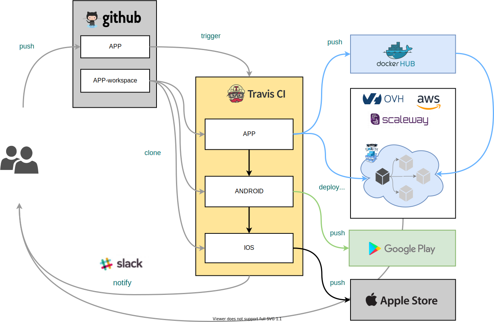
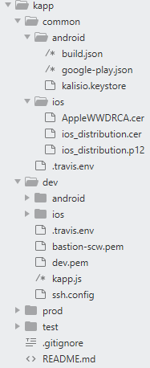
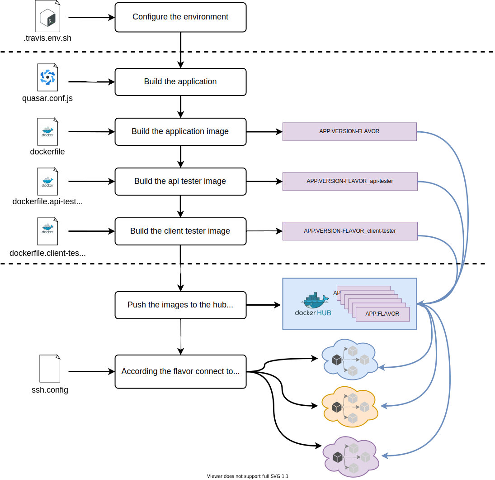
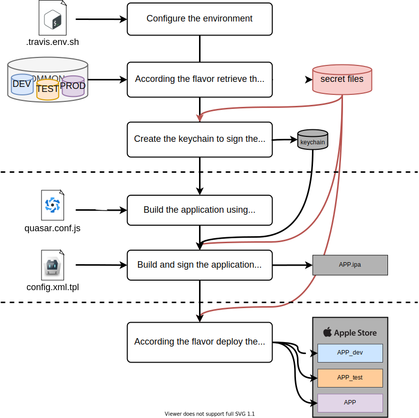

# Deploy your app

## Deployment pipeline

The main purpose of the continuous integration and deployment (CI/CD) pipeline is to create/build application artifacts (Docker images for the web application and mobile application bundles) and deploy it in production-like environments in order to test/run it. We rely on [Travis CI](https://travis-ci.org) for continuous integration and delivery, as such you need to create the CI/CD pipeline in Travis CI by syncing your GitHub repository.

You can read this [article](https://medium.com/better-programming/why-we-stopped-using-so-called-best-practices-in-our-ci-cd-process-2ff09811f633) on Medium to get an overview of our global CI/CD pipeline, which is illustrated in the following schema:

The different operations performed by each stages are the following:
* **APP**: executes the *travis.app.sh* script to
  * creates the Docker images for the application and testing
  * run backend and frontend tests on the target infrastructure
  * deploy the web application on the target infrastructure
* **ANDROID**: executes the *travis.android.sh* script to
  * build the Android APK
  * deploy it to Google Play
* **IOS**: executes the *travis.ios.sh* script to
  * build the iOS IPA
  * deploy it to App Store Connect

::: tip
You can skip any of this stage by adding `[skip stage]` to your commit message, e.g. `[skip android]` to skip the Android build
:::

In addition, the *travis.env.sh* script automatically generates a temporary environment file, based on the secret variables defined in the Travis repository settings or coming from a dedicated private repository (see details hereafter), which is used to [configure the application](./configure.md). The following schema summarizes the different scripts used by the CI/CD:

## Deployment flavors

CI/CD comes al well in three different flavors, as defined by the value of the `FLAVOR`/`NODE_APP_INSTANCE` environment variables:
* **dev**: in order to deploy current development/alpha version, linked to the `master` branch of your code
* **test**: in order to deploy current staging/beta version, linked to the `test` branch of your code, identified by matching the following regular expression pattern `^test-*|-test$`
* **prod**: in order to deploy current production version, linked to `tags` on the `test` branch of your code

The output Docker image artifacts use the prerelease SemVer notation to identify which flavor has been used to produce it —  `1.0.0-dev` for alpha version, `1.3.0-test` for beta version or `1.4.0` for production.

::: tip
In the CI/CD process the `FLAVOR`/`NODE_APP_INSTANCE` environment variable is automatically set based on the branch/tag you are pushing. During local development these variables are usually not defined.
:::

Starting from the following base application setup:
* a root domain, defined by the value of the `DOMAIN` environment variable like `kalisio.xyz`
* a version number, defined by the value of the `VERSION` environment variable like `1.3.0` and automatically extracted from your *package.json* file
* a name, defined in the `APP` environment variable like `kapp`

Each flavor is then attached to a different target infrastructure, subdomain and version tag:
* **dev**: `SUBDOMAIN=dev.$DOMAIN`, `VERSION_TAG=$VERSION-dev`
* **test**: `SUBDOMAIN=test.$DOMAIN`, `VERSION_TAG=$VERSION-test`
* **prod**: `SUBDOMAIN=$DOMAIN`, `VERSION_TAG=$VERSION`

The subdomain is usually used to build a fully-qualified domain name for the application based on its name, i.e. `$APP.$SUBDOMAIN`. The version tag defines the name of the created Docker images as `$APP:$VERSION_TAG`.

## Deployment workspace

Each build stage of the CI/CD pipeline first setup the "workspace" required to correctly build the application, i.e. environment variables, application and module source code, configuration files, etc. The following schema summarizes the different steps performed to setup the workspace in the *travis.env.sh* script:

In order to simplify and unify as much as possible secrets management we use a private GitHub repository as a secret store for:
* environment variables through env files
  * **.env** for application configuration
  * **.travis.env** for CI/CD configuration
* configuration files required either by the application or the CI/CD (e.g. mobile application certificates, ssh key to connect to hosting infrastructures, etc.)

Each workspace includes a **common** folder to store shared secrets between all flavor, then a folder dedicated to secrets specific to each flavor as depicted in the following diagram:

## Web application deployment

The following schema summarizes the different steps performed to deploy the web application:

## Mobile applications deployment

The following schema summarizes the different steps performed to deploy the Android application:

The following schema summarizes the different steps performed to deploy the IOS application:

