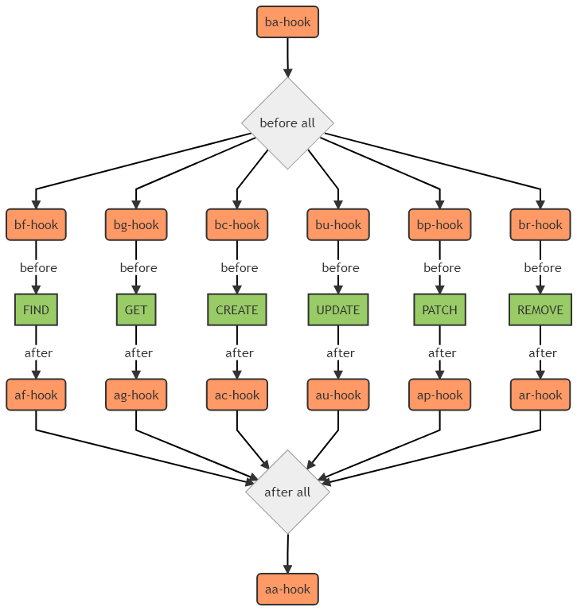

# Documentation

## Generating the doc

The approach we have adopted rely on [VitePress](https://vitepress.dev/) to generate the static web site

### Install VitePress

You first need to install vitepress:

```bash
$yarn add -D vitepress
```

And then add the documentation generation scripts to the `package.json` file:

```json
"scripts": {
  "dev": "vitepress dev",
  "build": "vitepress build",
  "preview": "vitepress preview"
}
```

Create the following directory structure to store the **VuePress** stuff:

```
docs/
|_ .vitepress/
|    |_ config.mjs
|_ package.json
|_ index.md
|....
```

* `.vitepress` stores the **VitePress** configuration.
* `index.md` is the entry point of your documentation. 
* `package.json` is the Node.js entry point to build the documentation. The file must have the following content:

<<< @/package.json

::: tip
The structure follows the **VitePress** directory structure and more information can be found [here](https://vitepress.dev/guide/getting-started#file-structure)
:::

### Configure VitePress

Edit the `config.mjs` to configure **VitePress**. We usually have this kind of configuration:

<<< @/.vitepress/config.mjs

### Write the documentation

Here are few tips to know when writing the documentation:
* Pages structure: the pages should match the navigation structure you have defined in the `config.js` file.
* Handling assets: you can simply refer to the asset using relative URLs. Please refer to the [Asset Handling](https://vitepress.dev/guide/asset-handling) page to know more.
* Take advantage of [Markdown extensions](https://vitepress.dev/guide/markdown)

### Deploy the documentation to the gh-pages

Add the following lines to your `.travis.yml` file:

```yaml
  - stage: DOCS
    language: node_js
    node_js:
    - '8'
    install: true
    script:
    - cd docs && yarn install && yarn build
    deploy:
      provider: pages
      local-dir: docs/.vitepress/dist
      skip-cleanup: true
      github-token: $GITHUB_TOKEN  
      keep-history: true
      on:
        branch: master
```

::: tip
You must set the secure variable `GITHUB_TOKEN` in your Travis CI project settings
:::


## Working with diagrams

We use two distinct tools to work with diagrams:
* [draw.io](http://draw.io)] a complete editor to create well known diagrams
* [mermaid](https://github.com/knsv/mermaid) which allows you to generate diagrams from a simple text definition. We mainly use mermaid to create the hooks diagrams.

To be able to include the diagrams within the documentation, we adopted the following methodology:

### Draw.io

1. make it with [draw.io](http://draw.io) and store it in this folder
2. export it as SVG/PNG in the root **assets** folder
3. reference it in the documentation using a link like this ``

### mermaid

1. install the [mermaid CLI](https://github.com/mermaidjs/mermaid.cli)
2. start from the [hooks diagram template file](./hooks-diagram-template.mmd)
3. output the SVG/PNG file in the root **assets** folder using `mmdc -i ./my-hooks-diagram.mmd -t neutral -b transparent -o my-hooks-diagram.svg`
4. reference it in the documentation using a link like this ``

The template looks like this:
